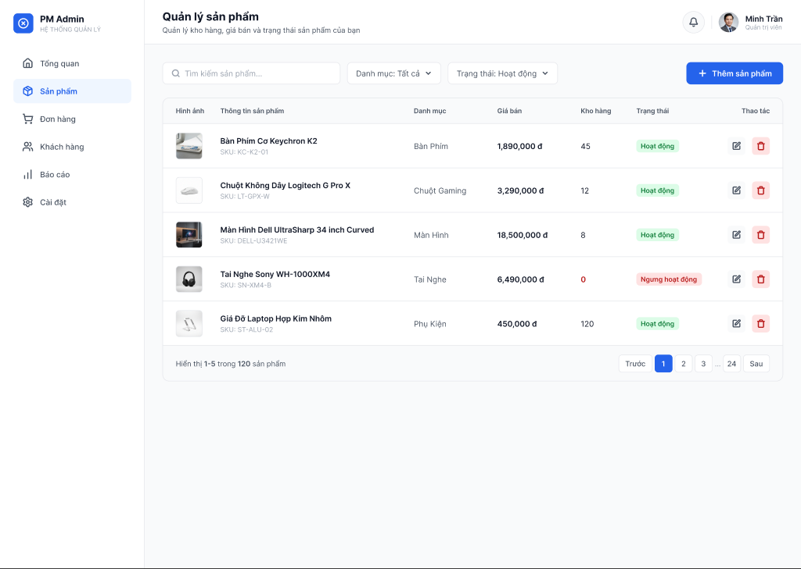
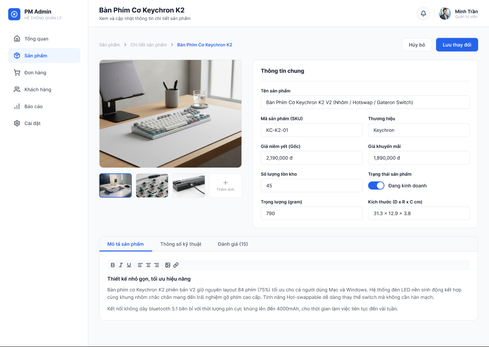

# Đặc tả UI hai màn hình Seller Products

## Quy ước bằng chứng

**[Figma]** là dữ liệu đọc từ metadata/design context của node 2:5 và 2:192. **[Đề xuất]** là phương án triển khai cho phần chưa có thiết kế; bản chốt theo project nằm trong [PROJECT-ADAPTATION.md](PROJECT-ADAPTATION.md). Không trình bày đề xuất như dữ liệu Figma.

Nguồn đầy đủ: [XML](source/page-structure.xml), [reference danh sách](source/product-list.reference.tsx.txt), [reference chi tiết](source/product-detail.reference.tsx.txt). Đơn vị bên dưới là px của canvas gốc 1440 × 1024. Tọa độ trong XML tương đối với node cha; vị trí ngoài canvas (-721, -451), (759, -451) không phải margin của website.

## 1. Khung dùng chung [Figma]

| Vùng | Kích thước / vị trí | Styling |
| --- | --- | --- |
| Toàn màn hình | 1440 × 1024 | Nền #f9fafb; flex ngang |
| Sidebar | x=0, y=0, w=260, h=1024 | Trắng; border phải 1px #e5e7eb; padding 24 |
| Main | x=260, y=0, w=1180 | Cột dọc |
| Header | 1180 × 80 | Trắng, border đáy 1px #e5e7eb; padding ngang 32 |
| Body | Bắt đầu y=80 | Padding 32; gap giữa khối 24; vùng sử dụng rộng 1116 |

Đừng khóa chiều cao trang thực tế ở 1024px: đây là chiều cao artboard, không phải giới hạn nội dung. Fixed/sticky hay hành vi cuộn chưa được xác minh từ thiết kế.

### Sidebar

Brand ở x=24, y=24: logo 36 × 36 nền xanh #2563eb, radius 8; glyph circle-x 20 × 20. Khoảng cách logo–text 12. “PM Admin” Inter 16/700 #111827; “HỆ THỐNG QUẢN LÝ” 11/400 #9ca3af.

Menu bắt đầu y=92, rộng 212, mỗi item cao 44, gap 6, radius 8. Padding ngang 16; icon 20 × 20; gap icon–text 12. Sáu mục mẫu: Tổng quan, Sản phẩm, Đơn hàng, Khách hàng, Báo cáo, Cài đặt. Mục Sản phẩm active: nền #eff6ff, chữ/icon #2563eb, weight 600. Mục thường: chữ #4b5563, 14/500.

Đây là text mẫu thiết kế; quyền/đường dẫn Seller cần ánh xạ theo [IMPLEMENTATION.md](IMPLEMENTATION.md), không tạo route giả theo nhãn “Admin”.

### Header

Tiêu đề 20/700 #111827, subtitle 13/400 #4b5563, cách nhau 4. Vùng profile rộng 181, cao 40; gap 12. Nút chuông 40 × 40 hình tròn, nền #f9fafb, viền #e5e7eb; icon 18. Divider 1 × 24. Avatar 36 × 36 hình tròn. Tên mẫu Minh Trần 14/600; vai trò mẫu Quản trị viên 11/400 #9ca3af. Hai ảnh avatar ở hai frame không giống nhau; dùng session thực trong app.

## 2. Hệ màu, typography, geometry [Figma]

| Vai trò | Giá trị |
| --- | --- |
| Primary / active | #2563eb |
| Active navigation background | #eff6ff |
| Canvas, table head/footer, toolbar, nút icon sửa | #f9fafb |
| Surface | #ffffff |
| Border | #e5e7eb |
| Text chính | #111827 |
| Text phụ | #4b5563 |
| Placeholder / metadata | #9ca3af |
| Trạng thái hoạt động | nền #dcfce7, chữ #15803d |
| Ngưng hoạt động / xóa | nền #fee2e2, chữ #b91c1c |

Font Inter. Cỡ/weight: header 20/700; section title và brand 16/700; tên sản phẩm, giá, primary button 14/600; body/input 14/400; navigation 14/500; label form 13/600; subtitle/footer 13/400; table heading/badge 12/600; SKU 12/400; phụ đề brand/profile 11/400. Nội dung mô tả: heading 15/600, paragraph 14/400 line-height 1.6. Các text khác reference dùng line-height normal, không suy ra một line-height cố định toàn bộ app.

Radius: table/card/tab section 12; button/input/nav/main-image 8; thumbnail/badge/pagination/icon action 6; avatar/nút chuông tròn. Toggle track 48 × 24, knob 20. Không thấy shadow được khai báo trong hai reference.

Màu xanh, Inter và radius này khác mặc định cam/Be Vietnam Pro/phẳng của skill Shopee. Giữ chuẩn Figma trong scope hai màn hình, không đổi token toàn sàn.

## 3. Danh sách sản phẩm — node 2:5 [Figma]

Header: “Quản lý sản phẩm”, subtitle “Quản lý kho hàng, giá bán và trạng thái sản phẩm của bạn”.

### Toolbar — node 2:53

Tọa độ toàn màn hình x=292, y=112; rộng 1116, cao 40. Nhóm filter rộng 711, gap 12:
- Search: 320 × 40, padding ngang 16, radius 8, icon 16, gap 8, placeholder “Tìm kiếm sản phẩm...”.
- Category dropdown: 169 × 40, text “Danh mục: Tất cả”, chevron 14.
- Status dropdown: 198 × 40, text “Trạng thái: Hoạt động”, chevron 14.
- Bên phải: nút “Thêm sản phẩm” 174 × 40, nền primary, chữ trắng, icon plus 18, padding ngang 20, gap 8.

Thiết kế đang hiển thị filter “Hoạt động” nhưng vẫn có dòng “Ngưng hoạt động”; đây là điểm không nhất quán của mẫu, không phải quy tắc filter.

### Bảng — node 2:71

Tọa độ toàn màn hình x=292, y=176; kích thước 1116 × 511; radius 12, border 1. Header cao 47; 5 dòng × 80; footer cao 64. Các dòng viền đáy #e5e7eb, padding ngang 24, dọc 16.

| Cột | Rộng | Nội dung |
| --- | --- | --- |
| Hình ảnh | 80 | Thumbnail 48 × 48, object-cover, radius 6, viền |
| Thông tin sản phẩm | 348 ở canvas gốc; co giãn | Tên 14/600, 1 dòng ellipsis; SKU 12/400, cách 4 |
| Danh mục | 150 | Text 14/400 |
| Giá bán | 150 | 14/600 |
| Kho hàng | 100 | 14/400; số 0 đỏ 14/600 |
| Trạng thái | 140 | Badge cao 23, padding 4px 8px, radius 6 |
| Thao tác | 100 | Align phải, hai nút 32 × 32 cách 12 |

Nút sửa nền #f9fafb; nút xóa nền #fee2e2; icon 16 × 16.

Dữ liệu minh họa:
| Tên / SKU | Danh mục | Giá | Tồn | Badge |
| --- | --- | --- | --- | --- |
| Bàn Phím Cơ Keychron K2 / KC-K2-01 | Bàn Phím | 1,890,000 đ | 45 | Hoạt động |
| Chuột Không Dây Logitech G Pro X / LT-GPX-W | Chuột Gaming | 3,290,000 đ | 12 | Hoạt động |
| Màn Hình Dell UltraSharp 34 inch Curved / DELL-U3421WE | Màn Hình | 18,500,000 đ | 8 | Hoạt động |
| Tai Nghe Sony WH-1000XM4 / SN-XM4-B | Tai Nghe | 6,490,000 đ | 0 | Ngưng hoạt động |
| Giá Đỡ Laptop Hợp Kim Nhôm / ST-ALU-02 | Phụ Kiện | 450,000 đ | 120 | Hoạt động |

Footer x=292, y=623, w=1116, h=64; bên trái “Hiển thị 1-5 trong 120 sản phẩm”, nhấn weight 600 cho số. Bên phải “Trước”, 1, 2, 3, ..., 24, “Sau”; controls cao 32, gap 4, radius 6. Page active nền xanh/chữ trắng. Các con số này là fixture, không phải tổng thật hoặc hợp đồng pagination.

## 4. Chi tiết / chỉnh sửa — node 2:192 [Figma]

Header tên “Bàn Phím Cơ Keychron K2”; subtitle “Xem và cập nhật thông tin chi tiết sản phẩm”.

### Breadcrumb và hành động — node 2:240

x=292, y=112, w=1116, h=40. Breadcrumb: “Sản phẩm” → “Chi tiết sản phẩm” → tên sản phẩm; text 13, chevron 14, gap 8; tên cuối màu xanh/600.

Bên phải hai nút cách 12: “Hủy bỏ” 88 × 40, trắng/viền; “Lưu thay đổi” 124 × 40, nền primary/chữ trắng; radius 8.

### Gallery và form — node 2:254

x=292, y=176, w=1116, h=498. Hai cột **420 + gap 32 + 664**.

Gallery: ảnh chính 420 × 320, object-cover, radius 8, viền #e5e7eb. Thumbnail strip ở y=512 toàn màn hình, cách ảnh 16; ba thumbnail và một ô “Thêm ảnh”, mỗi ô 96 × 72, gap 12. Thumbnail đầu viền xanh 2; ảnh còn lại viền trung tính. Ô thêm ảnh viền nét đứt, icon plus 18, label 11, text phụ.

Form card: x=744, y=176, 664 × 498; trắng, radius 12, border 1, padding 24. “Thông tin chung” 16/700; divider cách tiêu đề 20, nội dung sau divider cách 20.

Form hữu dụng rộng 616. Label 13/600; gap label–input 6; input cao 40, padding ngang 16, radius 8. Các hàng cách 20; cột đôi rộng 300 + gap 16 + 300.

| Hàng | Trường trái / rộng toàn hàng | Trường phải |
| --- | --- | --- |
| 1 | Tên sản phẩm: Bàn Phím Cơ Keychron K2 V2 (Nhôm / Hotswap / Gateron Switch) | — |
| 2 | Mã sản phẩm (SKU): KC-K2-01 | Thương hiệu: Keychron |
| 3 | Giá niêm yết (Gốc): 2,190,000 đ | Giá khuyến mãi: 1,890,000 đ |
| 4 | Số lượng tồn kho: 45 | Trạng thái sản phẩm: toggle on + Đang kinh doanh |
| 5 | Trọng lượng (gram): 790 | Kích thước (D x R x C cm): 31.3 x 12.9 x 3.8 |

Toggle: 48 × 24, knob 20 × 20 lệch phải 2, nhãn cách 12. Đây chỉ là hình thức on; quy tắc transition phải theo lifecycle thật.

### Tabs và mô tả — node 2:310

x=292, y=698, w=1116, h=249; cách form-grid 24. Card trắng radius 12, border 1. Tab bar cao 45, nền #f9fafb.

Tabs: “Mô tả sản phẩm” rộng 156, “Thông số kỹ thuật” rộng 170, “Đánh giá (15)” rộng 137. Padding 14px 24px; tab đầu active chữ xanh, weight 600 và underline xanh 3px.

Content padding 24. Toolbar 1068 × 32, nền #f9fafb; icon 16: bold, italic, underline, separator, align-left/center/right, separator, image, link. Toolbar là hình thức tham chiếu, chưa xác minh mô hình rich text.

Nội dung bắt đầu cách toolbar 16: “Thiết kế nhỏ gọn, tối ưu hiệu năng”; hai đoạn mô tả trong reference. Nội dung tab Thông số/Đánh giá không được cung cấp trong hai frame, không tự bịa ra như một phần thiết kế gốc.

## 5. Trạng thái và responsive [Đề xuất]

- Loading giữ shell, hiển thị skeleton vùng bảng hoặc form; lỗi tải có retry, empty giải thích và CTA phù hợp quyền.
- Lưu đang chờ: chống gửi lặp, giữ draft, lỗi gắn field nếu adapter có invalidParameters; chỉ báo thành công khi API đã thành công.
- Xóa/ẩn: giữ confirmation và quyền backend thật. Đã xác minh app hỗ trợ xóa mềm cả published/hidden/archived; không suy ra chỉ xóa nháp từ tên hàm cũ.
- Focus rõ, label/input liên kết, icon-only có accessible name, tabs/switch dùng semantics và bàn phím phù hợp.
- Tablet: thu sidebar theo layout app, toolbar wrap, form xuống một cột khi không đủ không gian.
- Mobile: sidebar qua menu/drawer theo primitive hiện có; actions wrap; gallery/form xếp dọc; trường đôi xếp một cột; bảng cuộn trong vùng bảng hoặc dùng row card có đủ thông tin.
- Không có breakpoint mobile/tablet gốc. Kiểm tra 360 × 800, 768 × 1024 và desktop 1440 × 1024; ghi rõ đây là adaptation.
