# Flow các tính năng đã triển khai

Tài liệu này mô tả trạng thái hiện tại của Shopee Clone sau TS01 và các task đến T20. Các sơ đồ tập trung vào luồng đang hoạt động trong code; checkout COD, order history và hủy đơn đã có, còn thanh toán online, chat và vận chuyển thật chưa được triển khai.

## 1. Tổng quan phạm vi

| Nhóm               | Màn hình hoặc điểm vào                                                      | Chức năng hiện có                                                                            |
| ------------------ | --------------------------------------------------------------------------- | -------------------------------------------------------------------------------------------- |
| Nền tảng giao diện | `/`, `/design-system`, layout storefront                                    | Design system, header dùng chung, tìm kiếm, điều hướng danh mục, responsive và accessibility |
| Trang chủ          | `/`                                                                         | Banner chiến dịch, danh mục, flash sale, bán chạy, Mall và gợi ý hằng ngày từ API            |
| Khám phá sản phẩm  | `/search`                                                                   | Tìm kiếm, lọc, sắp xếp, phân trang và URL có thể chia sẻ                                     |
| Chi tiết sản phẩm  | `/products/{productId}`                                                     | Gallery, biến thể, giá, tồn kho, số lượng, shop, sản phẩm liên quan và purchase intent       |
| Tài khoản          | `/login`, `/register`, `/forgot-password`, `/reset-password`                | Email/password, Google OIDC, refresh session, logout và khôi phục mật khẩu                   |
| Phân quyền         | `/seller`, `/seller/shop`, `/admin` và API tương ứng                        | Buyer mặc định, seller onboarding/hồ sơ shop, admin duyệt placeholder và audit               |
| Hồ sơ giao hàng    | `/account/profile`, `/account/addresses`                                    | Hồ sơ, số điện thoại, CRUD địa chỉ và địa chỉ mặc định                                       |
| Tương tác buyer    | `/account/favorites`, `/account/recently-viewed`, `/account/followed-shops` | Yêu thích, lịch sử xem gần đây và danh sách shop đang theo dõi riêng theo tài khoản          |
| Gian hàng          | `/shops/{shopSlug}`                                                         | Hồ sơ shop, catalog riêng, tìm kiếm/lọc/sắp xếp/phân trang và theo dõi shop                  |
| Dữ liệu            | `asserts/*.json`, PostgreSQL                                                | Import 1.377 sản phẩm chuẩn hóa, idempotent, có provenance và dữ liệu sinh xác định          |

## 2. Kiến trúc chạy ứng dụng

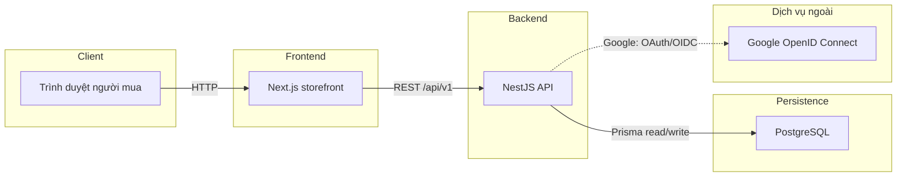

`@shopee-clone/contracts` giữ kiểu dữ liệu và parser dùng chung giữa frontend và backend. Dữ liệu riêng tư và mọi phản hồi phụ thuộc phiên đều dùng `Cache-Control: no-store`.

## 2.1. Seller order fulfillment

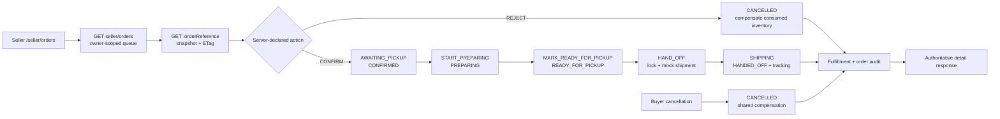

Mỗi mutation khóa `ShopOrder` rồi fulfillment aggregate, kiểm tra replay theo `Idempotency-Key` trước state/ETag, lấy `clock_timestamp()` của PostgreSQL, ghi audit bất biến và chỉ commit khi lifecycle, fulfillment, inventory, shipment cùng thành công.

## 2.2. Seller analytics dashboard (T26, phần đã apply)

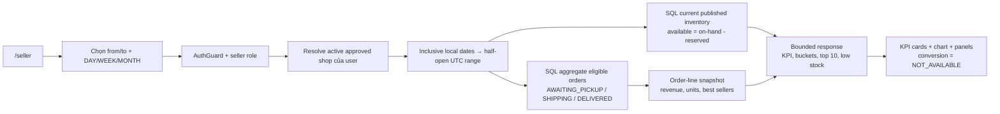

Đã triển khai `GET /api/v1/seller/dashboard` và `GET /api/v1/seller/analytics/products`. Dashboard chỉ tính đơn đã xác nhận/đang giao/đã giao, không nhận `shopId` từ client, trả múi giờ của shop (mặc định `Asia/Ho_Chi_Minh`), giới hạn khoảng ngày tối đa 366 ngày, và dùng `Cache-Control: private, no-store`. UI dashboard ở `/seller`, quản lý voucher/campaign ở `/seller/promotions`.

## 2.3. Seller promotion lifecycle và giá động

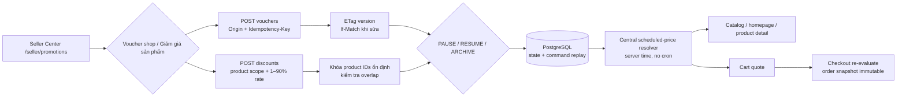

Mutation bị giới hạn theo shop sở hữu, lỗi ownership không tiết lộ resource tồn tại. `SellerPromotionCommand` lưu request digest và response để replay idempotent; version mismatch trả `412`. Resolver dùng cùng một rule cho public pricing và quote, theo thứ tự scheduled discount → shop voucher → platform voucher → shipping benefit.

## 2.4. Kiểm thử Seller Center

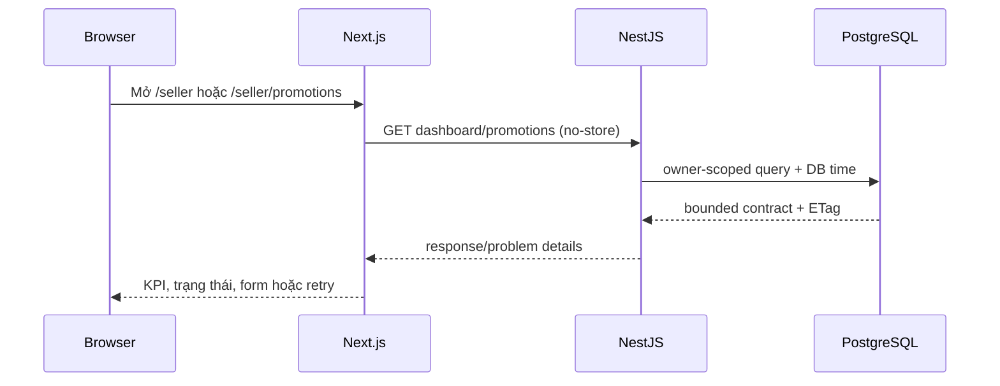

## 3. Hành trình khám phá sản phẩm công khai

```mermaid
flowchart LR
    visitor(["Người mua truy cập"])
    homepage["Trang chủ / "]
    homeModules["Banner, danh mục, module sản phẩm"]
    searchPage["Tìm kiếm /search"]
    discovery["Lọc, sắp xếp, phân trang"]
    productGrid["Danh sách sản phẩm"]
    productDetail["Chi tiết /products/{id}"]
    variant["Chọn biến thể và số lượng"]
    shopPage["Gian hàng /shops/{slug}"]
    shopCatalog["Catalog riêng của shop"]
    purchaseIntent{"Mua ngay hoặc thêm giỏ?"}
    loginHandoff["Chuyển đến /login với intent an toàn"]
    persistentCart["Giỏ hàng server-side /cart"]
    currentBoundary(["Chưa tạo đơn hàng"])

    visitor --> homepage
    homepage -->|"GET /homepage"| homeModules
    homepage --> searchPage
    homeModules --> productDetail
    searchPage -->|"GET /catalog/products"| discovery
    discovery --> productGrid
    productGrid --> productDetail
    productDetail --> variant
    productDetail -->|"Chọn tên shop"| shopPage
    shopPage --> shopCatalog
    shopCatalog --> productDetail
    variant --> purchaseIntent
    purchaseIntent -->|"Thêm vào giỏ"| persistentCart
    purchaseIntent -->|"Mua ngay khi là khách"| loginHandoff
    loginHandoff --> persistentCart
    persistentCart --> currentBoundary
```

Catalog chỉ trả sản phẩm đủ điều kiện hiển thị. Search hỗ trợ `q`, danh mục, khoảng giá, rating, vị trí shop, còn hàng, đang giảm giá và năm kiểu sắp xếp. Trang chi tiết ghi lựa chọn biến thể/số lượng vào giỏ server-side; chưa giữ tồn kho hoặc tạo đơn.

## 4. Vòng đời xác thực và session

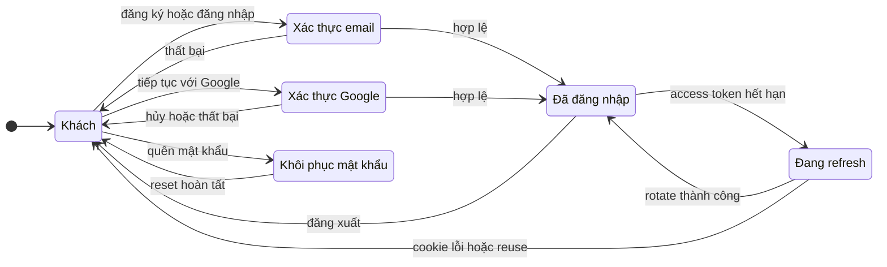

- Access token chỉ nằm trong React runtime memory.
- Refresh token chỉ nằm trong cookie `HttpOnly`, được lưu ở database dưới dạng digest và rotate theo từng lần refresh.
- Logout là idempotent; reset mật khẩu thu hồi các refresh session hiện có.
- Browser không lưu token trong local storage hoặc session storage.

### Đăng nhập Google và tạo session nội bộ

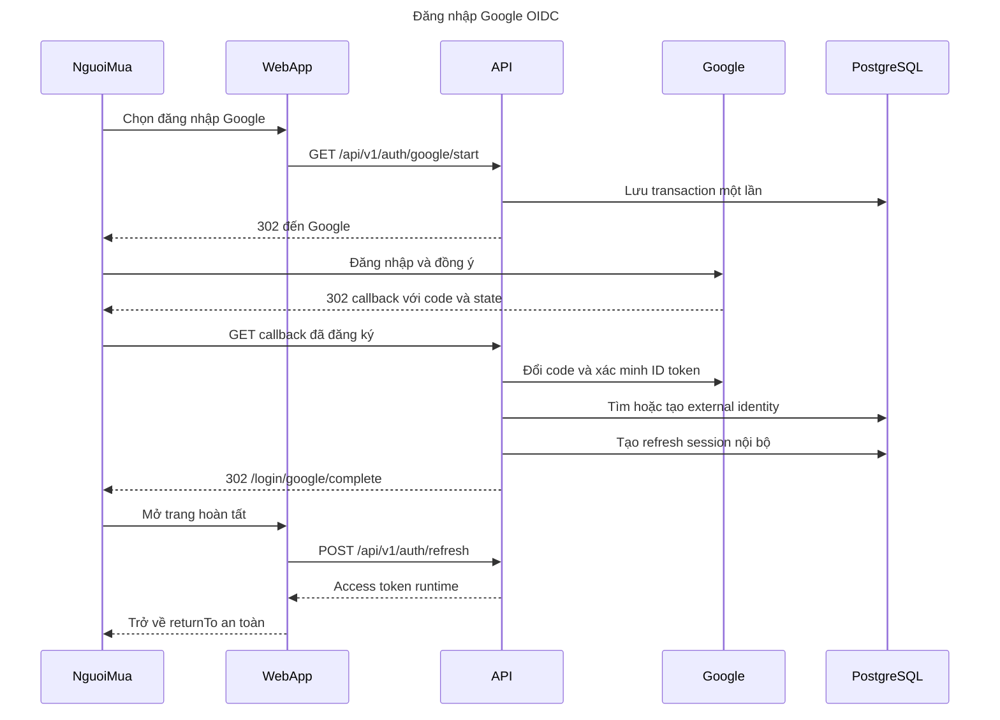

Google `sub` là định danh bên ngoài. Google access token, refresh token và ID token chỉ tồn tại tạm thời ở backend trong lúc xác minh rồi bị loại bỏ; ứng dụng chỉ duy trì session nội bộ. Email đã thuộc một tài khoản local nhưng chưa liên kết sẽ không được tự động gộp.

## 5. Phân quyền buyer, seller và admin

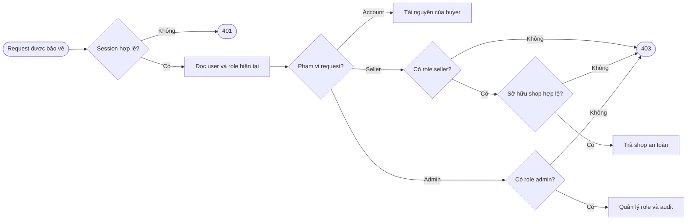

JWT chỉ mang identity (`sub`, `sid`). Backend luôn đọc role và ownership mới nhất từ PostgreSQL, vì vậy thu hồi role có hiệu lực ngay ở request tiếp theo. Admin không tự động có quyền seller và hệ thống không nhận `ownerId` do browser gửi lên.

## 6. Hồ sơ và địa chỉ giao hàng


Khi đổi tỉnh, cả district và ward không tương thích bị xóa; khi đổi district, ward bị xóa. Chọn lại cùng cấp cha giữ lựa chọn con, còn giá trị cũ ngoài snapshot được bảo toàn cho tới khi người dùng chủ động đổi cấp cha. Ward snapshot chỉ được tải từ asset nội bộ sau khi nhận diện district; browser không gọi NSO ở runtime. Năm huyện `Bạch Long Vĩ`, `Cồn Cỏ`, `Hoàng Sa`, `Lý Sơn` và `Côn Đảo` tự dùng sentinel `Không có đơn vị hành chính cấp xã`. API tiếp tục lưu province/district/ward dạng chuỗi.

Địa chỉ đầu tiên tự trở thành mặc định; xóa địa chỉ mặc định sẽ chọn địa chỉ cũ nhất còn hoạt động. ID không tồn tại, đã xóa hoặc thuộc user khác đều trả cùng một lỗi `404` đã làm sạch.

## 7. Yêu thích, xem gần đây và theo dõi shop

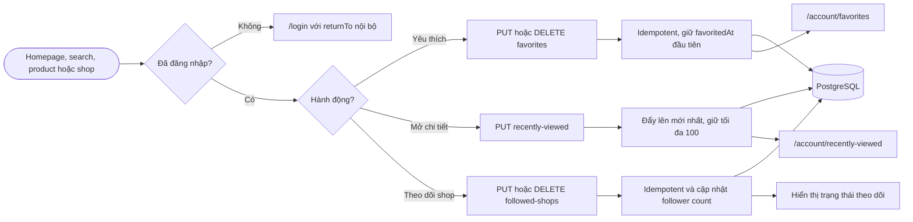

Favorites vẫn giữ một projection tối thiểu cho sản phẩm về sau không còn công khai để buyer có thể xóa. Recently viewed loại sản phẩm không còn hiển thị khỏi items và totals. Mọi quan hệ đều được truy vấn theo user đang xác thực.

### Trạng thái nút theo dõi shop

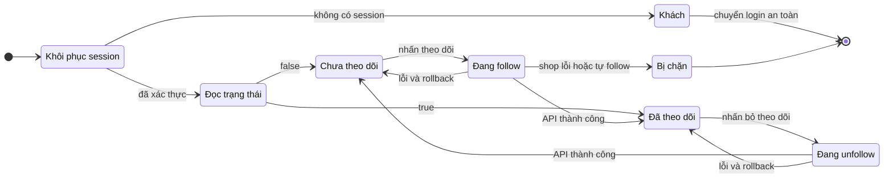

Nút follow trên storefront cập nhật lạc quan nhưng khóa thao tác lặp trong lúc request đang chạy. `404` chặn shop không công khai; `409` chặn owner tự theo dõi shop. Unfollow vẫn idempotent khi shop đã unavailable và không làm lộ follower count riêng tư.

### Danh sách shop đang theo dõi

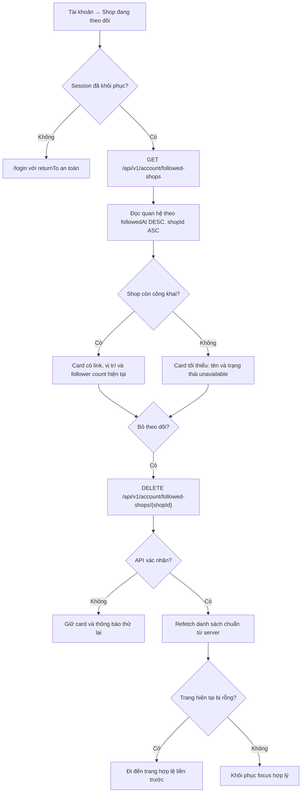

Danh sách được phân trang theo owner đang đăng nhập và luôn `no-store`. Shop inactive hoặc soft-deleted vẫn xuất hiện ở dạng tối thiểu để buyer có thể bỏ theo dõi; hard-delete dùng cascade nên quan hệ biến mất. Card chỉ bị loại sau khi DELETE thành công và frontend đã đọc lại dữ liệu có thẩm quyền từ backend.

## 8. Luồng tải public shop storefront

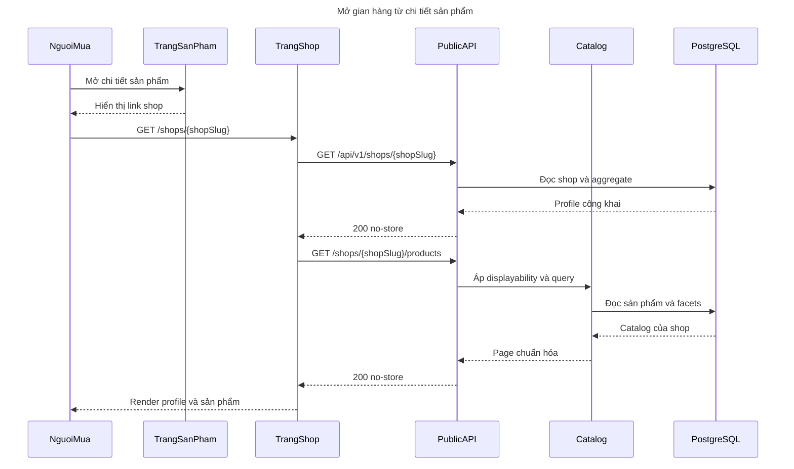

Shop không tồn tại, inactive, deleted hoặc slug không chuẩn đều dùng cùng presentation not-found. Rating shop được tính theo rating-count-weighted; danh mục và tổng sản phẩm chỉ tính sản phẩm công khai đủ điều kiện.

## 9. Luồng import dataset và chạy local


Importer chạy local, không crawl mạng, không dùng dữ liệu ngẫu nhiên và an toàn khi chạy lặp. Ba giá thiếu và 952 rating thiếu được sinh xác định theo policy `dataset-v1`. Automatic GitHub Actions trigger hiện vẫn tạm tắt; các quality gate được chạy local hoặc manual dispatch.

## 10. Các ranh giới chưa triển khai

- Báo giá giỏ hàng dùng phí vận chuyển mô phỏng và preview voucher; không giữ tồn kho, giữ lượt voucher, cam kết cước cuối cùng hoặc tạo đơn.
- Purchase intent ở trang sản phẩm chưa báo checkout thành công.
- Đã có checkout COD, order history theo shop, timeline và hủy đơn chờ xác nhận; chưa có thanh toán online, shipment thật, seller fulfillment, return/refund workflow, review body, chat hoặc notification realtime.
- Seller mới có role/ownership boundary và safe shop projection, chưa có bộ công cụ quản lý gian hàng hoàn chỉnh.
- Admin hiện tập trung vào role assignment/revocation và role audit, chưa phải dashboard vận hành marketplace đầy đủ.

## 11. Giỏ hàng đa shop yêu cầu đăng nhập

### Đăng nhập trước khi thêm hoặc quản lý giỏ hàng

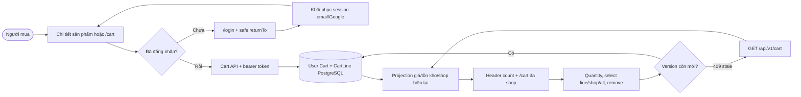

Mọi endpoint `/api/v1/cart/**` yêu cầu bearer session hợp lệ và chỉ lấy owner từ tài khoản đã xác
thực. Khách không gọi Cart API, header hiển thị 0 và `/cart` cung cấp login handoff. Không có guest
cookie, guest cart, merge endpoint hoặc cleanup job. Khi đăng xuất, `CartProvider` xóa ngay projection
riêng tư khỏi bộ nhớ. Mọi mutation trả lại toàn bộ projection đã xác nhận và các điều chỉnh số
lượng/giá có kiểu rõ ràng.

### Chính sách xác thực cho các phase tiếp theo

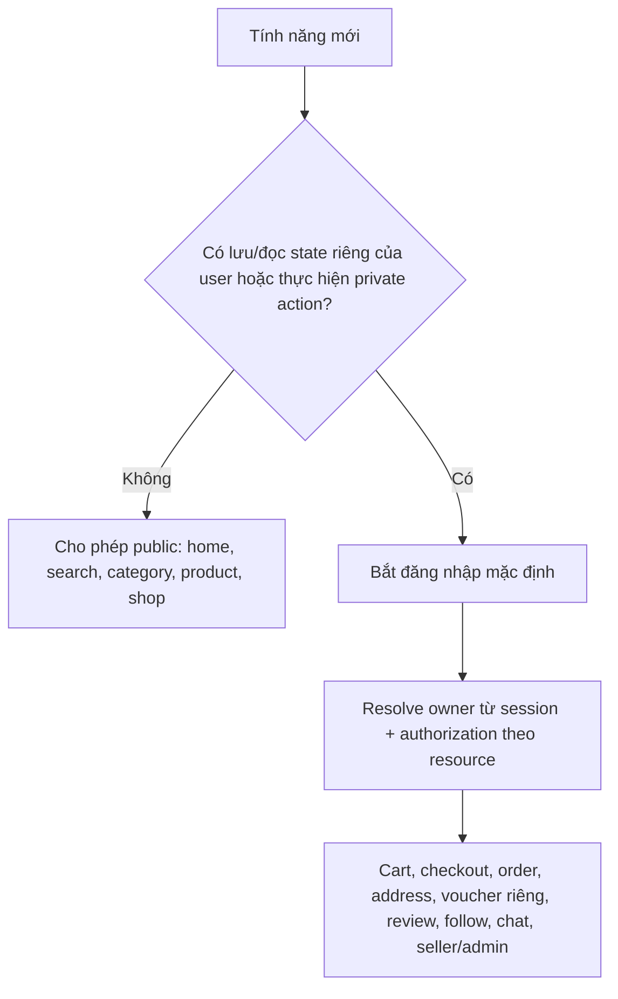

Một task sau chỉ được mở hành động user-scoped cho khách khi OpenSpec của task đó định nghĩa rõ mô
hình identity, privacy, abuse và CSRF riêng.

### Bảo vệ mutation toàn ứng dụng

```mermaid
flowchart TD
    request["Unsafe browser request"]
    origin{"Origin khớp allowlist tuyệt đối?"}
    media{"Không override method; JSON hợp lệ; body <= 100 KiB?"}
    class{"Security class của route?"}
    ordinary["Chạy guard rồi mới vào domain service"]
    oauth["Google callback có state/OIDC verifier"]
    webhook["Provider webhook có signature verifier"]
    deny["403/413/415 Problem Details đã làm sạch"]

    request --> origin
    origin -->|"Không"| deny
    origin -->|"Có"| media
    media -->|"Không"| deny
    media -->|"Có"| class
    class -->|"Ordinary"| ordinary
    class -->|"Google OAuth"| oauth
    class -->|"Signed webhook"| webhook
```

Rate limiter tổng quát chưa nằm trong T16; auth limiter hiện có được giữ nguyên.

## 12. Báo giá có thẩm quyền và vận chuyển mô phỏng T17


Browser không gửi giá, số lượng, phí hoặc tổng tiền vào quote. Backend tính lại từ PostgreSQL bằng
số nguyên VND và không ghi dữ liệu. Mỗi shop có một shipment `MOCK` với `ECONOMY`, `STANDARD` hoặc
`EXPRESS`; surcharge dựa trên tỉnh/thành cũ và tổng trọng lượng variant. Response cũ không được ghi
đè lựa chọn mới; đăng xuất xóa quote riêng tư khỏi bộ nhớ.

## 13. Preview voucher T18 và transaction checkout tương lai T19


Mã hợp lệ về cấu trúc nhưng không đủ điều kiện vẫn trả quote `200` cùng lý do an toàn; request có
field tiền, mã trùng hoặc slot trùng bị từ chối ở contract/DTO. T18 chỉ cung cấp preview và seam nội
bộ cho T19. Không có endpoint consume công khai; checkout phải sở hữu transaction và dùng cùng kết
quả tính lại có thẩm quyền trước khi ghi order, usage counter và redemption audit.

## 14. Checkout COD đa shop và purchase snapshot T19

```mermaid
flowchart TD
    buyer(["Buyer đã đăng nhập"])
    cart["/cart có quote hiện hành"]
    draft["sessionStorage draft v1<br/>chỉ ID, service và voucher code"]
    checkout["/checkout tải cart + address"]
    preview["POST /api/v1/checkout/preview<br/>If-Match cart version"]
    recalc["RepeatableRead: pricing-v2 + voucher-v1 + mock-v1"]
    blockers{"Có blocker?"}
    review["Hiển thị snapshot, ETA, voucher và tổng từ server"]
    edit{"Đổi address/service/note?"}
    stale["Đánh dấu stale + hủy response cũ"]
    key["Tạo/reuse UUID idempotency theo submit intent"]
    confirm["POST /api/v1/checkout/cod<br/>fingerprint + If-Match + Idempotency-Key"]
    lock["Serializable + advisory intent lock + cart FOR UPDATE"]
    replay{"Đã có buyer + key?"}
    digest{"Request digest giống?"}
    existing["200 replay purchase cũ"]
    keyConflict["409 idempotency conflict"]
    rebuild["Tính lại checkout và so fingerprint"]
    changed{"Preview còn khớp?"}
    reviewAgain["409 preview changed<br/>buyer xem tổng mới"]
    write["Ghi Purchase + 1 ShopOrder/shop + OrderLine snapshots"]
    voucher["Consume voucher + usage/redemption"]
    cleanup["Xóa đúng line đã mua + tăng cart version một lần"]
    commit{"Commit thành công?"}
    rollback["Rollback toàn bộ graph, voucher và cart"]
    success["201 purchaseReference"]
    result["/checkout/success/:reference"]
    ownerGet["GET owner-scoped committed snapshot"]
    missing["404 giống nhau cho missing/foreign"]

    buyer --> cart --> draft --> checkout --> preview --> recalc --> blockers
    blockers -->|"Có"| review
    blockers -->|"Không"| review --> edit
    edit -->|"Có"| stale --> preview
    edit -->|"Không"| key --> confirm --> lock --> replay
    replay -->|"Có"| digest
    digest -->|"Giống"| existing --> result
    digest -->|"Khác"| keyConflict
    replay -->|"Chưa"| rebuild --> changed
    changed -->|"Không"| reviewAgain --> review
    changed -->|"Có"| write --> voucher --> cleanup --> commit
    commit -->|"Không"| rollback
    commit -->|"Có"| success --> result --> ownerGet
    ownerGet -->|"Không thuộc buyer"| missing
```

Fingerprint loại `evaluatedAt` nhưng bao gồm cart version, full address, line/product/variant snapshot,
service, shipping, note, voucher allocations và toàn bộ phép cộng tiền. Hai request đồng thời cùng intent
hội tụ về một purchase; serialization conflict PostgreSQL `40001` được retry có giới hạn. Trang kết quả
chỉ đọc snapshot đã commit nên catalog thay đổi sau đó không làm đổi nội dung đơn. T19 kiểm tra tồn kho
lúc confirm nhưng chưa reserve hoặc decrement tồn kho; no-oversell giữa nhiều buyer thuộc T24.

## 15. Order history, lifecycle timeline và hủy đơn T20

```mermaid
flowchart TD
    buyer(["Buyer đã đăng nhập"])
    list["/account/orders + status filter"]
    listApi["GET /api/v1/account/orders<br/>opaque cursor + owner SQL"]
    snapshots["ShopOrder + committed snapshots"]
    cards["Order cards theo từng shop"]
    detail["/account/orders/:orderReference"]
    detailApi["GET owner detail + ETag + timeline"]
    allowed{"Server cho phép hủy?"}
    modal["Chọn reason + giữ một UUID retry"]
    cancel["POST /cancel<br/>If-Match + Idempotency-Key"]
    guard["Origin + Auth + strict parser"]
    lock["Lock ShopOrder thuộc buyer"]
    replay{"Key đã tồn tại?"}
    digest{"Digest giống?"}
    original["200 kết quả đã commit"]
    keyConflict["409 idempotency conflict"]
    version{"Version hiện hành<br/>và còn pending?"}
    stale["409 + web refresh detail"]
    update["CANCELLED + version increment"]
    event["Append BUYER timeline event"]
    commit["Atomic commit + updated detail"]

    buyer --> list --> listApi --> snapshots --> cards --> detail --> detailApi --> allowed
    allowed -->|"Không"| detail
    allowed -->|"Có"| modal --> cancel --> guard --> lock --> replay
    replay -->|"Có"| digest
    digest -->|"Giống"| original --> detail
    digest -->|"Khác"| keyConflict
    replay -->|"Chưa"| version
    version -->|"Không"| stale --> detailApi
    version -->|"Có"| update --> event --> commit --> detail
```

## 16. Đánh giá xác thực T21

```mermaid
flowchart TD
    buyer["Buyer mở đơn DELIVERED"] --> capability["GET order detail: review capability theo từng line"]
    capability --> eligible{"Line chưa được review?"}
    eligible -->|Không| existing["Hiện trạng đã đánh giá, không tạo bản ghi thứ hai"]
    eligible -->|Có| stage["POST review-media multipart: xác thực ảnh, owner, hạn 24 giờ"]
    stage --> create["POST review với Idempotency-Key"]
    create --> ownership["Transaction kiểm tra buyer + order line + DELIVERED"]
    ownership --> attach["Attach media STAGED của chính buyer"]
    attach --> aggregate["Tính lại rating product và shop từ VISIBLE reviews"]
    aggregate --> public["GET public review list: cursor + filter sao"]
    public --> edit["PATCH author review với If-Match review version"]
    edit --> stale{"ETag còn mới?"}
    stale -->|Không| reload["409, tải canonical review rồi giữ form để retry"]
    stale -->|Có| aggregate
```

Review chỉ gắn với một `OrderLine` đã giao và không public dữ liệu đơn hàng, email, địa chỉ, storage key hay trạng thái staging. Ảnh chỉ public sau khi được attach; ảnh staged hết hạn có cleanup command ở local storage. `HIDDEN` đã có persistence/audit boundary cho moderation sau này, vì thế không xuất hiện trong list public hay aggregate.

```mermaid
stateDiagram-v2
    [*] --> PENDING_CONFIRMATION
    PENDING_CONFIRMATION --> AWAITING_PICKUP
    PENDING_CONFIRMATION --> CANCELLED: Buyer hoặc internal actor
    AWAITING_PICKUP --> SHIPPING
    AWAITING_PICKUP --> CANCELLED: Internal actor tương lai
    SHIPPING --> DELIVERED
    DELIVERED --> RETURN_REQUESTED
    RETURN_REQUESTED --> RETURNED
    RETURN_REQUESTED --> REFUNDED
    RETURNED --> REFUNDED
    CANCELLED --> [*]
    REFUNDED --> [*]
```

Mỗi transition tăng `ShopOrder.version` đúng một lần và ghi một `OrderTimelineEvent` trong cùng
transaction. Buyer chỉ có command hủy ở `PENDING_CONFIRMATION`; các cạnh seller/return được lưu trong
state machine để task sau tái sử dụng nhưng T20 chưa mở endpoint tương ứng. List/detail chỉ dùng snapshot
T19 và filter ownership trong PostgreSQL, nên reference missing và foreign cùng trả `404` không liệt kê.

## 17. Seller onboarding và hồ sơ shop T22

```mermaid
flowchart TD
    buyer["Buyer account"] --> workspace["GET /seller/shop/workspace"]
    workspace --> accountAddress["Đọc địa chỉ account mặc định\n(defaultAddress hoặc null)"]
    accountAddress --> hasShop{"Có shop chưa xóa?"}
    hasShop -->|Không| apply["POST /seller/shop\nprofile + pickup/return address"]
    apply --> lock["Lock user + partial unique owner"]
    lock --> pending["PENDING_APPROVAL + INACTIVE"]
    hasShop -->|Có| completeAddress{"Pickup/return shop\nđầy đủ?"}
    completeAddress -->|Có| manage["Ưu tiên địa chỉ shop\nBuyer: PATCH registration\nSeller: PATCH profile"]
    completeAddress -->|Không| prefill["Prefill pickup + return\ntừ defaultAddress nếu có"] --> manage
    pending --> admin["Admin POST approval"]
    admin --> decision{"Quyết định"}
    decision -->|Approve| approved["Grant SELLER + APPROVED + ACTIVE\n(one transaction)"]
    decision -->|Reject| rejected["REJECTED + INACTIVE\nremains BUYER"]
    rejected --> manage
    approved --> toggle["Seller chỉ đổi ACTIVE/INACTIVE"]
    approved --> sellable["Catalog · storefront · cart · quote · checkout"]
    toggle --> sellable
    suspended["SUSPENDED"] --> unavailable["Ẩn/chặn sale, không lộ lý do buyer"]
    pending --> unavailable
    rejected --> unavailable
    toggle --> unavailable
```

Owner identity luôn lấy từ session; browser không truyền `ownerId`. `defaultAddress` chỉ là dữ liệu
khởi tạo form: shop đã có địa chỉ đầy đủ luôn được ưu tiên, còn thay đổi địa chỉ account sau này không tự
ghi đè shop. Điều kiện bán là shop chưa xóa,
`APPROVED` và `ACTIVE`, được kiểm tra lại ở cart, báo giá và checkout để trạng thái shop thay đổi sau
khi buyer thêm hàng vào giỏ không thể tạo sale mới. Slug giữ unique toàn cục, còn owner và tên shop chỉ
unique với shop chưa soft-delete.

## 18. Seller Center: quản lý sản phẩm T23

```mermaid
flowchart LR
    seller["Seller shop đã duyệt"] --> center["/seller\nSeller Center sidebar"]
    center --> shop["Hồ sơ shop: xem chỉ đọc / cập nhật"]
    center --> list["Sản phẩm\n/seller/products"]
    list --> editor["Tạo mới hoặc chỉnh sửa editor"]
    editor --> draft["POST/PATCH: lưu DRAFT"]
    editor --> options["Thêm tối đa 2 nhóm\nMàu sắc: Đỏ/Xanh\nKích cỡ: M/L"]
    options --> combinations["Tự sinh Đỏ-M, Đỏ-L, Xanh-M, Xanh-L"]
    combinations --> stock["Seller nhập tồn kho từng dòng"]
    stock --> validation{"Category, media, stock, dimensions hợp lệ?"}
    validation -->|Không| errors["Problem Details theo field\nGiữ dữ liệu form"] --> editor
    validation -->|Có| publish["PATCH lifecycle: PUBLISHED"]
    publish --> public["Catalogue · Storefront · Product detail"]
    public --> purchase["Cart · Quote · Checkout re-check"]
    editor --> identifiers["Server tự sinh slug + SKU\nkhông cho seller nhập"]
    editor --> hide["HIDDEN / ARCHIVED"]
    moderation["Moderation SUSPENDED"] --> hidden["Không public, không mua"]
    hide --> hidden
```

Shop ID không nằm trong payload seller. Mọi mutation lookup shop từ access session đã có role `seller`,
và public/purchase flows chỉ nhận listing `ACTIVE`/published, moderation `ACTIVE`, category hợp lệ,
shop active/approved, variant active và tồn kho dương. Product đã archive vẫn hiện cho owner nhưng không
thể publish lại; moderation là boundary cho admin task tiếp theo nên seller không thể tự override.

## 19. Seller profile và product media

```mermaid
flowchart TD
    openShop["Mở /seller/shop"] --> exists{"Shop đã tồn tại?"}
    exists -->|"Chưa"| onboarding["Form đăng ký shop"]
    exists -->|"Rồi"| profile["Hồ sơ chỉ đọc"]
    profile --> edit["Cập nhật hồ sơ"]
    edit --> form["Form điền từ canonical data"]
    form --> action{"Lưu hoặc hủy"}
    action -->|"Hủy"| profile
    action -->|"Lưu thành công"| profile
    action -->|"Lỗi"| form

    product["/seller/products/new"] --> pick["Chọn nhiều ảnh local"]
    pick --> validate["Client kiểm tra JPG/PNG/WebP, 5 MB, tối đa 9"]
    validate --> upload["POST /api/v1/seller/products/media\nfile từng ảnh, multipart, Origin guard"]
    upload --> staged["Asset STAGED, preview riêng seller, hết hạn 24h"]
    staged --> gallery["Gallery preview, xóa, sắp xếp, retry"]
    gallery --> mapping["Ảnh cho từng giá trị nhóm đầu\nĐỏ dùng chung Đỏ-M và Đỏ-L"]
    mapping --> save["POST/PATCH /api/v1/seller/products"]
    save --> tx{"Ownership + expiry + payload hợp lệ?"}
    tx -->|"Không"| retry["Rollback, giữ staged asset"]
    tx -->|"Có"| attach["Transaction attach ProductImage + option image"]
    attach --> public["GET /api/v1/product-media/:id\nCatalog/detail hiển thị URL public"]
```

Màn hình kiểm thử: `/seller/shop` (shop đã có dữ liệu phải thấy hồ sơ và nút `Cập nhật hồ sơ`),
`/seller/products/new` hoặc `/seller/products/:productId` (chọn nhiều ảnh, kéo thứ tự, gán ảnh
cho `Đỏ`/`Xanh`, kiểm tra các tổ hợp và tồn kho). Endpoint media gồm `POST
/api/v1/seller/products/media`, `GET /api/v1/seller/products/media/:mediaId/preview` và
`GET /api/v1/product-media/:mediaId`. Ảnh staged không được đọc qua public route trước khi lưu
sản phẩm.

## 20. Kế hoạch T24: tồn kho và checkout reservation

> Trạng thái: Đã apply backend, migration, pg-boss TTL và Seller Center; concurrency/API/UI regression suites đã có kiểm thử tự động.

```mermaid
flowchart TD
    seller["Seller mở /seller/inventory"] --> balances["GET /api/v1/seller/inventory\nOn-hand · Reserved · Sold · Available"]
    balances --> adjust["Nhập delta + lý do + ghi chú"]
    adjust --> request["POST /seller/inventory/:variantId/adjustments\nIf-Match + Idempotency-Key"]
    request --> lock["Lock inventory row + kiểm tra version"]
    lock --> valid{"onHand + delta >= reserved\nvà không âm?"}
    valid -->|Không| conflict["409 Problem Details\nReload balance, giữ form"]
    valid -->|Có| commit["Cập nhật on-hand + version\nGhi audit event bất biến"]
    commit --> balances
```

```mermaid
sequenceDiagram
    actor Buyer
    participant Checkout as Checkout API
    participant Inventory as Inventory service
    participant DB as PostgreSQL
    participant Queue as One-shot expiry queue

    Buyer->>Checkout: POST /checkout/cod
    Checkout->>DB: Rebuild cart + pricing + fingerprint
    Checkout->>Inventory: Reserve authoritative quantities
    Inventory->>DB: Lock variants theo UUID tăng dần
    alt Đủ available stock cho tất cả dòng
        Inventory->>DB: reserved += quantity + ACTIVE reservation
        Inventory->>Queue: Chạy một lần tại expiresAt
        Checkout->>DB: Transaction order + voucher + cart cleanup
        Checkout->>Inventory: Consume trong cùng transaction
        Inventory->>DB: reserved -= qty; onHand -= qty; sold += qty
        Checkout-->>Buyer: Purchase thành công
    else Một dòng thiếu stock
        Inventory-->>Checkout: Atomic rollback
        Checkout-->>Buyer: 409 insufficient stock
    end
```

```mermaid
stateDiagram-v2
    [*] --> ACTIVE: checkout giữ hàng
    ACTIVE --> CONSUMED: purchase commit
    ACTIVE --> RELEASED: checkout thất bại
    ACTIVE --> EXPIRED: one-shot job tới expiresAt
    CONSUMED --> [*]
    RELEASED --> [*]
    EXPIRED --> [*]
```

`available = onHand - reserved` là công thức duy nhất cho catalog, product detail, cart, quote,
checkout và Seller Center. Reservation chỉ bắt đầu khi buyer xác nhận COD, không giữ hàng lúc xem
sản phẩm, thêm giỏ hoặc preview. Job hết hạn là one-shot pg-boss lưu bền vững trong PostgreSQL tại
`expiresAt = databaseNow + 15 phút`, không phải CronJob; nếu worker bị gián đoạn thì job chạy muộn và
chỉ làm stock bị giữ lâu hơn, không gây oversell. Reservation và job phải commit cùng transaction;
enqueue không được âm thầm bỏ qua.

Kiểm thử API seller: `GET /api/v1/seller/inventory?lowStock=true`, `GET
/api/v1/seller/inventory/:variantId/adjustments`, và `POST
/api/v1/seller/inventory/:variantId/adjustments` với `If-Match: "inventory-<version>"`,
`Idempotency-Key: <UUID>` và body `{ "delta": 10, "reason": "RESTOCK", "note": null }`.
Màn hình tương ứng là `/seller/inventory`; nút `Điều chỉnh` mở form delta/lý do, còn `Lịch sử`
hiển thị before/delta/after. Migration local chạy bằng `pnpm --filter @shopee-clone/api
db:migrate:deploy`; worker expiry dùng pg-boss với `DATABASE_URL`, không lưu credential riêng.
Nếu migration dừng giữa chừng, chỉ sau khi kiểm tra DB và backup mới dùng `prisma migrate resolve
--rolled-back 20260817160000_inventory_reservations`, sửa nguyên nhân rồi chạy lại
`db:migrate:deploy`; không sửa trực tiếp `_prisma_migrations` trên môi trường production.

## 21. Kế hoạch: pg-boss TTL 15 phút cho inventory reservation

> Trạng thái: Đã apply; giữ nguyên TTL 15 phút và dùng database time/transactional pg-boss.

```mermaid
flowchart LR
    reserve["Tạo ACTIVE reservation\nexpiresAt = DB time + 15 phút"] --> tx["Cùng PostgreSQL transaction:\nreserved stock + pg-boss job"]
    tx --> committed{"Reservation và job\nđều commit?"}
    committed -->|Không| rollback["Rollback toàn bộ\nkhông giữ stock"]
    committed -->|Có| delay["pg-boss lưu job\nchạy tại expiresAt"]
    delay --> expired["Expiry worker"]
    expired --> verify{"DB vẫn ACTIVE, đúng generation\nvà databaseNow >= expiresAt?"}
    verify -->|Có| release["reserved -= quantity\nreservation EXPIRED\nhold EXPIRED"]
    release --> pending["Order vẫn PENDING\nchặn payment/fulfillment\ncho tới khi reserve lại"]
    verify -->|Không| noop["No-op\nCONSUMED/RELEASED/stale/early"]
    paymentFail["Payment FAILED trước 15 phút"] --> immediate["Shared release command\nreservation RELEASED"]
    immediate --> pending
```

```mermaid
stateDiagram-v2
    [*] --> ACTIVE: giữ tồn kho thành công
    ACTIVE --> CONSUMED: payment hoặc COD commit
    ACTIVE --> RELEASED: payment thất bại
    ACTIVE --> EXPIRED: pg-boss chạy tại/sau expiresAt 15 phút
    RELEASED --> ACTIVE: reserve lại bằng generation mới
    EXPIRED --> ACTIVE: reserve lại bằng generation mới
    CONSUMED --> [*]
```

pg-boss dùng chính PostgreSQL và `DATABASE_URL`, nên không cần RabbitMQ, Redis, outbox hay credential
dịch vụ mới. Job được ghi bằng transaction Prisma hiện tại; nếu không ghi được job thì reservation cũng
phải rollback. Worker luôn dùng database time, lock lại reservation/inventory và kiểm tra generation,
vì vậy job trùng, job cũ hoặc đến sau khi thanh toán thành công không thay đổi tồn kho lần hai.

Record reservation được giữ để audit; “xóa reservation” trong nghiệp vụ nghĩa là nhả stock hold và đổi
sang `EXPIRED`/`RELEASED`, không hard-delete. Payment failure gọi release ngay, còn pg-boss chỉ là
recovery cho reservation còn `ACTIVE` tới hạn. Không dùng CronJob hoặc `setTimeout` 15 phút trong API.

## 22. Soft delete và cleanup sản phẩm sau 7 ngày

```mermaid
flowchart LR
    seller["Seller mở /seller/products"] --> confirm["Custom alertdialog\nảnh + cảnh báo 7 ngày"]
    confirm -->|Hủy/Escape| restore["Đóng dialog, trả focus"]
    confirm -->|Xác nhận| delete["DELETE /api/v1/seller/products/:productId"]
    delete --> tx["Transaction: ownership + DB clock\ndeletedAt + dọn cart/favorite/placement"]
    tx --> hidden["Ẩn ngay khỏi seller/catalog/cart/quote/checkout"]
    hidden --> wait["Giữ record và media private\ntrong 7 ngày"]
    cron["04:00 Asia/Ho_Chi_Minh\n@nestjs/schedule"] --> lock["PostgreSQL advisory lock"]
    lock --> batch["Batch 100\nclock_timestamp()"]
    batch --> boundary{"deletedAt < DB time - 7 days?"}
    boundary -->|Không| next["Đợi run sau"]
    boundary -->|Có| history{"Order/review/reservation/\ndataset/sold history?"}
    history -->|Có| tombstone["purgeBlockedAt + HISTORICAL_TOMBSTONE\nGiữ tombstone private"]
    history -->|Không| purge["Xóa authoring graph\ncart/variant/inventory/audit/options"]
    purge --> stage["Stage media trong transaction"]
    stage --> commit["Commit DB"]
    commit --> storage["Xóa S3/local sau commit"]
    storage -->|Lỗi| retry["Giữ STAGED để retry cleanup"]
    storage -->|Thành công| mediaRows["Xóa media metadata"]
```

Các endpoint kiểm tra: `DELETE /api/v1/seller/products/:productId` (204, `no-store`) và
`GET /api/v1/health/product-retention` (status aggregate, không có dữ liệu nhạy cảm). Màn hình kiểm thử
là `/seller/products` với sản phẩm draft/published, dialog xác nhận, sau đó xác nhận sản phẩm biến mất;
trang `/products/{id}` của sản phẩm đã xóa hiển thị `Sản phẩm đã bị xóa` qua `410 PRODUCT_DELETED`.

## 23. Inventory chỉ hiển thị sản phẩm đang bán

```mermaid
flowchart TD
    seller["Seller mở /seller/inventory"] --> request["GET /api/v1/seller/inventory"]
    request --> predicate["Predicate chung:\nshop APPROVED + ACTIVE\nproduct ACTIVE + moderation ACTIVE + category active\nvariant ACTIVE + chưa xóa"]
    predicate --> low["Lọc low-stock bằng available = onHand - reserved"]
    low --> cursor["Cursor + LIMIT (eligible rows trước pagination)"]
    cursor --> image["Chọn ảnh đầu theo sortOrder, id\nproductImageUrl hoặc null"]
    image --> ui["Thumbnail cố định + fallback\n/seller/inventory"]
    ui --> mutation["POST /seller/inventory/:variantId/adjustments"]
    mutation --> recheck["Recheck predicate + version/idempotency\ntrong transaction"]
    recheck -->|Không hợp lệ| refresh["Problem Details no-store\nrefresh published-only list"]
    recheck -->|Hợp lệ| audit["Update balance + audit immutable"]
```

Inventory không hiển thị draft, hidden, archived, suspended, soft-deleted hoặc variant inactive.
API và UI đều không nhận storage credential; ảnh S3/local chỉ là URL đã được server kiểm tra.

## 24. Review/order history với sản phẩm đã xóa

```mermaid
sequenceDiagram
    actor Buyer
    participant Orders as Order history API
    participant DB as PostgreSQL
    participant Product as Product detail API
    participant Web as `/products/{id}`
    Buyer->>Orders: GET /api/v1/account/orders
    Orders->>DB: OrderLine snapshot + product.deletedAt
    DB-->>Orders: productName/image snapshot, productAvailable=false
    Orders-->>Buyer: Link `/products/{id}` vẫn giữ nguyên
    Buyer->>Product: GET /api/v1/catalog/products/{id}
    Product->>DB: tìm public row, sau đó deleted tombstone
    DB-->>Product: deletedAt IS NOT NULL
    Product-->>Web: 410 Problem Details code PRODUCT_DELETED
    Web-->>Buyer: `Sản phẩm đã bị xóa` + quay lại an toàn
```

Review/order snapshot không bị xóa; chỉ product authoring graph đủ điều kiện mới bị purge. Product
không tồn tại trả 404 generic, còn tombstone trả 410 tối thiểu, không lộ seller, mô tả, media hay
`purgeBlockReason`.
