# Flow các tính năng đã triển khai

Tài liệu này mô tả trạng thái hiện tại của Shopee Clone sau TS01 và các task đến T20. Các sơ đồ tập trung vào luồng đang hoạt động trong code; checkout COD, order history và hủy đơn đã có, còn thanh toán online, chat và vận chuyển thật chưa được triển khai.

## 1. Tổng quan phạm vi

| Nhóm               | Màn hình hoặc điểm vào                                                      | Chức năng hiện có                                                                            |
| ------------------ | --------------------------------------------------------------------------- | -------------------------------------------------------------------------------------------- |
| Nền tảng giao diện | `/`, `/design-system`, layout storefront                                    | Design system, header dùng chung, tìm kiếm, điều hướng danh mục, responsive và accessibility |
| Trang chủ          | `/`                                                                         | Banner chiến dịch, danh mục, flash sale, bán chạy, Mall và gợi ý hằng ngày từ API            |
| Khám phá sản phẩm  | `/search`                                                                   | Tìm kiếm, lọc, sắp xếp, phân trang và URL có thể chia sẻ                                     |
| Chi tiết sản phẩm  | `/products/{productId}`                                                     | Gallery, biến thể, giá, tồn kho, số lượng, shop, sản phẩm liên quan và purchase intent       |
| Tài khoản          | `/login`, `/register`, `/forgot-password`, `/reset-password`                | Email/password, Google OIDC, refresh session, logout và khôi phục mật khẩu                   |
| Phân quyền         | `/seller`, `/admin` và API tương ứng                                        | Buyer mặc định, seller theo quyền và ownership, admin quản lý role và audit                  |
| Hồ sơ giao hàng    | `/account/profile`, `/account/addresses`                                    | Hồ sơ, số điện thoại, CRUD địa chỉ và địa chỉ mặc định                                       |
| Tương tác buyer    | `/account/favorites`, `/account/recently-viewed`, `/account/followed-shops` | Yêu thích, lịch sử xem gần đây và danh sách shop đang theo dõi riêng theo tài khoản          |
| Gian hàng          | `/shops/{shopSlug}`                                                         | Hồ sơ shop, catalog riêng, tìm kiếm/lọc/sắp xếp/phân trang và theo dõi shop                  |
| Dữ liệu            | `asserts/*.json`, PostgreSQL                                                | Import 1.377 sản phẩm chuẩn hóa, idempotent, có provenance và dữ liệu sinh xác định          |

## 2. Kiến trúc chạy ứng dụng

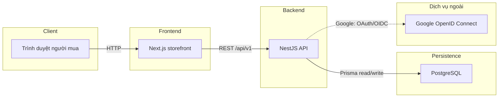

`@shopee-clone/contracts` giữ kiểu dữ liệu và parser dùng chung giữa frontend và backend. Dữ liệu riêng tư và mọi phản hồi phụ thuộc phiên đều dùng `Cache-Control: no-store`.

## 3. Hành trình khám phá sản phẩm công khai


Catalog chỉ trả sản phẩm đủ điều kiện hiển thị. Search hỗ trợ `q`, danh mục, khoảng giá, rating, vị trí shop, còn hàng, đang giảm giá và năm kiểu sắp xếp. Trang chi tiết ghi lựa chọn biến thể/số lượng vào giỏ server-side; chưa giữ tồn kho hoặc tạo đơn.

## 4. Vòng đời xác thực và session

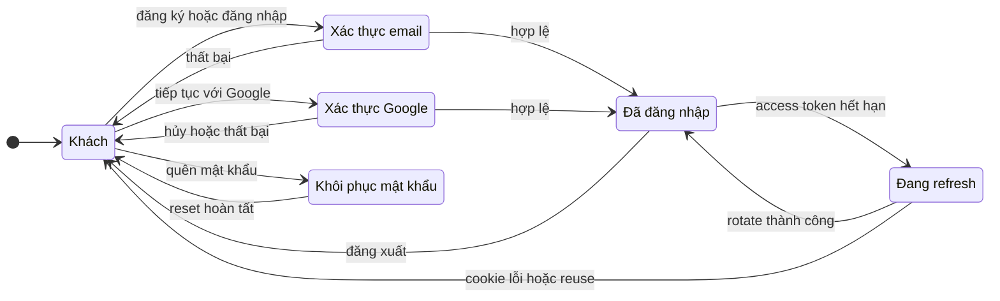

- Access token chỉ nằm trong React runtime memory.
- Refresh token chỉ nằm trong cookie `HttpOnly`, được lưu ở database dưới dạng digest và rotate theo từng lần refresh.
- Logout là idempotent; reset mật khẩu thu hồi các refresh session hiện có.
- Browser không lưu token trong local storage hoặc session storage.

### Đăng nhập Google và tạo session nội bộ

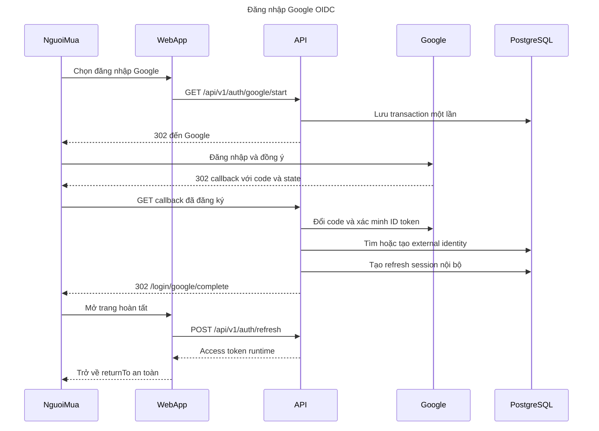

Google `sub` là định danh bên ngoài. Google access token, refresh token và ID token chỉ tồn tại tạm thời ở backend trong lúc xác minh rồi bị loại bỏ; ứng dụng chỉ duy trì session nội bộ. Email đã thuộc một tài khoản local nhưng chưa liên kết sẽ không được tự động gộp.

## 5. Phân quyền buyer, seller và admin


JWT chỉ mang identity (`sub`, `sid`). Backend luôn đọc role và ownership mới nhất từ PostgreSQL, vì vậy thu hồi role có hiệu lực ngay ở request tiếp theo. Admin không tự động có quyền seller và hệ thống không nhận `ownerId` do browser gửi lên.

## 6. Hồ sơ và địa chỉ giao hàng

```mermaid
flowchart LR
    signedIn(["Buyer đã đăng nhập"])
    profilePage["Trang hồ sơ"]
    profileApi["GET hoặc PATCH /account/profile"]
    addressPage["Trang địa chỉ"]
    provincePopup["Popup 63 tỉnh/thành cũ"]
    districtPopup["Popup quận/huyện phụ thuộc"]
    wardKind{"Quận/huyện có tổ chức cấp xã?"}
    wardChunk["Tải lười snapshot 10.035 phường/xã"]
    wardPopup["Popup phường/xã phụ thuộc"]
    noWardSentinel["Tự chọn sentinel không có cấp xã"]
    addressAction{"Thao tác địa chỉ?"}
    accountApi["Account API"]
    userLock["Khóa user FOR UPDATE"]
    ownerCheck["Kiểm tra ownership"]
    mutation["Create, update, delete hoặc set default"]
    defaultInvariant["Duy trì đúng một default"]
    database[("PostgreSQL")]

    signedIn --> profilePage
    profilePage --> profileApi
    profileApi --> database
    signedIn --> addressPage
    addressPage --> provincePopup
    provincePopup --> districtPopup
    districtPopup --> wardKind
    wardKind -->|"Có"| wardChunk
    wardChunk --> wardPopup
    wardPopup --> addressAction
    wardKind -->|"Không: 5 huyện đặc thù"| noWardSentinel
    noWardSentinel --> addressAction
    addressAction --> accountApi
    accountApi --> userLock
    userLock --> ownerCheck
    ownerCheck --> mutation
    mutation --> defaultInvariant
    defaultInvariant --> database
```

Khi đổi tỉnh, cả district và ward không tương thích bị xóa; khi đổi district, ward bị xóa. Chọn lại cùng cấp cha giữ lựa chọn con, còn giá trị cũ ngoài snapshot được bảo toàn cho tới khi người dùng chủ động đổi cấp cha. Ward snapshot chỉ được tải từ asset nội bộ sau khi nhận diện district; browser không gọi NSO ở runtime. Năm huyện `Bạch Long Vĩ`, `Cồn Cỏ`, `Hoàng Sa`, `Lý Sơn` và `Côn Đảo` tự dùng sentinel `Không có đơn vị hành chính cấp xã`. API tiếp tục lưu province/district/ward dạng chuỗi.

Địa chỉ đầu tiên tự trở thành mặc định; xóa địa chỉ mặc định sẽ chọn địa chỉ cũ nhất còn hoạt động. ID không tồn tại, đã xóa hoặc thuộc user khác đều trả cùng một lỗi `404` đã làm sạch.

## 7. Yêu thích, xem gần đây và theo dõi shop


Favorites vẫn giữ một projection tối thiểu cho sản phẩm về sau không còn công khai để buyer có thể xóa. Recently viewed loại sản phẩm không còn hiển thị khỏi items và totals. Mọi quan hệ đều được truy vấn theo user đang xác thực.

### Trạng thái nút theo dõi shop

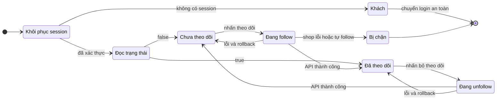

Nút follow trên storefront cập nhật lạc quan nhưng khóa thao tác lặp trong lúc request đang chạy. `404` chặn shop không công khai; `409` chặn owner tự theo dõi shop. Unfollow vẫn idempotent khi shop đã unavailable và không làm lộ follower count riêng tư.

### Danh sách shop đang theo dõi

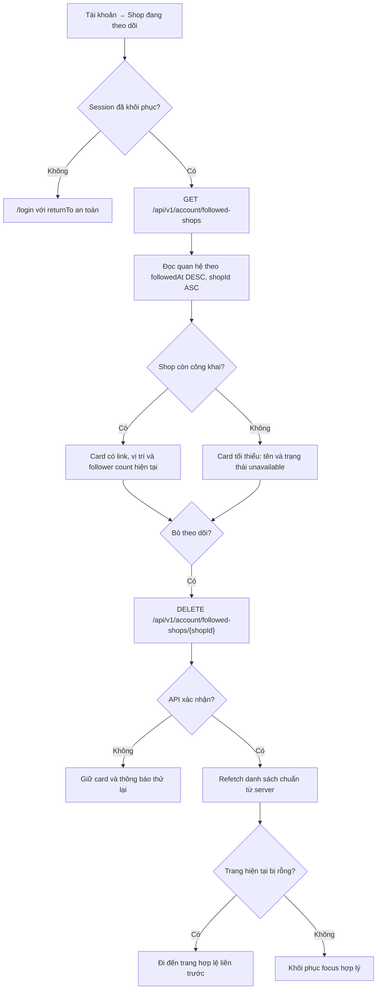

Danh sách được phân trang theo owner đang đăng nhập và luôn `no-store`. Shop inactive hoặc soft-deleted vẫn xuất hiện ở dạng tối thiểu để buyer có thể bỏ theo dõi; hard-delete dùng cascade nên quan hệ biến mất. Card chỉ bị loại sau khi DELETE thành công và frontend đã đọc lại dữ liệu có thẩm quyền từ backend.

## 8. Luồng tải public shop storefront

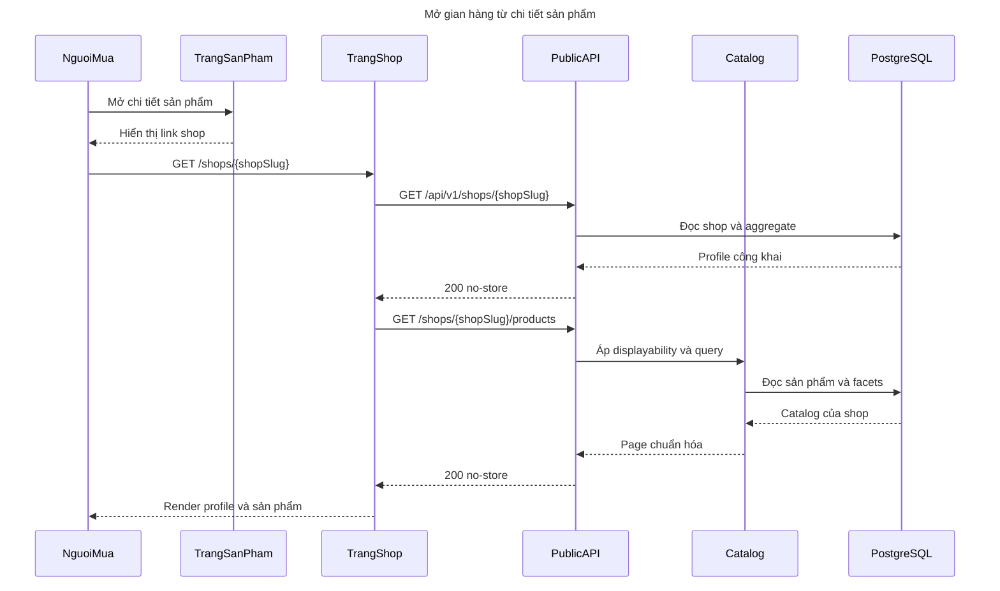

Shop không tồn tại, inactive, deleted hoặc slug không chuẩn đều dùng cùng presentation not-found. Rating shop được tính theo rating-count-weighted; danh mục và tổng sản phẩm chỉ tính sản phẩm công khai đủ điều kiện.

## 9. Luồng import dataset và chạy local

```mermaid
flowchart LR
    developer(["Developer"])
    install["pnpm install"]
    infrastructure["infra:up"]
    migrate["db:migrate:deploy"]
    seed["db:seed"]
    sourceDocs["6 file asserts/*.json"]
    validate["Validate manifest và checksum"]
    validData{"Dataset hợp lệ?"}
    reject(["Dừng trước khi ghi DB"])
    normalize["Chuẩn hóa dataset-v1"]
    transaction["Transactional upsert"]
    provenance["Lưu provenance và fallback metadata"]
    database[("PostgreSQL local")]
    verify["db:verify và quick E2E"]

    developer --> install
    install --> infrastructure
    infrastructure --> migrate
    migrate --> seed
    sourceDocs --> validate
    seed --> validate
    validate --> validData
    validData -->|"Không"| reject
    validData -->|"Có"| normalize
    normalize --> transaction
    transaction --> provenance
    provenance --> database
    database --> verify
```

Importer chạy local, không crawl mạng, không dùng dữ liệu ngẫu nhiên và an toàn khi chạy lặp. Ba giá thiếu và 952 rating thiếu được sinh xác định theo policy `dataset-v1`. Automatic GitHub Actions trigger hiện vẫn tạm tắt; các quality gate được chạy local hoặc manual dispatch.

## 10. Các ranh giới chưa triển khai

- Báo giá giỏ hàng dùng phí vận chuyển mô phỏng và preview voucher; không giữ tồn kho, giữ lượt voucher, cam kết cước cuối cùng hoặc tạo đơn.
- Purchase intent ở trang sản phẩm chưa báo checkout thành công.
- Đã có checkout COD, order history theo shop, timeline và hủy đơn chờ xác nhận; chưa có thanh toán online, shipment thật, seller fulfillment, return/refund workflow, review body, chat hoặc notification realtime.
- Seller mới có role/ownership boundary và safe shop projection, chưa có bộ công cụ quản lý gian hàng hoàn chỉnh.
- Admin hiện tập trung vào role assignment/revocation và role audit, chưa phải dashboard vận hành marketplace đầy đủ.

## 11. Giỏ hàng đa shop yêu cầu đăng nhập

### Đăng nhập trước khi thêm hoặc quản lý giỏ hàng


Mọi endpoint `/api/v1/cart/**` yêu cầu bearer session hợp lệ và chỉ lấy owner từ tài khoản đã xác
thực. Khách không gọi Cart API, header hiển thị 0 và `/cart` cung cấp login handoff. Không có guest
cookie, guest cart, merge endpoint hoặc cleanup job. Khi đăng xuất, `CartProvider` xóa ngay projection
riêng tư khỏi bộ nhớ. Mọi mutation trả lại toàn bộ projection đã xác nhận và các điều chỉnh số
lượng/giá có kiểu rõ ràng.

### Chính sách xác thực cho các phase tiếp theo

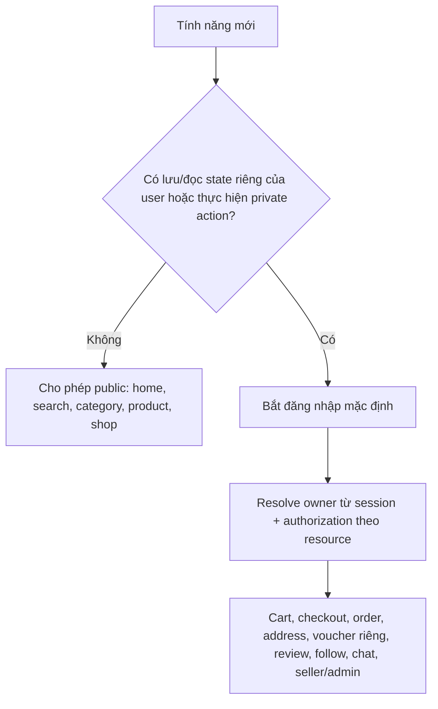

Một task sau chỉ được mở hành động user-scoped cho khách khi OpenSpec của task đó định nghĩa rõ mô
hình identity, privacy, abuse và CSRF riêng.

### Bảo vệ mutation toàn ứng dụng

```mermaid
flowchart TD
    request["Unsafe browser request"]
    origin{"Origin khớp allowlist tuyệt đối?"}
    media{"Không override method; JSON hợp lệ; body <= 100 KiB?"}
    class{"Security class của route?"}
    ordinary["Chạy guard rồi mới vào domain service"]
    oauth["Google callback có state/OIDC verifier"]
    webhook["Provider webhook có signature verifier"]
    deny["403/413/415 Problem Details đã làm sạch"]

    request --> origin
    origin -->|"Không"| deny
    origin -->|"Có"| media
    media -->|"Không"| deny
    media -->|"Có"| class
    class -->|"Ordinary"| ordinary
    class -->|"Google OAuth"| oauth
    class -->|"Signed webhook"| webhook
```

Rate limiter tổng quát chưa nằm trong T16; auth limiter hiện có được giữ nguyên.

## 12. Báo giá có thẩm quyền và vận chuyển mô phỏng T17

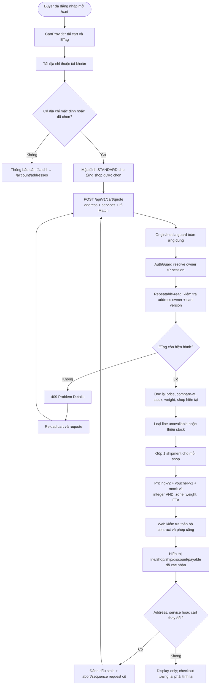

Browser không gửi giá, số lượng, phí hoặc tổng tiền vào quote. Backend tính lại từ PostgreSQL bằng
số nguyên VND và không ghi dữ liệu. Mỗi shop có một shipment `MOCK` với `ECONOMY`, `STANDARD` hoặc
`EXPRESS`; surcharge dựa trên tỉnh/thành cũ và tổng trọng lượng variant. Response cũ không được ghi
đè lựa chọn mới; đăng xuất xóa quote riêng tư khỏi bộ nhớ.

## 13. Preview voucher T18 và transaction checkout tương lai T19

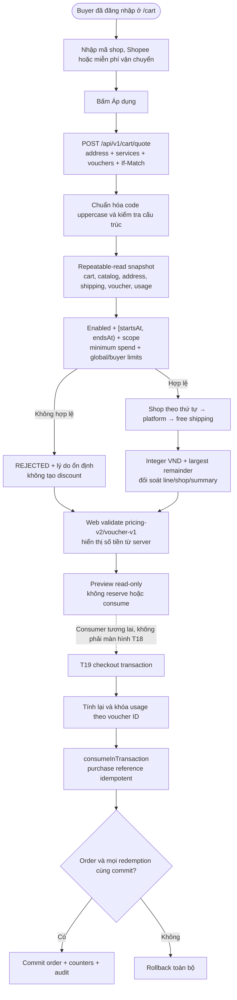

Mã hợp lệ về cấu trúc nhưng không đủ điều kiện vẫn trả quote `200` cùng lý do an toàn; request có
field tiền, mã trùng hoặc slot trùng bị từ chối ở contract/DTO. T18 chỉ cung cấp preview và seam nội
bộ cho T19. Không có endpoint consume công khai; checkout phải sở hữu transaction và dùng cùng kết
quả tính lại có thẩm quyền trước khi ghi order, usage counter và redemption audit.

## 14. Checkout COD đa shop và purchase snapshot T19

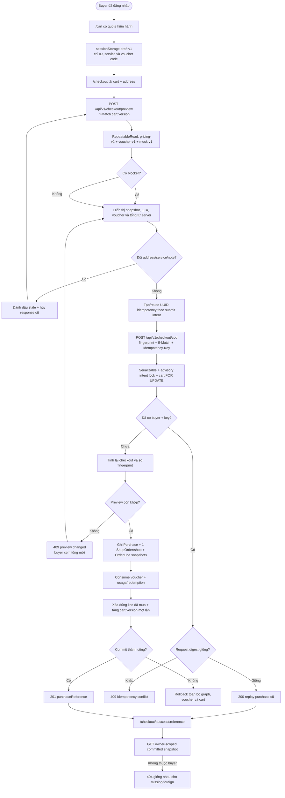

Fingerprint loại `evaluatedAt` nhưng bao gồm cart version, full address, line/product/variant snapshot,
service, shipping, note, voucher allocations và toàn bộ phép cộng tiền. Hai request đồng thời cùng intent
hội tụ về một purchase; serialization conflict PostgreSQL `40001` được retry có giới hạn. Trang kết quả
chỉ đọc snapshot đã commit nên catalog thay đổi sau đó không làm đổi nội dung đơn. T19 kiểm tra tồn kho
lúc confirm nhưng chưa reserve hoặc decrement tồn kho; no-oversell giữa nhiều buyer thuộc T24.

## 15. Order history, lifecycle timeline và hủy đơn T20

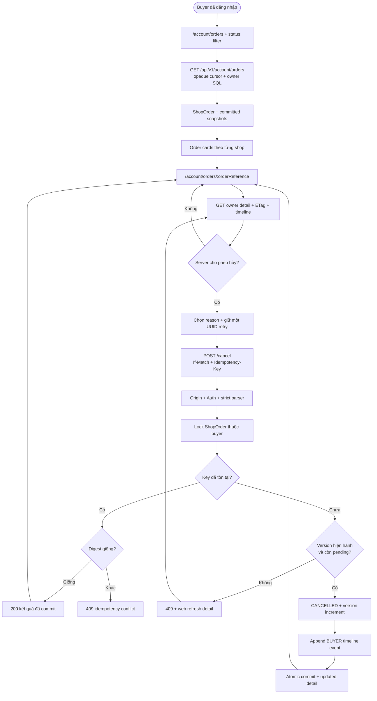

## 16. Đánh giá xác thực T21

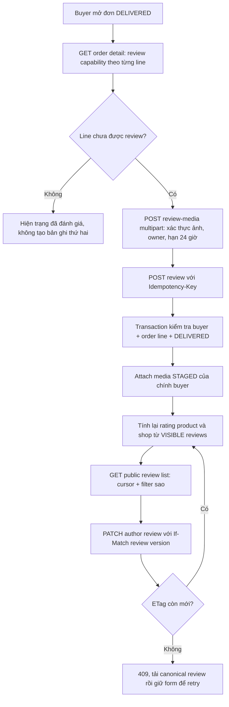

Review chỉ gắn với một `OrderLine` đã giao và không public dữ liệu đơn hàng, email, địa chỉ, storage key hay trạng thái staging. Ảnh chỉ public sau khi được attach; ảnh staged hết hạn có cleanup command ở local storage. `HIDDEN` đã có persistence/audit boundary cho moderation sau này, vì thế không xuất hiện trong list public hay aggregate.

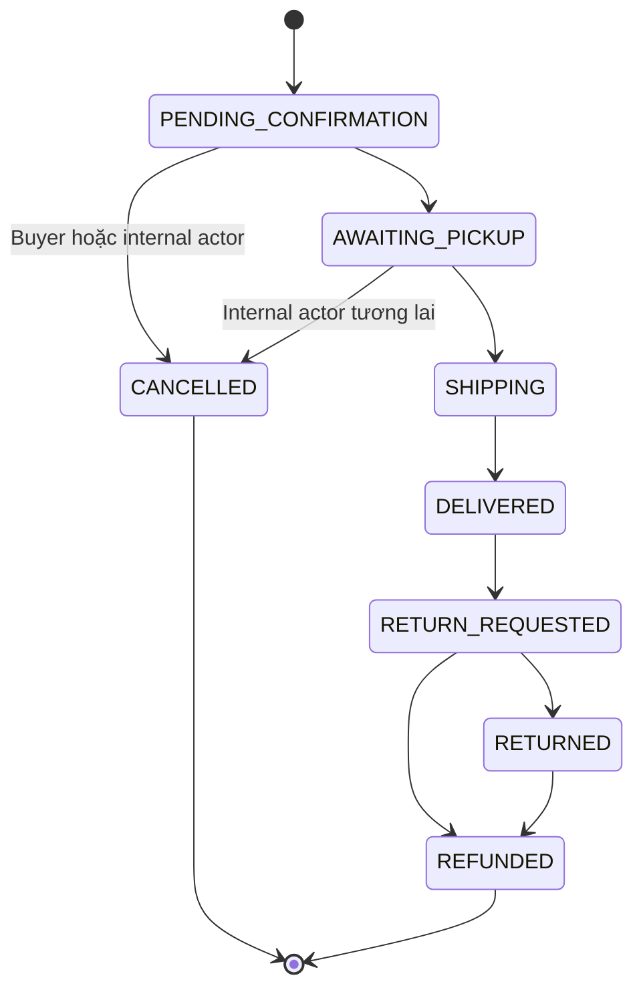

Mỗi transition tăng `ShopOrder.version` đúng một lần và ghi một `OrderTimelineEvent` trong cùng
transaction. Buyer chỉ có command hủy ở `PENDING_CONFIRMATION`; các cạnh seller/return được lưu trong
state machine để task sau tái sử dụng nhưng T20 chưa mở endpoint tương ứng. List/detail chỉ dùng snapshot
T19 và filter ownership trong PostgreSQL, nên reference missing và foreign cùng trả `404` không liệt kê.
