## Context

See `proposal.md` for motivation and `specs/buyer-followed-shops/spec.md` for observable behavior. T15 already provides `ShopFollower`, two pagination-oriented indexes, status lookup, idempotent follow/unfollow, the public shop profile, `ShopFollowControl`, strict shop contracts, and a mocked shop quick-E2E runner. T13 and T14 provide protected account navigation, client-side `authenticatedFetch`, page-based private lists, unavailable-item presentation, and pagination patterns.

The missing path is a relationship-first read. A buyer can currently inspect follow state only after opening a known storefront. T15 intentionally deferred a followed-shops list, so no existing API contract or screen can be extended implicitly. This change crosses shared contracts, the existing NestJS shop module, private account UI, and database/browser verification, but it requires no new persistence model or external dependency.

## Goals / Non-Goals

**Goals:**

- Add one owner-scoped, deterministic, bounded list read without changing existing follow mutation shapes.
- Preserve unavailable relationships as removable private items while exposing no non-public shop details.
- Reuse the existing composite relationship and user-first privacy boundary rather than introduce a second source of truth.
- Make the account destination responsive, accessible, session-safe, and consistent with favorites/recently-viewed screens.
- Keep list reads and browser tests bounded so the new page does not create N+1 requests or mutate the developer database during quick verification.

**Non-Goals:**

- Followed-shop feeds, recommendations, notifications, marketing segments, seller follower identity lists, or export.
- Search, filter, folders, manual ordering, bulk unfollow, or automatic refollow.
- Seller profile editing, shop onboarding, logos/banners, or private inactive-shop inspection.
- Cursor pagination, realtime cross-tab synchronization, a denormalized follower counter, or a new database migration.

## Flow hoạt động dự kiến

```mermaid
flowchart LR
    entry(["Mở Shop đang theo dõi"])
    restore["Khôi phục session"]
    signedIn{"Đã đăng nhập?"}
    login["Chuyển đến login"]
    normalize["Chuẩn hóa page"]
    listApi["GET followed-shops"]
    ownedRows["Đọc relation theo buyer"]
    publicShop{"Shop còn public?"}
    available["Card có link shop"]
    unavailable["Card unavailable"]
    accountPage["Render trang phân trang"]
    openShop["Mở storefront"]
    unfollow["DELETE followed-shops/{id}"]
    confirmed{"Server xác nhận?"}
    retry["Giữ card và báo lỗi"]
    reconcile["Refetch page hợp lệ"]

    entry --> restore
    restore --> signedIn
    signedIn -->|"Không"| login
    signedIn -->|"Có"| normalize
    normalize --> listApi
    listApi --> ownedRows
    ownedRows --> publicShop
    publicShop -->|"Có"| available
    publicShop -->|"Không"| unavailable
    available --> accountPage
    unavailable --> accountPage
    available --> openShop
    accountPage --> unfollow
    unfollow --> confirmed
    confirmed -->|"Không"| retry
    retry -.-> accountPage
    confirmed -->|"Có"| reconcile
    reconcile -.-> accountPage
```

## Decisions

### 1. Extend the existing private shop boundary with one page read

Add `GET /api/v1/account/followed-shops?page=&pageSize=` before the existing `status` and `:shopId` routes in `ShopFollowController`. It remains under `AuthGuard`, returns `Cache-Control: no-store`, uses strict query parsing, and maps repository failures through the existing sanitized shop Problem Details filter. PUT and DELETE continue to require `AuthOriginGuard`; the new safe GET does not create a new mutation policy.

Add `FollowedShopPageQuery`, pagination constants (`1`, `20`, maximum `48`), available/unavailable item types, the page response, and exact runtime parsers to the existing framework-neutral shop contract surface. The available summary contains `id`, canonical slug/link, name, location, and current follower count. The unavailable summary contains only `id`, retained name, and `href: null`; relationship `shopId` and `followedAt` remain outside the summary in both union variants.

Adding the list to the public profile was rejected because it is private, owner-scoped behavioral data. Reusing the catalog page size of 12 was rejected because account collections already standardize on 20 while retaining the common maximum of 48.

### 2. Paginate relationship rows before projecting current shop availability

The repository counts every `ShopFollower` owned by the authenticated user and reads only the requested slice ordered by `followedAt DESC, shopId ASC`. The query joins/selects the related shop identity and lifecycle fields even when the shop is inactive or soft-deleted. Available shop IDs from that bounded page are then counted with one grouped follower query and mapped back into request order.

Pagination starts from relationships rather than public shops, so unavailable relationships do not silently disappear or create short pages and remain reachable for cleanup. Hard-deleted shops are already removed by the existing cascade and therefore need no tombstone table. The existing `(user_id, followed_at DESC, shop_id)` index supports the exact owner/order access path, so T15.1 adds no schema or migration.

Calling the public profile service once per row was rejected because up to 48 items would create N+1 profile/catalog/count work. Returning full inactive shop rows was rejected because a past relationship does not authorize current private lifecycle data. Omitting unavailable relationships was rejected because it would leave invisible rows that the buyer cannot manage.

### 3. Treat follower counts as current server projections, not client state

Available list items include current counts produced from persisted unique `shop_followers` rows. The list screen does not decrement counts optimistically. After a confirmed DELETE it removes no authoritative relationship until the response parses, then refetches the canonical page and totals. Normal concurrent changes may shift page contents between reads; deterministic ordering and refetch provide normal bounded page semantics without introducing snapshot locks.

Adding a `followerCount` column was rejected because T15 deliberately selected relationship-derived counts and no measured scale issue justifies reconciliation complexity. Returning follower counts for unavailable shops was rejected because the current DELETE contract already uses `null` to avoid leaking non-public shop state.

### 4. Build a list-specific account management boundary

Add `/account/followed-shops/page.tsx` as a thin route that renders a client `FollowedShopsManagement` component. It reuses `ProtectedAccountState`, the shared pagination primitive, loading/empty/error components, `authenticatedFetch`, and account-page visual conventions. Extend the protected-account return-path union and both authenticated navigation surfaces with “Shop đang theo dõi”.

Extend `shop-follow-api.ts` with a list reader and strict response parsing. Use a list-specific card/removal control rather than `ShopFollowControl`: the storefront control performs a status fetch and assumes a public shop, while this page already knows every item is persisted and must also remove unavailable rows. Available cards link to the canonical storefront; unavailable cards have no link and explain only that the shop is no longer available.

The unfollow action keeps the card mounted and disabled while pending. Success triggers a list refetch; if the current page becomes empty and `page > 1`, navigation uses the nearest preceding page. Failure retains the card, focus, and canonical server state and announces a retryable error. No relationship collection, pending action, or access credential enters browser storage.

Rendering the list as a server component was rejected because authenticated bearer credentials live only in React runtime memory. Reusing the storefront follow control was rejected because its unavailable-shop status semantics would incorrectly report an existing private relationship as false.

### 5. Preserve strict privacy and compatibility boundaries

The controller derives `userId` only from the authenticated request and never accepts it through path, query, or body. Pagination errors list only safe parameter names. Telemetry may record coarse outcome, page size, item count, and authenticated opaque user ID, but not the complete shop ID collection, relationship timestamps, names, or unavailable lifecycle state.

Existing public shop/profile/catalog responses remain session-neutral. Existing status, PUT, DELETE, product-detail shop links, favorites, recently viewed, profile/address, auth, and role routes retain their current contracts. Automatic GitHub Actions triggers remain disabled.

Returning distinct inactive/deleted reasons was rejected because the private management need is satisfied by one unavailable state. Persisting a client cache was rejected because followed shops are private and server-authoritative.

### 6. Verify the new path without expanding delivery infrastructure

Contract tests cover exact union shapes, unknown keys, canonical timestamps/identifiers, pagination math, bounds, and unavailable privacy. Repository/service tests cover owner scoping, order/tie-breakers, out-of-range pages, grouped counts, unavailable mapping, and persistence errors. Supertest covers the exact route precedence, auth, validation, no-store, OpenAPI, and sanitized `400/401/503` responses.

The existing PostgreSQL shop suite covers real index-backed ordering, cross-user isolation, counts, inactive/soft-deleted items, hard-delete cascade, and repeat reads without adding migration tests for a nonexistent schema change. Frontend tests cover session restoration, navigation, page parsing, all screen states, available/unavailable cards, pending/unfollow success/failure, page reconciliation, focus/live announcements, and storage privacy. Extend `test:e2e:shop:quick` by intercepting the private list and DELETE routes so it verifies the account journey at mobile, tablet, and desktop sizes without changing the developer database.

## Risks / Trade-offs

- [Page-number contents can shift during concurrent follow changes] → Keep stable tie-breakers, return canonical totals, and refetch after mutations instead of promising snapshot pagination.
- [Retained names for unavailable shops expose a prior relationship] → Return the name only to its authenticated owner and omit slug, location, counts, owner, and lifecycle reason.
- [Grouped follower counts can change immediately after response] → Treat them as point-in-time display values and never use them for authorization or client-side arithmetic.
- [Removing the focused card can disrupt keyboard position] → Keep the card through confirmation, move focus to the next logical card or page heading after reconciliation, and announce the outcome.
- [Adding another account link can crowd the desktop header] → Keep the short label in the existing account cluster and verify 360, 768, and 1440 pixel layouts.

## Migration Plan

1. Add and validate contracts, query parsing, repository/service projection, controller documentation, and focused unit/API tests without changing the database schema.
2. Add the route, client list helper, account management screen, navigation, styles, and component tests; deploy API before or with the web so the new client never targets a missing endpoint.
3. Extend PostgreSQL verification and mocked shop quick E2E, then run format, lint, typecheck, contract/API/web tests, builds, shop/auth/account regressions, and the local quick browser gate.
4. Roll back the web route/navigation first if necessary, then the additive API read and contract exports. Existing follow rows, indexes, mutations, and public storefronts require no data rollback.
