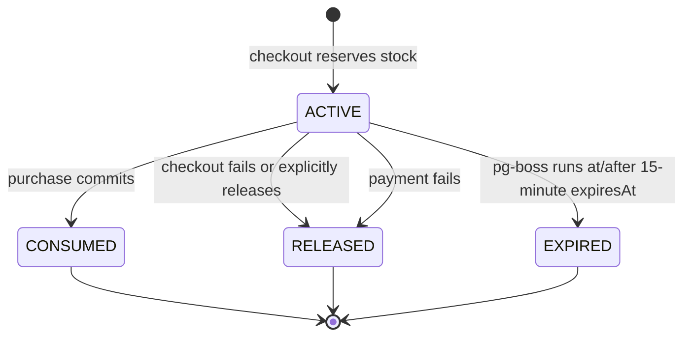

## Context

See `proposal.md` for motivation and the two delta specs for observable behavior. The current Prisma `Inventory` row stores `quantityOnHand` and `quantityReserved`; seller product writes can replace on-hand stock directly, while checkout only re-reads availability inside its serializable purchase transaction. That transaction protects one buyer/idempotency key and order atomicity, but it does not conditionally claim inventory against other checkout keys.

The design must preserve the existing `/api/v1/checkout/preview` and `/api/v1/checkout/cod` contracts, checkout fingerprinting, voucher atomicity, cart ETags, immutable order snapshots, and the seller product/variant authoring flow. PostgreSQL remains the source of truth.

## Goals / Non-Goals

**Goals:**

- Make overselling impossible while the database is available and invariants hold.
- Preserve retry-safe COD checkout and seller adjustment semantics.
- Provide one balance definition for every catalog, cart, checkout, and seller consumer.
- Keep reservation expiry durable across API restarts without a recurring CronJob.
- Use the existing PostgreSQL dependency and pg-boss rather than introducing RabbitMQ for one scheduling use case.
- Make every seller-originated on-hand change reconstructable from immutable audit events.

**Non-Goals:**

- Warehouse/bin/location stock, inbound purchase orders, batch/serial tracking, or external ERP sync.
- Returns, refunds, seller order rejection, and carrier-driven restocking; later order-lifecycle changes will call the inventory command API.
- Reserving stock when a buyer merely views a product, adds to cart, or requests checkout preview.
- Replacing immutable order-line snapshots with live catalog or inventory reads.

## Decisions

### 1. Extend the balance row and add immutable inventory records

`Inventory` remains one row per variant and gains `quantitySold`, `version`, and database check constraints:

```text
quantityOnHand >= 0
quantityReserved >= 0
quantitySold >= 0
quantityReserved <= quantityOnHand
available = quantityOnHand - quantityReserved
```

`InventoryAdjustment` records seller and system-originated on-hand changes with shop, variant, actor, reason, note, delta, before/after values, resulting version, idempotency key, request digest, and UTC timestamp.

`InventoryReservation` stores buyer, cart/version, checkout key and digest, lifecycle state (`ACTIVE`, `CONSUMED`, `RELEASED`, `EXPIRED`), expiry, optional purchase reference, terminal reason, and timestamps. `InventoryReservationLine` stores one immutable quantity per variant. A partial unique index permits only one live reservation per buyer checkout key while allowing a failed terminal attempt to be retried later.

Alternative considered: derive all balances by summing an append-only movement ledger. That gives strong accounting but makes every current-stock read and lock path more expensive. This phase keeps materialized balances guarded by constraints and records immutable adjustment/reservation history for audit.

### 2. Use sorted row locks and conditional balance writes

Every multi-variant reservation sorts canonical variant UUIDs, locks the matching inventory rows in that order, validates the complete set, and applies all reserved increments in one transaction. Seller adjustment and consumption use the same lock helper. Conditional updates include expected versions and invariant predicates; database check constraints are the final guard.

Prisma does not expose row-lock clauses declaratively, so the inventory repository will use parameterized `Prisma.sql` statements for `SELECT ... FOR UPDATE` and guarded updates. Dynamic identifiers or untrusted raw SQL strings are prohibited.

Alternative considered: rely only on serializable transaction retries. Serializable isolation reduces anomalies but does not express the stock predicate as directly as locking and validating the exact inventory rows; explicit deterministic locks also make multi-line behavior and failure reporting predictable.

### 3. Keep reservation creation internal to COD confirmation

The buyer API request shape remains unchanged. `POST /api/v1/checkout/cod` performs two durable phases under the existing buyer/idempotency advisory lock:

1. Rebuild and validate checkout, obtain authoritative database time, then create or resume an `ACTIVE` reservation for the selected lines in a short serializable transaction. The existing TTL remains exactly 15 minutes (`expiresAt = databaseNow + 15 minutes`) and is not derived from a browser or application-host clock.
2. Rebuild the checkout in the purchase transaction, verify the same active unexpired reservation and fingerprint, write purchase/orders/vouchers, consume reservation lines, update balances, clean purchased cart lines, and mark the reservation `CONSUMED` with the purchase reference.

Consumption decrements both `quantityReserved` and `quantityOnHand`, increments `quantitySold`, advances inventory versions, and increments the existing product sold summary in the same purchase transaction. The purchase lookup remains the first replay check, so a successful replay never enters reservation code.

If phase two fails, the service attempts an idempotent release. A crash between phases leaves a durable active reservation that the expiry path can recover. If a retry arrives with the same key and digest before expiry, it resumes that reservation; a different digest conflicts. Terminal failed attempts do not become successful checkout idempotency results.

An authoritative payment-failure outcome calls the same release command immediately with terminal reason `payment-failed`; it does not wait for pg-boss. If a future payment flow persists an order before payment completes, order lifecycle and inventory-hold lifecycle remain separate: expiry leaves the order pending, marks its hold expired, and blocks payment/fulfillment until stock is reserved again under a new generation. The current COD path still consumes its reservation immediately when the purchase commits.

Alternative considered: reserve during preview. Preview is intentionally read-only and can run repeatedly as addresses, shipping, and vouchers change; reserving there would allow passive browsing or refreshes to hold stock unnecessarily.

### 4. Release expiry through a durable pg-boss one-shot job

Each committed active reservation enqueues one `inventory-reservation-expire` pg-boss job for its exact `expiresAt` through `fromPrisma(transaction)`. Job persistence participates in the reservation transaction, so either both reservation and job commit or neither commits. The enqueue path MUST throw and roll back when the scheduler dependency is unavailable; it MUST NOT silently return because a worker failed to start. Scheduler readiness and worker-consumer readiness are reported separately.

The job contains only reservation identity and a generation token. On delivery, the worker starts a PostgreSQL transaction, uses database time, locks and re-reads the reservation and sorted inventory lines, and releases only when the generation matches, state is `ACTIVE`, and `databaseNow >= expiresAt`. Early, duplicate, stale, released, expired, or consumed deliveries are successful no-ops. Terminal reservation rows are retained for audit and idempotency.

The worker is not a recurring CronJob. If it is offline at the target time, the durable job runs after recovery. Inventory mutation paths also opportunistically expire due reservations for the variants they lock, providing a correctness backstop. Delayed release may temporarily under-report availability, but it cannot oversell.

Alternative considered: an in-process `setTimeout` loses work on restart. A recurring database scan was rejected because the project preference is one-shot scheduling rather than CronJob polling. BullMQ was not selected because it introduces Redis when PostgreSQL is already required.

RabbitMQ TTL/DLX was considered and rejected for this modular monolith: it requires a second stateful service plus a transactional outbox to close the database/broker dual-write gap, while pg-boss can persist the exact scheduled time in the same PostgreSQL transaction. RabbitMQ becomes worth reconsidering only if payment/inventory are split into separate services or queue throughput materially exceeds the shared database design.

### 5. Expose seller inventory commands separately from product content

The inventory module introduces:

- `GET /api/v1/seller/inventory` for cursor-paginated balances and filters.
- `GET /api/v1/seller/inventory/:variantId/adjustments` for immutable audit history.
- `POST /api/v1/seller/inventory/:variantId/adjustments` with `If-Match`, `Idempotency-Key`, delta, reason code, and optional note.

Responses include a canonical inventory version and ETag. Conflict Problem Details distinguish stale version, insufficient unreserved stock, idempotency misuse, and general inventory unavailability without revealing another shop.

The product create transaction records `INITIAL_STOCK`. For an existing variant, the product editor computes the requested difference only as input to the inventory command inside the same server transaction and records `PRODUCT_EDIT`; it never directly writes `quantityOnHand`. The dedicated `/seller/inventory` screen is added to the Seller Center navigation, while product editing continues to show stock and can link to inventory history.

Alternative considered: remove stock from product authoring immediately. Keeping initial stock and existing edit affordances minimizes seller workflow disruption, provided every difference passes through the same domain command and audit path.

### 6. Centralize the available-stock projection

A shared backend inventory projection returns checked integers for on-hand, reserved, sold, available, and version. Catalog, homepage, product detail, cart, pricing, checkout assembly, engagement, and seller summaries consume this projection instead of duplicating subtraction or reading `quantityOnHand` alone.

Buyer responses expose only the available quantity they need. Seller responses expose all four concepts. Expired jobs that have not run yet remain conservatively reserved; mutation-time recovery releases them before a new claim is evaluated.

### 7. Test against real PostgreSQL concurrency

Unit tests cover contracts, canonical digests, arithmetic, state transitions, and UI states. PostgreSQL integration tests use separate database connections and barriers to race reservations/adjustments intentionally. Checkout tests inject failures after reservation, during voucher consumption, order writes, and inventory consumption. E2E tests cover seller adjustment/history and one buyer checkout path; the focused homepage suite remains unchanged.

## Flow

```mermaid
sequenceDiagram
    actor Buyer
    participant API as Checkout API
    participant Inv as Inventory Service
    participant DB as PostgreSQL
    participant Queue as pg-boss/PostgreSQL

    Buyer->>API: POST /checkout/cod + If-Match + Idempotency-Key
    API->>DB: Rebuild authoritative checkout
    API->>Inv: Reserve selected variant quantities
    Inv->>DB: Lock inventory rows in variant-id order
    DB-->>Inv: Current balances
    alt All lines have stock
        Inv->>DB: Increment reserved + create ACTIVE reservation
        Inv->>Queue: Insert one job at DB expiresAt in same transaction
        Inv-->>API: Reservation acquired
        API->>DB: Revalidate and write purchase transaction
        API->>Inv: Consume reservation in same transaction
        Inv->>DB: reserved -= qty; onHand -= qty; sold += qty
        DB-->>API: Purchase committed
        API-->>Buyer: 201 purchase result
    else Any line is understocked
        Inv-->>API: Atomic reservation conflict
        API-->>Buyer: 409 insufficient stock
    end
```



## Risks / Trade-offs

- [Two-phase confirmation leaves a short reservation window] → Keep the first transaction small, retain the exact 15-minute TTL, resume by checkout idempotency key, and make release/expiry idempotent.
- [Queue worker outage temporarily hides sellable stock] → Fail conservatively, persist one-shot jobs in PostgreSQL, and opportunistically release due reservations during locked mutations.
- [Scheduler initialization failure could commit a reservation without a job] → Treat scheduler availability as a write-path prerequisite, throw instead of silently skipping enqueue, and verify reservation/job atomicity in PostgreSQL integration tests.
- [Application and database clocks can differ] → Derive `createdAt`, `expiresAt`, and due checks from PostgreSQL time.
- [Multiple-variant locks can deadlock] → Canonically sort variant IDs, keep transactions bounded, and retain limited retry for PostgreSQL serialization/deadlock errors.
- [Materialized counters can drift after a defect or manual SQL] → Enforce database checks, write all mutations through one repository, add reconciliation diagnostics, and test ledger/balance invariants.
- [Product edit and inventory adjustment race] → Require inventory version, lock the variant inventory row, and return a stale-version conflict rather than overwriting a concurrent change.
- [Adding a queue schema complicates local setup] → Use the existing PostgreSQL service, initialize queue storage through application startup/migration guidance, and document worker health/readiness.

## Migration Plan

1. Add enums, `quantitySold`, `version`, adjustment/reservation tables, indexes, and check constraints while leaving current readers compatible.
2. Backfill existing inventory with `quantitySold = 0`, `version = 0`, validate `quantityReserved <= quantityOnHand`, and create baseline audit events for existing on-hand quantities.
3. Deploy the inventory module, seller endpoints, and pg-boss scheduler/worker health checks before enabling checkout reservation calls.
4. Switch product authoring and all stock readers to the centralized inventory projection.
5. Enable the exact 15-minute reservation/consume integration in COD checkout and monitor conflicts, active reservation age, job backlog, release latency, and invariant failures.
6. Deploy Seller Center inventory controls and remove any remaining direct on-hand writes.

Rollback disables new reservation creation first, drains or releases active reservations, restores the previous checkout path, and only then removes new application reads. Schema removal is deferred until no reservation or adjustment data is needed; immutable audit data is retained during ordinary rollback.
