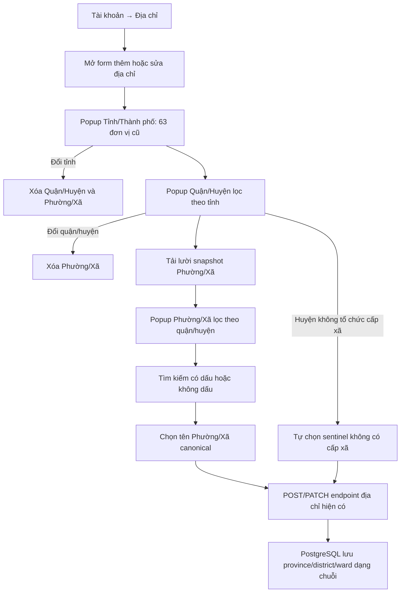

## Context

Xem `proposal.md` để biết động cơ thay đổi và `specs/legacy-address-selector/spec.md` để biết hành vi bắt buộc. Hiện frontend giữ một snapshot tĩnh ngày `2025-06-30` từ dịch vụ `DMDVHC` của Tổng cục Thống kê, nhưng cấu trúc chỉ dừng ở 63 tỉnh/thành và 696 quận/huyện. `LegacyAdministrativeDivisionFields` quản lý hai popup phụ thuộc, còn `AddressManagement` render `ward` bằng ô nhập tự do. Backend và contract dùng tên đơn vị dạng chuỗi cho cả ba cấp.

Dữ liệu phường/xã lớn hơn đáng kể so với hai cấp hiện tại. Không được gọi dịch vụ hành chính bên ngoài ở runtime vì màn hình địa chỉ phải ổn định khi nguồn ngoài chậm hoặc không khả dụng.

## Goals / Non-Goals

**Goals:**

- Hoàn thiện bộ chọn ba cấp trên frontend với cùng snapshot hành chính cũ và quan hệ cha-con xác định.
- Không đưa toàn bộ dữ liệu phường/xã vào bundle storefront ban đầu.
- Giữ nguyên payload và dữ liệu đã lưu, kể cả giá trị cũ chưa khớp snapshot cho tới khi người dùng chủ động thay đổi.
- Có kiểm tra tự động để phát hiện dữ liệu thiếu, trùng hoặc gắn sai quận/huyện.

**Non-Goals:**

- Không chuyển sang bộ đơn vị hành chính sau sáp nhập, không cung cấp công tắc chọn snapshot.
- Không geocoding, bản đồ, mã bưu chính hoặc xác minh địa chỉ giao hàng ngoài quan hệ ba cấp.
- Không thêm endpoint hành chính, bảng database, migration hoặc thay đổi DTO.
- Không tự động chuẩn hóa lại hàng loạt địa chỉ đã lưu.

## Decisions

### 1. Commit snapshot tĩnh thay vì gọi API hành chính ở runtime

Mở rộng dữ liệu từ cùng nguồn `DMDVHC` và ngày chốt `2025-06-30`, lưu mã, tên và mã quận/huyện cha trong artifact TypeScript được tạo có tính lặp lại. Metadata nguồn, ngày snapshot và số lượng kỳ vọng được pin cạnh dữ liệu; test xác nhận các con số từ artifact đã tạo.

Nguồn có 10.035 phường/xã thuộc 691/696 quận/huyện. Năm huyện `Bạch Long Vĩ`, `Cồn Cỏ`, `Hoàng Sa`, `Lý Sơn` và `Côn Đảo` không tổ chức cấp xã được pin bằng danh sách mã huyện riêng. Khi chọn một huyện trong danh sách này, frontend tự dùng sentinel `Không có đơn vị hành chính cấp xã` làm giá trị `ward`; sentinel mô tả đúng cấu trúc hành chính và không giả mạo một đơn vị trong snapshot.

Lý do: form không phụ thuộc mạng ngoài, kết quả test và build ổn định, đồng thời khớp đúng bộ tỉnh/quận hiện có. Phương án gọi API trực tiếp khi mở popup bị loại vì tạo phụ thuộc runtime, CORS và rủi ro nguồn thay đổi. Dùng package dữ liệu bên thứ ba cũng bị loại vì khó đảm bảo đúng mốc trước sáp nhập.

### 2. Tách ward snapshot thành module tải lười theo màn hình địa chỉ

Giữ catalog tỉnh/quận hiện tại gọn và bổ sung một module generated dạng `districtCode -> readonly LegacyWard[]`. Component chỉ `import()` module này khi đã nhận diện quận/huyện và cần danh sách phường/xã. Module được cache sau lần tải đầu; UI có trạng thái đang tải và lỗi tải có thể thử lại.

Lý do: hơn nhiều phường/xã so với quận/huyện, vì vậy import tĩnh lồng vào catalog hiện tại sẽ tăng client chunk của màn hình trước khi người dùng cần trường này. Chia thành hàng trăm file theo quận/huyện cho payload nhỏ hơn nhưng tăng độ phức tạp build và bảo trì; một chunk tải lười là cân bằng phù hợp cho project hiện tại.

### 3. Mở rộng component hiện có thành state machine ba cấp

Thêm `LegacyWard`, `initialWard`, `wardError` và state `ward` vào `LegacyAdministrativeDivisionFields`; `DivisionPopup` chấp nhận cả tên field `ward` và lựa chọn cấp xã. Resolver ward sử dụng cùng quy tắc chuẩn hóa đang dùng cho province/district.

Quy tắc chuyển trạng thái:

- Tỉnh thay đổi sang mã khác: xóa district và ward.
- Quận/huyện thay đổi sang mã khác: xóa ward.
- Chọn lại cùng mã cha: giữ cấp con.
- Giá trị đã lưu chưa nhận diện: vẫn hiển thị và nằm trong hidden input; chỉ bị xóa khi người dùng thay đổi nó hoặc cấp cha liên quan.
- Trong lúc ward module đang tải, giá trị hiện có vẫn được hiển thị nhưng popup chưa cho chọn danh sách mới.
- Huyện thuộc danh sách không tổ chức cấp xã: tự đặt ward sentinel, hiển thị trường ở trạng thái chỉ đọc và vẫn cho phép submit bằng contract chuỗi hiện có.

Phương án giữ `ward` là `InputField` và chỉ gợi ý datalist bị loại vì vẫn cho phép tạo tổ hợp ngoài quận/huyện và không cung cấp trải nghiệm popup nhất quán.

### 4. Giữ contract lưu địa chỉ dạng tên hiển thị

Popup đặt tên canonical vào hidden input `ward`, và `AddressManagement` tiếp tục dựng payload hiện tại. Không gửi mã ward mới lên API. Điều này đảm bảo địa chỉ Google/email hiện có, endpoint tài khoản và Prisma schema không cần thay đổi.

Mã đơn vị chỉ là identity nội bộ của bộ chọn để so sánh cha-con và reset state. Nếu sau này nghiệp vụ vận chuyển cần mã hành chính, đó sẽ là change riêng có migration và contract rõ ràng.

### 5. Kiểm thử theo lớp dữ liệu, component và form tích hợp

- Data test pin metadata/số lượng, mã duy nhất, mọi quận có danh sách hợp lệ và mọi ward trỏ tới quận tồn tại.
- Lookup test xác nhận tên có dấu, không dấu, viết tắt hỗ trợ và giới hạn tìm kiếm trong quận đã chọn.
- Component test xác nhận disable/loading/empty, lựa chọn, reset theo cấp cha, giữ giá trị cũ và hành vi bàn phím.
- Address-management test xác nhận payload create/update gửi `ward` đã chọn và validation hiện có vẫn hiển thị đúng.
- Quick verification dùng các gate frontend liên quan; không cần backend E2E mới vì contract backend không đổi.

## Flow

## Risks / Trade-offs

- [Snapshot phường/xã lớn làm tăng kích thước client asset] → Tách thành dynamic import chỉ tải trên màn hình quản lý địa chỉ; pin kích thước/count trong test để phát hiện tăng bất thường.
- [Nguồn dữ liệu cũ có thể ngừng phục vụ] → Commit artifact generated vào repository cùng provenance; build/runtime không phụ thuộc nguồn.
- [Tên trùng nhau giữa các quận hoặc trong cùng tỉnh] → Tra cứu ward luôn nhận quận/huyện đã resolve làm scope và dùng code làm identity.
- [Dữ liệu cũ có tên không còn trong snapshot] → Bảo toàn chuỗi khi mở/sửa; chỉ reset sau hành động đổi cấp cha của người dùng.
- [Dynamic import thất bại] → Hiển thị trạng thái lỗi có nút thử lại, không xóa giá trị đang lưu và không cho submit giá trị mới chưa chọn.
- [Năm huyện không có cấp xã nhưng contract yêu cầu ward] → Pin mã huyện từ nguồn và dùng sentinel mô tả rõ ràng, giữ API/database dạng chuỗi như cũ.

## Migration Plan

1. Tạo và kiểm tra artifact ward snapshot trước khi nối vào UI.
2. Phát hành frontend với popup mới; backend/database được triển khai nguyên trạng.
3. Theo dõi lỗi tải chunk và lỗi validation của form địa chỉ.
4. Nếu cần rollback, khôi phục trường ward dạng text; dữ liệu đã lưu vẫn tương thích vì cả hai phiên bản đều dùng chuỗi.
