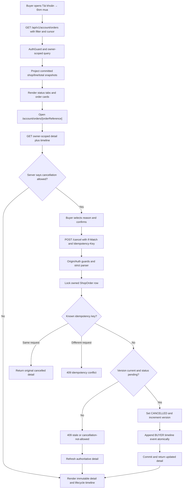

## Context

See `proposal.md` for motivation and the two delta specs for behavior. T19 persists one buyer-owned `Purchase` with one `ShopOrder` per merchant, immutable address/shop/shipping/line/voucher snapshots, and the initial `PENDING_CONFIRMATION` state. It exposes only a narrow purchase-result read by purchase reference; there is no buyer order index, child-order detail, lifecycle version, transition history, or cancellation command.

T20 must make those child orders discoverable without recalculating historical catalog data or taking ownership of seller fulfillment (T25), inventory release/reservation (T24), carrier tracking (T33), or returns/refunds (T29). The existing AuthGuard, project-wide Origin guard, Problem Details, Prisma/PostgreSQL ownership, strict shared contracts, integer minor-unit money, and focused E2E conventions remain mandatory.

## Goals / Non-Goals

**Goals:**

- Make each per-shop `ShopOrder` the buyer-visible order unit while retaining its parent purchase reference.
- Centralize allowed lifecycle transitions in one reusable state machine for later seller/admin workflows.
- Append a complete immutable event for creation and every transition in the same transaction as the status update.
- Make cancellation retry-safe, race-safe, owner-scoped, and limited to the state that does not require inventory/seller compensation.
- Provide stable cursor pagination and exact shared contracts for buyer list/detail screens.
- Render committed snapshots and lifecycle history without reading mutable catalog or account-address fields.

**Non-Goals:**

- Expose seller/admin transition endpoints; T25 and later admin work will call the internal lifecycle service.
- Implement packing, pickup, carrier webhooks, delivery proof, inventory release, cancellation approval, refunds, or return logistics.
- Recompute purchase totals after cancellation or change the T19 financial snapshots.
- Add search across orders, downloadable invoices, repeat purchase, or a cross-shop purchase summary page.

## Decisions

### 1. Treat each ShopOrder as the list/detail/cancellation aggregate

Expose these authenticated buyer endpoints:

| Endpoint                                             | Purpose                                                          | Success            |
| ---------------------------------------------------- | ---------------------------------------------------------------- | ------------------ |
| `GET /api/v1/account/orders`                         | Cursor-paginated per-shop order list with optional status filter | `200`              |
| `GET /api/v1/account/orders/:orderReference`         | Owner-scoped immutable detail and timeline                       | `200`              |
| `POST /api/v1/account/orders/:orderReference/cancel` | Retry-safe buyer cancellation                                    | `200` first/replay |

`ShopOrder.id` is the public order reference; `Purchase.id` remains visible as the checkout/purchase reference. Cancelling one shop order does not cancel siblings from the same checkout. Returning purchase groups in the list was rejected because status, merchant ownership, fulfillment, and cancellation evolve independently per shop.

The list defaults to 20 and caps at 50. Items contain a lean but complete line summary, shop snapshot, status/payment state, itemized payable total, version, creation/update time, and purchase reference. Detail adds address, shipping, relevant voucher allocations, all financial fields, cancellation capability, and the timeline.

### 2. Expand the enum and enforce one table-driven transition matrix

Extend `ShopOrderStatus` with:

```text
PENDING_CONFIRMATION -> AWAITING_PICKUP -> SHIPPING -> DELIVERED
        |                     |                         |
        +-> CANCELLED <-------+                         +-> RETURN_REQUESTED
                                                               |       |
                                                               v       v
                                                            RETURNED  REFUNDED
                                                               |
                                                               +-----> REFUNDED
```

Implement a pure framework-neutral transition predicate and a single backend lifecycle service. The service receives current/target status, expected version, actor, reason, and an existing Prisma transaction; it rejects every edge not in the specs before writes. T25 can reuse this service rather than duplicating seller rules. Scattering checks across controllers was rejected because later seller/admin endpoints would drift.

`RETURN_REQUESTED`, `RETURNED`, and `REFUNDED` exist for storage, filtering, and future integration. T20 exposes no buyer return/refund command, so their operational workflow remains T29.

### 3. Add versioned immutable OrderTimelineEvent rows

Add `ShopOrder.version Int @default(0)` and an `OrderTimelineEvent` model with:

- UUID primary key and restrictive `orderId` relation;
- nullable `previousStatus`, required `status`, and `orderVersion`;
- `actorType` (`SYSTEM | BUYER | SELLER | ADMIN`) plus nullable `actorUserId`;
- stable bounded `reasonCode`, nullable normalized `reasonNote`, and UTC `occurredAt`;
- nullable cancellation `idempotencyKey` and `requestDigest`;
- unique `(orderId, orderVersion)` and `(orderId, idempotencyKey)` constraints plus chronological indexes.

Database checks keep order versions non-negative, require user identity for non-system actors, require both idempotency fields together, and bound reason text. Timeline rows have no update/delete production API. A mutable `status_history` JSON column was rejected because it cannot enforce event identity, actor relations, concurrency, or efficient chronological reads.

The T20 migration adds all enum values, columns, constraints, and tables additively, then inserts one `SYSTEM / ORDER_CREATED` version-0 event for every existing T19 order using its `createdAt`. `OrderWriter` creates the same event for new orders inside the T19 checkout transaction. Seed data continues to contain no fake transactional orders.

### 4. Make buyer cancellation row-locked and idempotent

Cancellation requires:

- `If-Match: "order-<version>"`;
- `Idempotency-Key: <canonical uuid>`;
- `{ reasonCode, reasonNote? }`, where the code is one of `CHANGE_ADDRESS`, `CHANGE_PRODUCT`, `FOUND_BETTER_PRICE`, `NO_LONGER_NEEDED`, or `OTHER` and the normalized note is at most 500 characters.

Within one transaction:

1. lock the referenced order joined to its purchase owner;
2. return non-enumerating `404` if ownership does not match;
3. look up `(orderId, idempotencyKey)` before current-state validation;
4. replay the existing result when its request digest matches, otherwise return idempotency conflict;
5. verify the expected version and `PENDING_CONFIRMATION` state;
6. update status to `CANCELLED` and increment version with an affected-row assertion;
7. append the buyer event with the key/digest;
8. project the updated owner detail before commit.

The row lock serializes different cancellation keys and later internal transitions. Looking up the key before state validation makes a response-loss retry succeed even though the order is already cancelled. Allowing buyer cancellation in `AWAITING_PICKUP` was rejected for T20 because stock release and seller/carrier compensation are not implemented; an authorized internal actor can still use the lifecycle edge later.

### 5. Use owner-filtered queries and exact snapshot projectors

Every list/detail/cancellation query joins `ShopOrder → Purchase` and filters `purchase.buyerId` in SQL. Unknown and foreign references share the same `404`; authorization is never performed after returning a graph.

Create list and detail projectors that:

- read `Purchase.addressSnapshot`, `ShopOrder.shopSnapshot`, `shippingSnapshot`, `OrderLine` snapshots, and persisted voucher allocations only;
- convert BigInt to safe integers and recheck line/order total equations;
- validate order/timeline version continuity and actor shape;
- sort lines, allocations, and events deterministically;
- pass every result through exact shared-contract guards.

Reusing the T19 whole-purchase projector was rejected because an order detail must isolate one shop and include lifecycle data without exposing sibling shops. Reading current catalog/address tables was rejected because it would corrupt historical meaning.

### 6. Bind opaque cursors to filter and ordering

Order by `(createdAt DESC, id DESC)` and encode a versioned base64url cursor containing the last tuple plus the normalized filter. A cursor is valid only for the filter that created it. Queries fetch `limit + 1`, return at most `limit`, and derive the next cursor from the last returned row.

Offset pagination was rejected because new orders can shift rows between requests. A cursor shared across different filters was rejected because it can silently skip or duplicate results.

### 7. Build account screens around server-declared capabilities

Add account navigation link `Đơn mua`, `/account/orders`, and `/account/orders/[orderReference]`.

- The list keeps the selected status in a validated URL query so tabs are deep-linkable, resets the cursor on filter change, and uses an explicit `Xem thêm` action.
- Cards render snapshot shop/product data, order/payment labels, total, creation time, and a detail link.
- Detail renders address, lines, shipping, vouchers/totals, and a vertical chronological timeline.
- The cancel button is shown only when `cancellation.allowed` is true. A modal requires a reason, preserves one browser UUID for transport retry, prevents double submit, sends the ETag, and refreshes detail after success or conflict.
- Loading, empty, expired-session, non-enumerating not-found, transient error, and mobile sticky-action states remain accessible.

Inferring cancellability from a frontend status string was rejected because later business rules can change without a UI release.

### 8. Verify the state machine and buyer journey in focused layers

- Shared-contract tests cover exact keys, filter/cursor parsing, cancellation normalization, money equations, timeline continuity, and malformed actor/event data.
- Pure state-machine table tests cover every allowed and forbidden status pair.
- Prisma/migration tests cover enum mappings, version/event constraints, idempotency uniqueness, restrictive relations, and deterministic backfill.
- PostgreSQL HTTP tests cover owner isolation, status filters, pagination stability, source-data mutation, cancellation validation, replay/conflict, response-loss semantics, row-lock races, event atomicity, and unchanged snapshots.
- Web tests cover tab/query synchronization, pages, detail/timeline, modal validation, duplicate click, conflict refresh, and auth/not-found states.
- Add `test:e2e:orders:quick` for authenticated list → detail → cancel → refresh at 360/768/1440 widths, then run the existing `test:e2e:homepage:quick` regression gate.

## Flow



## Risks / Trade-offs

- **[T20 stores future return/refund states without their workflow]** → Expose them read-only and group them under one buyer tab; T29 owns commands, compensation, and refund semantics.
- **[Existing T19 orders lack a creation event]** → Backfill version-0 events deterministically in the migration and verify row counts before enabling reads.
- **[Cancellation can race a later seller transition]** → Lock the same order row, validate expected version/status after the lock, and commit one update plus event.
- **[A cancellation response can be lost]** → Persist order-scoped idempotency key and canonical request digest on the committed timeline event and replay before state validation.
- **[List pages can become large]** → Cap page size, use keyset pagination/indexes, and omit full address/timeline from list items.
- **[Status labels may drift between API and UI]** → Export constants from shared contracts and keep only localization labels in the web layer.
- **[Future cancellation after pickup needs compensation]** → Keep buyer cancellation limited to pending confirmation until inventory, seller, payment, and carrier workflows can participate atomically.

## Migration Plan

1. Add lifecycle enum values, order version, timeline actor enum/table, constraints, and indexes in one additive migration.
2. Backfill exactly one version-0 creation event per existing shop order using stable IDs or conflict-safe business uniqueness; verify no duplicate/missing events.
3. Update T19 `OrderWriter` so new shop orders and creation events commit together.
4. Deploy shared contracts and backend list/detail/cancellation APIs; old T19 checkout/result routes remain compatible.
5. Deploy account order screens and focused browser coverage after API/migration verification.
6. Roll back UI/API routing first if needed. Additive statuses/events can remain dormant; removing populated timeline data is destructive and requires separate approval.
