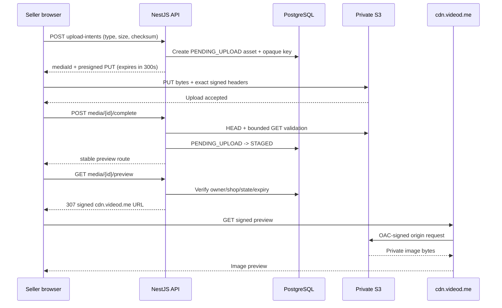

## Context

See `proposal.md` for motivation and `specs/seller-product-media-upload/spec.md` for the behavior contract.

The seller-product media API currently accepts multipart bytes, validates them in NestJS, writes them through `SellerProductMediaStorage`, and creates a `SellerProductMediaAsset` directly in the staged state. The asset model has only `STAGED` and `ATTACHED`, while the frontend expects an API-owned preview route. Private CloudFront delivery and stable attached-media references are separate concerns already represented in the existing media boundary.

The new upload path must remove the API from the byte-transfer hot path without letting the browser choose S3 keys, credentials, TTLs, or public access. Direct upload also creates a new trust boundary: client-declared metadata is provisional until the API verifies the completed private object.

## Goals / Non-Goals

**Goals:**

- Keep the current seller ownership, 5 MiB, MIME, dimension, attachment, and staged-expiry rules while transferring upload bytes directly from the browser to S3.
- Give each upload a single-purpose S3 presigned `PUT` credential valid for exactly 300 seconds.
- Make staged preview owner-only through a separately signed CloudFront URL on `cdn.videod.me`.
- Keep all signature-bearing URLs ephemeral and keep existing stable attached-media references unchanged.
- Make completion idempotent and safe across browser retries and upload/complete timing races.

**Non-Goals:**

- Notifications, automatic retry, resumable or multipart S3 uploads, client-selected keys, image transformations, malware scanning, review/return media, or importing third-party images.
- Redesigning public attached-product image delivery or backfilling existing product URLs.
- Treating client metadata, S3 upload success, or a CloudFront preview response as proof that an image is valid before server verification.

## Decisions

### 1. Use an intent → PUT → complete protocol

`POST /api/v1/seller/products/media/upload-intents` accepts `{ mimeType, byteSize, checksumSha256 }`. After seller/shop authorization and boundary validation, the API creates a `PENDING_UPLOAD` asset with a random UUID-based key and returns:

```json
{
  "mediaId": "uuid",
  "upload": {
    "url": "https://private-bucket.s3...signed-query",
    "method": "PUT",
    "headers": {
      "Content-Type": "image/png",
      "x-amz-checksum-sha256": "base64-checksum"
    },
    "expiresAt": "UTC timestamp"
  }
}
```

The frontend sends the bytes directly to that URL and then calls `POST /api/v1/seller/products/media/{mediaId}/complete`. A single multipart API call was rejected because it keeps the API in the byte path. Issuing a URL before creating the database row was rejected because ownership, cleanup, and idempotent completion would lack an authoritative intent record. Presigned POST was not selected because the current browser flow needs one object and a simple `PUT`; exact size is rechecked at completion.

### 2. Fix upload credential lifetime at 300 seconds

The signer always passes `expiresIn: 300`; the client cannot request a TTL. The response `expiresAt` is derived from the same issuance time. A new intent is required after expiry, and a URL is never refreshed in place or reused for another key.

The five-minute limit applies to S3 authorization, not to completion of an object already uploaded before expiry. Completion may succeed later while the pending record remains within its cleanup window. This avoids rejecting a valid upload that finished near the expiration boundary.

### 3. Bind signed properties and verify the object before staging

The S3 `PutObject` signature binds bucket, key, `Content-Type`, and `ChecksumSHA256`; the API returns the exact headers the browser must send. The object key is derived only from the API-generated media ID and validated extension under the managed prefix. S3 CORS allows configured web origins, `PUT`, the signed headers, and only the response headers required by the browser.

Completion performs a private `HeadObject` to compare size, content type, checksum metadata, and expected key, then reads at most the existing 5 MiB limit to verify magic bytes and dimensions. Only then does the transaction change `PENDING_UPLOAD` to `STAGED`, set the existing 24-hour staged expiry, and expose the preview route. An already verified asset returns the same completion result. A missing or mismatched object remains non-attachable; notification, retry, and user-facing remediation are intentionally deferred.

Trusting browser dimensions or treating HTTP 200 from S3 as completion was rejected because an authorized seller could upload bytes inconsistent with declared metadata. Using only `HeadObject` was rejected because it cannot prove image structure or dimensions.

### 4. Add a pending state and intent metadata without storing credentials

Extend `SellerProductMediaState` with `PENDING_UPLOAD`. Reuse the backend-only `storageKey`, MIME, size, and checksum fields as the intent contract; width and height remain nullable until completion or are moved to a separate verified-metadata shape. Add `uploadExpiresAt` for audit/UX and preserve `expiresAt` for the staged attachment window. No database column stores a presigned URL or signature.

State transitions are:

```text
PENDING_UPLOAD --verified completion--> STAGED --product save--> ATTACHED
       |                                  |
       +--cleanup after abandonment-------+--existing staged cleanup after expiry
```

Creating a separate upload-session table was rejected for this first direct-upload flow because one intent maps one-to-one to one media asset. It can be introduced later if multipart/resumable uploads require multiple parts or retries.

### 5. CloudFront signs only owner-authorized staged previews

The existing preview route remains the stable frontend value. It loads the media by ID, seller, shop, `STAGED` state, and non-expired `expiresAt`, verifies the object exists, and returns a bodyless `307` to a CloudFront canned-policy signed URL under `https://cdn.videod.me`. Preview signatures expire after at most 300 seconds and responses use `private, no-store`, `no-cache`, and `no-referrer` headers.

CloudFront uses a trusted key group for viewer authorization and OAC with always-sign behavior for the private S3 origin. The bucket has Block Public Access enabled and grants CloudFront only `s3:GetObject` on the managed prefix. An unsigned CDN path and direct S3 read remain unusable.

Returning a signed preview URL in upload completion JSON was rejected because it spreads bearer credentials into domain payloads and logs. The stable preview route can always issue a fresh credential after authorization.

### 6. Keep failure handling synchronous and defer notifications

Intent validation, S3 verification failure, expiry, and signer unavailability return existing Problem Details-style safe errors. Logs contain the media ID, operation, safe reason code, and status only. The proposal does not emit inbox/email notifications, enqueue retries, or introduce failure-outbox events. Those behaviors require separate product decisions about recipient, deduplication, severity, and retry ownership.

### 7. Limit frontend exposure and diagnostics

The seller editor treats the S3 URL as an ephemeral transport value held only in memory. It calculates the checksum, requests an intent, performs the signed `PUT`, calls completion, and then stores only the media ID and stable preview route in component/form state. Request logging redacts all `X-Amz-*` and CloudFront signature parameters and never records upload headers or bodies.

## Activity Flow



## Risks / Trade-offs

- [An authorized seller uploads unexpected or oversized bytes] → Bind MIME/checksum, cap declared size, verify the private object before staging, and clean abandoned objects with lifecycle rules.
- [The browser finishes close to URL expiry] → Treat upload expiry as a PUT authorization boundary and allow later idempotent completion of an already-present object.
- [A pending database row exists without an S3 object] → Keep it non-attachable and remove it through scheduled database cleanup; no notification is sent in this phase.
- [CORS misconfiguration blocks valid browsers or permits excess origins] → Version and test the exact origin/method/header policy before enabling the frontend path.
- [Checksum calculation adds browser CPU latency] → Use Web Crypto off the render path, show upload preparation state, and retain the 5 MiB cap.
- [Completion reads the image once through the API] → Bound the read to 5 MiB; this preserves validation while removing the larger browser-to-API upload transfer.
- [Signed URLs leak through diagnostics] → Keep them in memory only, return CloudFront signatures only in `Location`, and regression-test redaction.
- [CloudFront or S3 clock/configuration drift causes false 403s] → Synchronize host time, verify trusted key group/OAC/CORS before rollout, and expose safe operational metrics without credentials.

## Migration Plan

1. Add the S3 presigner dependency, pending state/metadata migration, strict 300-second configuration, and dual old/new upload support behind a server-controlled rollout flag.
2. Configure private S3 CORS and lifecycle cleanup, verify Block Public Access, IAM prefix permissions, CloudFront OAC, trusted key group, and `cdn.videod.me` preview behavior.
3. Deploy upload-intent/completion APIs and tests, then deploy the seller editor direct-upload flow to an internal shop cohort.
4. Verify intent expiry, signed-header enforcement, completion validation, owner-only preview, abandoned cleanup, and signature-free logs.
5. Expand rollout and remove the legacy multipart upload route only after active clients use the new contract.

Rollback disables new intent creation and restores the existing multipart upload UI while leaving already completed staged/attached assets valid. Pending intents expire and are cleaned; rollback does not make S3 or CloudFront public and does not require deleting stable product references.
