# T28 — Product/shop moderation and user reporting flows

Trạng thái: **Implementation hoàn tất, verification còn mở**. Các sơ đồ mô tả implementation, test, locking, rate limiting và aggregate consistency; các hạng mục E2E full-stack còn thiếu được ghi rõ trong task và verification report.

## 1. Bản đồ các nhóm task quan trọng

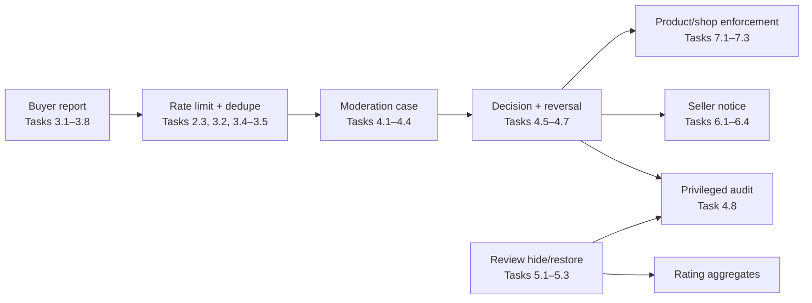

## 2. Report validation, idempotency, rate limit và case aggregation

Task liên quan: `2.3`, `3.1–3.5`, `3.7–3.8`.

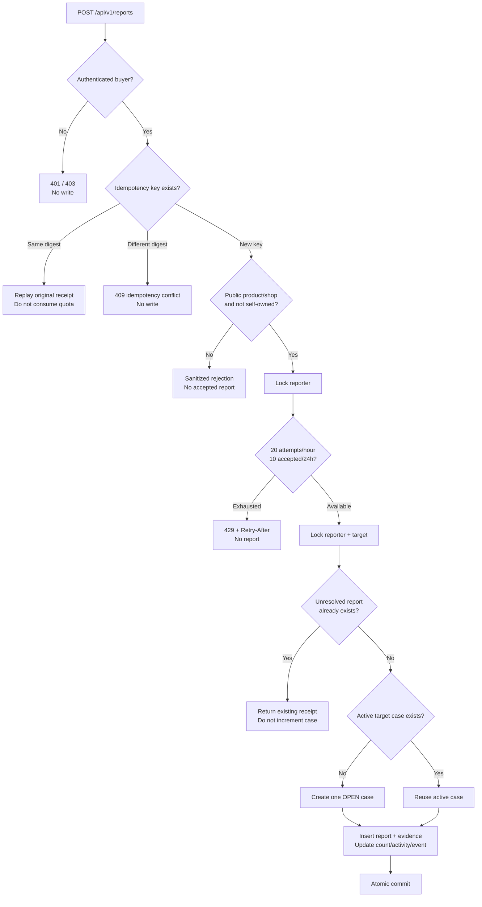

### Race cần chặn: hai report đầu tiên cùng target

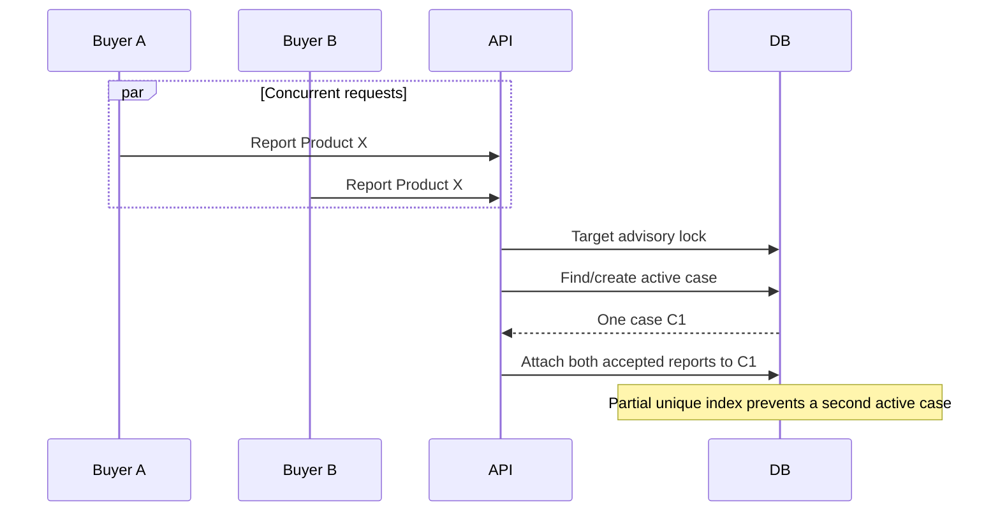

## 3. Case state và optimistic concurrency

Task liên quan: `4.1–4.4`, `8.4–8.5`.

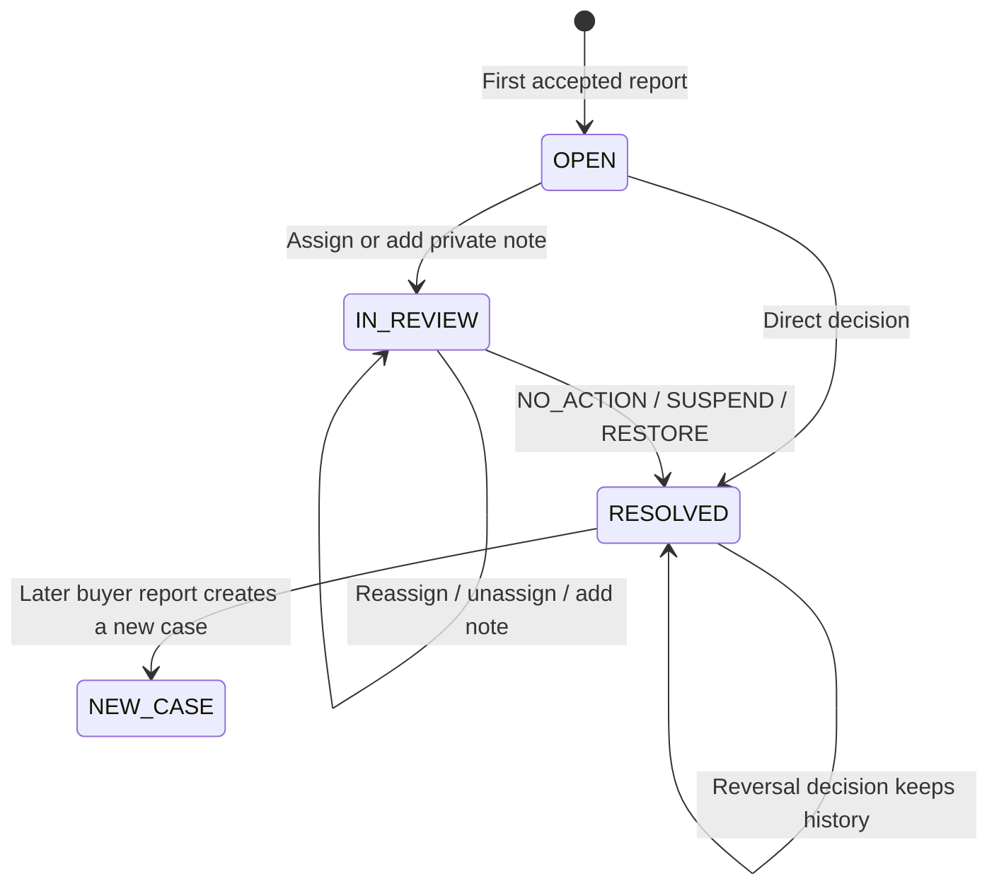

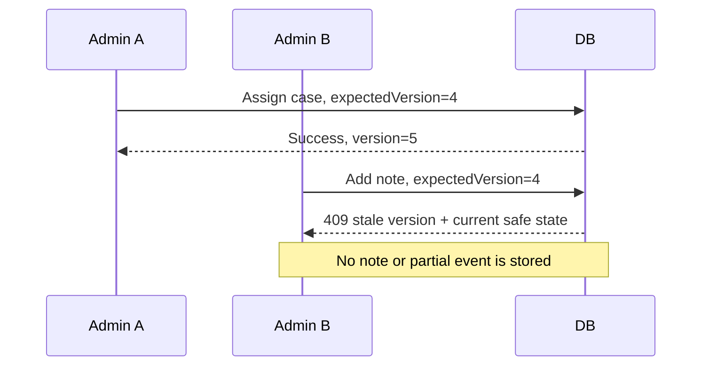

## 4. Atomic decision và reversal

Task liên quan: `4.5–4.9`, `6.1`, `7.3`.

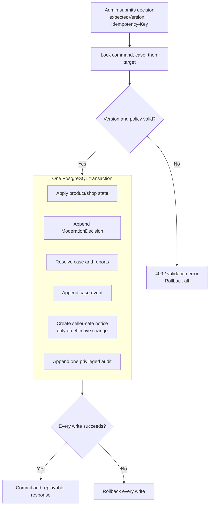

### Reversal giữ lịch sử, không xóa quyết định cũ

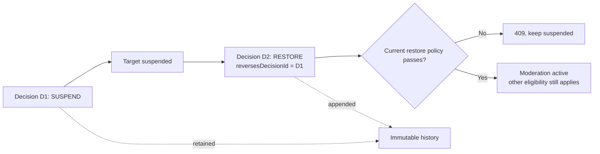

## 5. Enforcement xuyên public và commerce flow

Task liên quan: `7.1–7.3`.

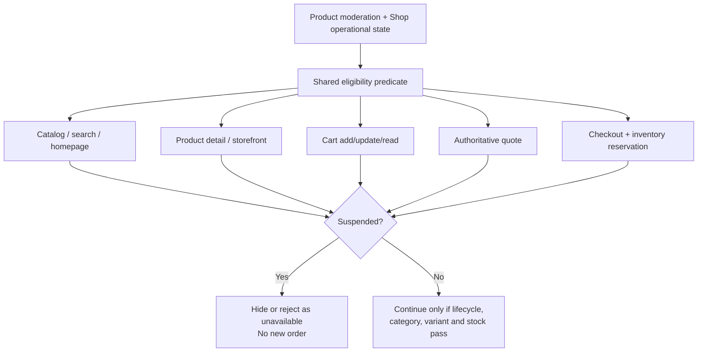

## 6. Review moderation và aggregate consistency

Task liên quan: `5.1–5.3`.

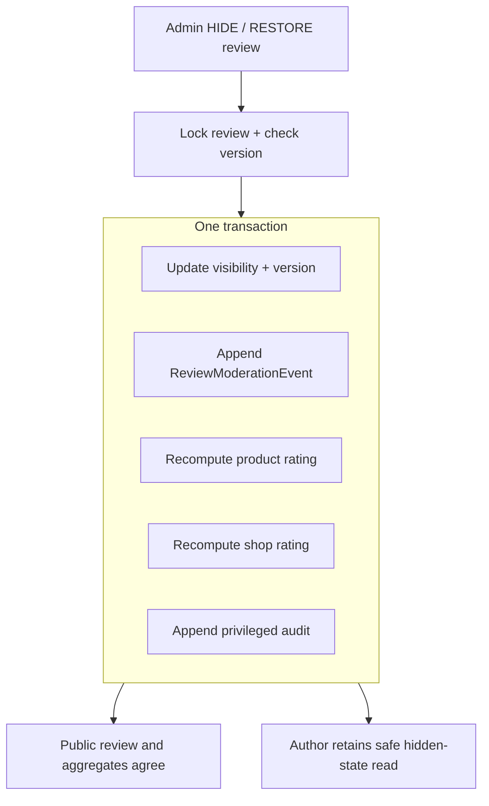

## 7. Privacy boundaries

Task liên quan: `4.3`, `4.8`, `6.4`, `8.8`.

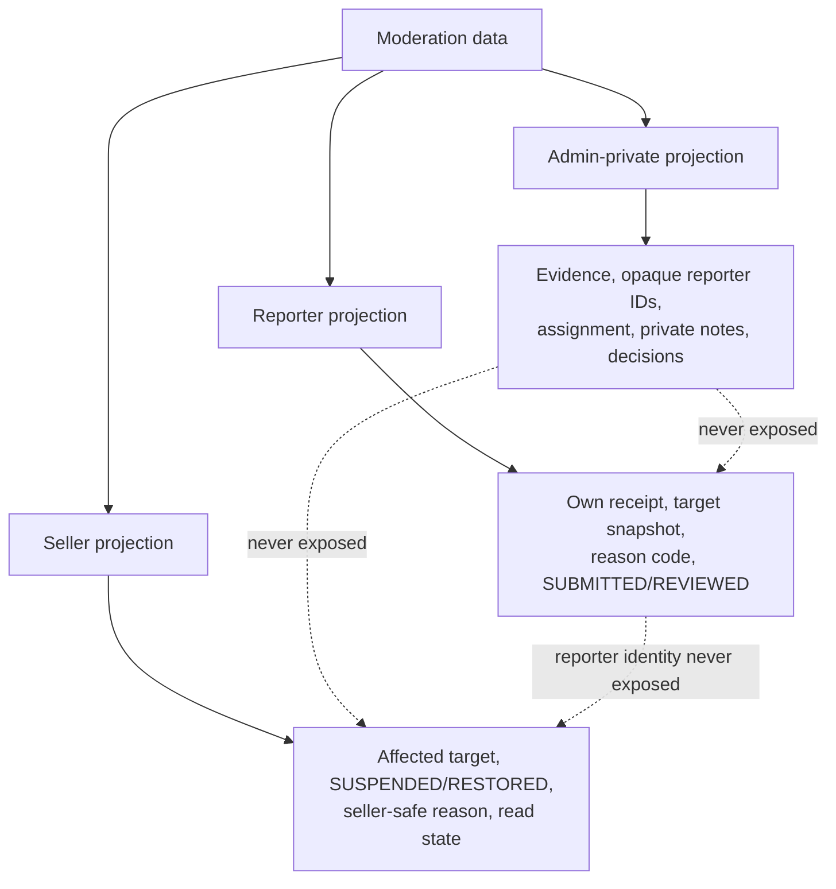

## 8. Browser verification: reporting and moderation journey

**Liên quan:** Task 8.2, 8.5, 8.7 và 9.5
**Mục tiêu:** Kiểm tra hành vi người dùng, khả năng truy cập và bố cục responsive của các màn hình mới mà không nhầm lẫn với kiểm thử giao dịch cơ sở dữ liệu.

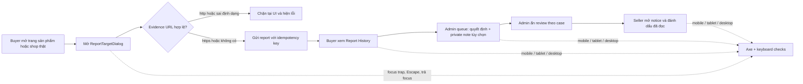

| Phần được kiểm tra | Cách kiểm tra | Ranh giới cần nhớ |
|---|---|---|
| Gửi report ở trang sản phẩm/shop | Render trang storefront thật; chỉ chặn request tạo report để kiểm tra payload | Không ghi dữ liệu test vào môi trường phát triển. |
| Lịch sử report, admin queue/review, seller notice | Browser chạy với API state giả lập xác định trước | Xác nhận UI, role flow, lỗi và payload; **không** thay thế kiểm thử transaction/PostgreSQL thật. |
| Accessibility và responsive | Axe, focus dialog, Escape/Tab, kích thước mobile/tablet/desktop | Bao gồm những màn hình T28 mới có trong luồng trên. |

> Kiểm thử browser không chứng minh rằng quyết định moderation đã làm sản phẩm biến mất khỏi catalogue hoặc bị từ chối ở checkout. Điều đó cần một E2E full-stack với dữ liệu cô lập và sẽ được giữ ở Task 9.4.
