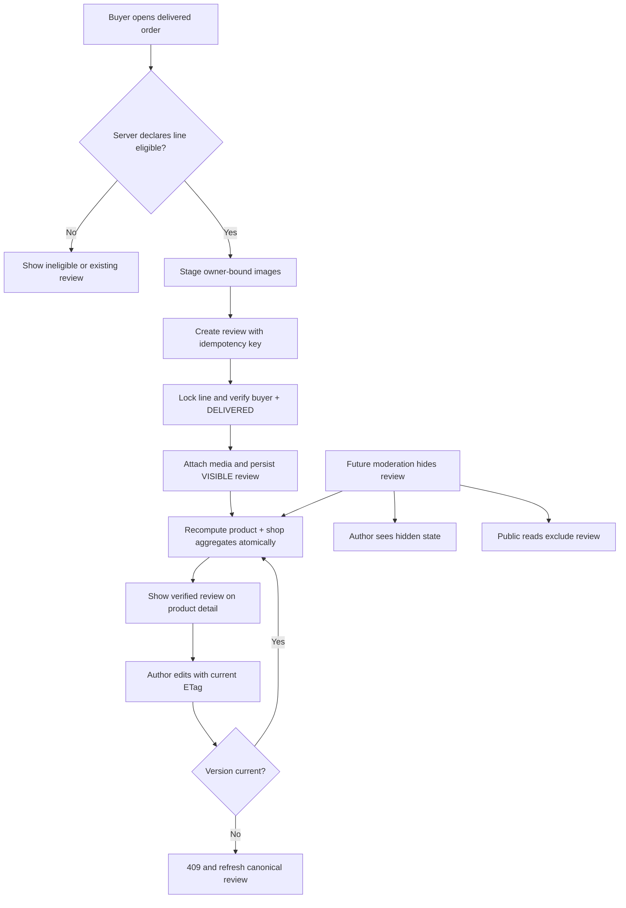

## Context

T20 persists immutable `OrderLine` snapshots, owner-bound purchases, delivered status, and transactional lifecycle history. Product records currently contain seed-owned rating fields while shops have no authoritative equivalent. The project has no generic upload subsystem, so T21 cannot safely accept arbitrary image URLs as buyer-owned review media.

## Goals / Non-Goals

**Goals:**

- Use one delivered order line as the unique, durable proof for one verified review.
- Keep author writes owner-scoped, idempotent, and protected against stale concurrent edits.
- Keep public review reads deterministic and free of private order/account data.
- Keep product/shop rating projections correct under create, edit, and visibility changes.
- Provide local review-image staging behind a replaceable storage boundary.

**Non-Goals:**

- Production object storage/CDN, video, arbitrary external URLs, or a generic marketplace upload service.
- Automated moderation, admin moderation UI, seller replies, likes, review incentives, or coins.
- Seller fulfillment, carrier tracking, return/refund implementation, or lifecycle changes.

## Review Flow

## Decisions

### 1. Review identity is unique per order line

Persist `ProductReview` with immutable `orderLineId`, `buyerUserId`, `productId`, and `shopId`; mutable rating, normalized text, visibility, version, and timestamps; and paired idempotency metadata. Enforce a unique `orderLineId`. Create authorization joins `OrderLine → ShopOrder → Purchase`, locks the owned line/order, and checks `DELIVERED` inside the transaction.

This permits another review after a different delivered purchase while preventing duplicates for the same purchased line. A `(buyerUserId, productId)` uniqueness rule would incorrectly block legitimate repeat purchases.

### 2. Reviews are visible-first with append-only moderation audit

New and author-edited reviews are `VISIBLE`. `HIDDEN` is modeled now with append-only `ReviewModerationEvent` rows for actor, prior/new state, reason, and UTC time. T21 does not expose privileged moderation actions; the state prepares T28 without deleting review evidence. Authors can retrieve their hidden review; public queries select `VISIBLE` only.

A pending queue was rejected because no moderator workflow exists yet and would leave reviews unpublished indefinitely.

### 3. Writes follow T20 idempotency and optimistic concurrency conventions

Create requires a UUID `Idempotency-Key` and canonical request digest. Equivalent replay returns the original result; different reuse conflicts. Update requires `If-Match` review ETag, locks the review, verifies author/version, replaces ordered media, increments version once, refreshes aggregates, and returns canonical detail before commit.

Last-write-wins was rejected because duplicate clicks and stale edit tabs can corrupt review content and rating aggregates.

### 4. Media is staged and owner-bound

Persist `ReviewMedia` with uploader, opaque ID, sanitized MIME/size/dimensions, storage key, state (`STAGED`/`ATTACHED`), 24-hour expiry, order, and optional review relation. An authenticated multipart endpoint stores only accepted images through a local adapter. Review writes accept media IDs, never URLs, and attach only unexpired records owned by the caller. A public media route serves `ATTACHED` assets only. An explicit cleanup command removes expired staged assets; T21 adds no background scheduler.

Arbitrary HTTPS URLs were rejected because they cannot prove uploader ownership and may expose tracking or private content.

### 5. Aggregates are recomputed in the review transaction

Keep existing product rating fields as cached projections and add equivalent fields to `Shop`. Review/visibility writes lock the affected product and shop, recompute count/average from visible durable reviews using integer arithmetic, then save both before commit. Migration resets seed-owned product ratings and initializes shop ratings to zero; dataset import stops owning those fields. Add a deterministic repair command for later reconciliation.

Recomputation is simpler and safer for current scale than incremental counters, which drift under edits, hides, retries, and rollbacks.

### 6. Private author and public discovery contracts remain separate

Private endpoints live under `/api/v1/account`: stage media, create from an owned order line, read authored review, and ETag-protected update. T20 order detail gains server-declared review capability per line. Public `GET /api/v1/catalog/products/:productId/reviews` supports exact rating, cursor, and bounded limit. Catalog, product detail, and shop storefront consume the same aggregate projections.

Separate DTOs reduce the chance that order references, address, email, moderation metadata, or storage keys leak through public responses.

## Risks / Trade-offs

- [Local media is not durable production storage] → Keep a narrow adapter and document local-only retention/backup limitations.
- [Aggregate recomputation may become expensive at high volume] → Recompute only affected product/shop rows and retain a repair command; optimize after measuring.
- [There is no seller fulfillment UI yet] → Tests create delivered fixtures through authorized lifecycle service boundaries rather than normal seed data.
- [Moderation may race author edits later] → Both paths use the same row lock/version and aggregate transaction.
- [Existing seeded ratings disappear] → Make review-derived zero states explicit and update dataset tests to prevent reintroduction.

## Migration Plan

1. Add review/media/moderation enums, tables, relations, aggregate fields, checks, indexes, and restrictive foreign keys.
2. Reset legacy seed-owned product rating projections and initialize shop projections without changing T20 order snapshots.
3. Update seed/import ownership, regenerate Prisma, deploy migration, and verify clean migrate/seed/database checks.
4. Release private write endpoints before public review UI and rating projections.
5. On application rollback, disable routes/UI but keep the additive schema and records for a forward fix.
