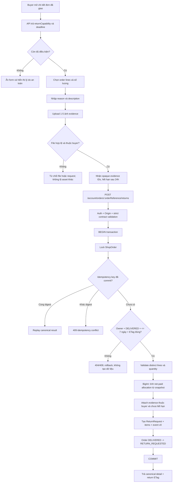
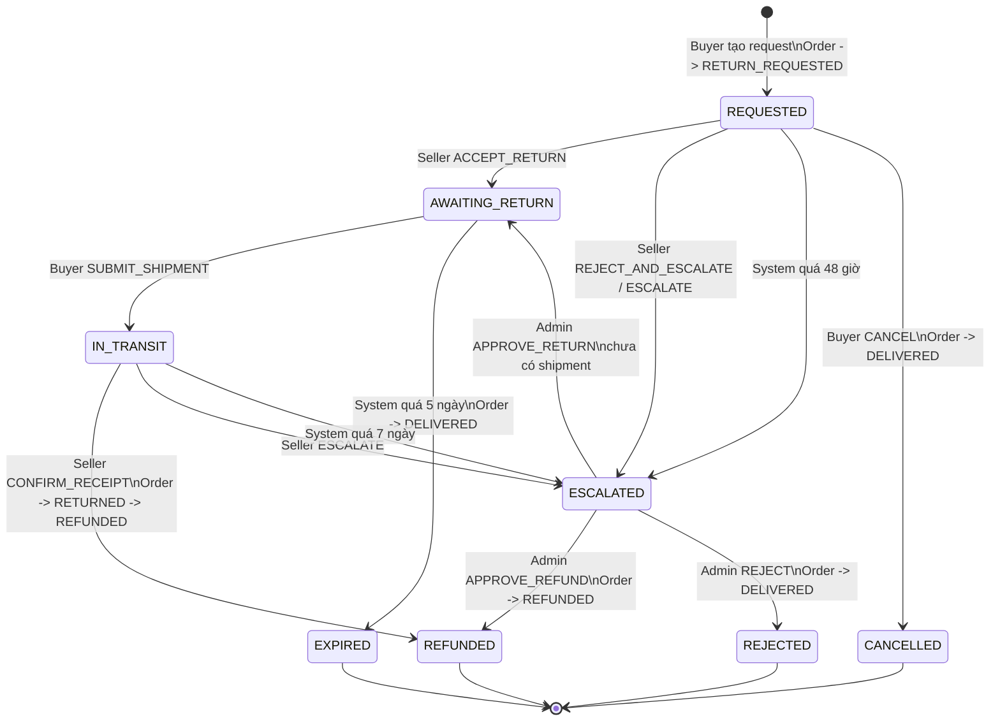
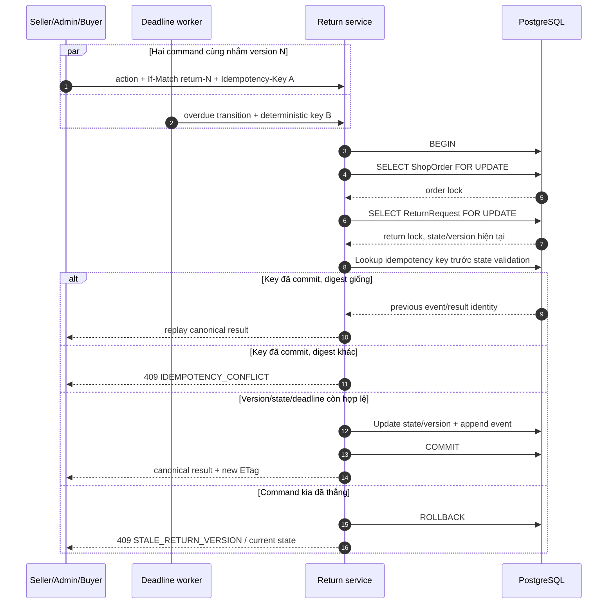
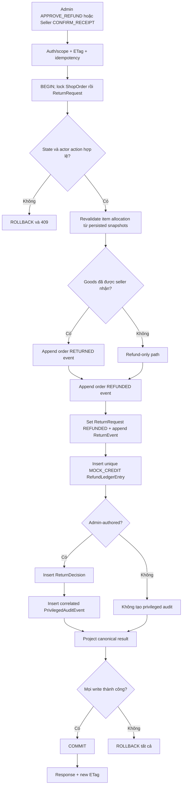
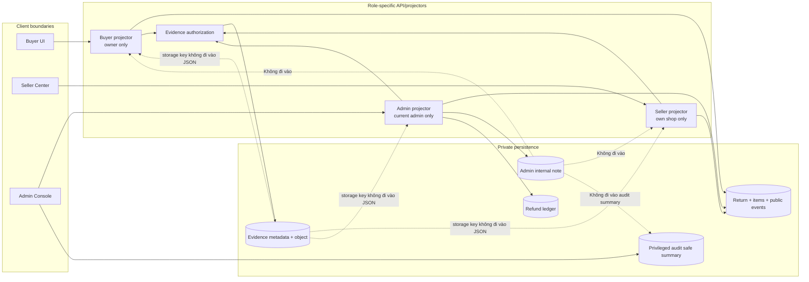

# T29 — Planned critical flows

Các sơ đồ dưới đây mô tả **implemented flow** cho change `implement-returns-refunds-disputes`, đã đối chiếu với Nest returns module, PostgreSQL e2e, UI workflows, và Playwright `e2e/returns.spec.ts`.

## 1. Buyer tạo hồ sơ trả hàng

**Task liên quan:** 1.1-1.8, 2.1-2.7, 3.1, 3.4-3.7, 5.1, 6.1-6.5, 7.1-7.6, 10.1-10.6.



Điểm cần kiểm tra trực quan:

- Giá/discount lấy từ `OrderLine` đã commit, không lấy từ product hiện tại.
- Toàn bộ request, item, evidence attachment và order transition cùng commit hoặc cùng rollback.
- Unknown order và order của buyer khác có cùng biểu hiện `404`.
- Client không được gửi số tiền hoàn; server tự tính.

## 2. State machine, deadline và đồng bộ trạng thái đơn hàng

**Task liên quan:** 3.1-3.3, 3.6-3.7, 5.2-5.7, 7.4-7.5, 8.3-8.4, 9.4, 12.2-12.4.



Nguyên tắc:

- Deadline được lưu thành UTC instant khi state bắt đầu, không tính lại theo đồng hồ trình duyệt.
- Foreground command luôn kiểm tra deadline dưới lock; deadline worker chạy trễ không làm action hết hạn trở nên hợp lệ.
- Mỗi transition sinh một `ReturnEvent`; mỗi thay đổi order sinh một `OrderTimelineEvent` với version liên tục.
- Từ chối, hủy hoặc hết hạn chỉ đảo trạng thái order về `DELIVERED`; không xóa lịch sử request.

## 3. Race condition, idempotency và thứ tự lock

**Task liên quan:** 2.3-2.5, 3.6, 4.3, 5.1-5.8, 8.3-8.5, 9.4-9.6, 12.5.



Thứ tự lock bắt buộc ở mọi mutation:

```text
ShopOrder -> ReturnRequest -> dependent rows read/write
```

Không có code path nào được lock `ReturnRequest` trước rồi quay lại lock `ShopOrder`; quy tắc này ngăn vòng chờ giữa seller, admin và deadline worker.

## 4. Transaction hoàn tiền, audit và rollback

**Task liên quan:** 2.1-2.7, 3.3-3.6, 5.3-5.6, 9.1-9.6, 12.1-12.5.



Invariant sau commit:

```text
ReturnRequest.status = REFUNDED
RefundLedgerEntry count for return = 1
Order status = REFUNDED
Return event versions liên tục
Order event versions liên tục
Admin decision hiệu lực => đúng 1 privileged audit correlation
```

Nếu bất kỳ insert/update nào thất bại, không được tồn tại trạng thái nửa chừng như “đã refund nhưng chưa có ledger” hoặc “đã audit nhưng order chưa đổi”.

## 5. Ranh giới dữ liệu theo vai trò

**Task liên quan:** 1.2-1.7, 4.1-4.7, 6.3-6.5, 7.1-7.6, 8.1-8.5, 9.1-9.6, 11.1-11.7.



Ma trận dữ liệu dự kiến:

| Dữ liệu                       | Buyer               | Seller của shop | Admin | Public/khác shop |
| ----------------------------- | ------------------- | --------------- | ----- | ---------------- |
| Order-line snapshot được trả  | Có, của chính buyer | Có, của shop    | Có    | Không            |
| Buyer description + evidence  | Có                  | Có              | Có    | Không            |
| Seller public reason          | Có                  | Có              | Có    | Không            |
| Admin public decision reason  | Có                  | Có              | Có    | Không            |
| Admin internal note           | Không               | Không           | Có    | Không            |
| Evidence storage key/path     | Không               | Không           | Không | Không            |
| Safe privileged audit summary | Không               | Không           | Có    | Không            |

## 6. Planned API verification map

| API                                                     | Happy path cần test                                           | Nhánh lỗi/race cần test                                                                              |
| ------------------------------------------------------- | ------------------------------------------------------------- | ---------------------------------------------------------------------------------------------------- |
| `POST /api/v1/account/return-evidence`                  | Upload ảnh hợp lệ, trả opaque ID                              | MIME giả, file hỏng, quá dung lượng/kích thước, thiếu auth                                           |
| `POST /api/v1/account/orders/:orderReference/returns`   | Partial return, amount đúng, evidence attach, order đổi state | Foreign/unknown, hết 7 ngày, stale ETag, duplicate line, quá quantity, key replay/conflict, rollback |
| `GET /api/v1/account/returns`                           | Filter + cursor ổn định                                       | Cursor khác filter, invalid query, không lộ return khác                                              |
| `GET /api/v1/account/returns/:returnReference`          | Detail/timeline/evidence đúng vai trò                         | Unknown/foreign giống nhau, internal note bị loại                                                    |
| `POST /api/v1/account/returns/:returnReference/actions` | Cancel và submit mock shipment                                | Sai state, quá deadline, stale/replay/race                                                           |
| `GET /api/v1/seller/returns`                            | Queue đúng shop/filter/deadline                               | Non-seller, cross-shop, cursor invalid                                                               |
| `GET /api/v1/seller/returns/:returnReference`           | Evidence và actions đúng shop                                 | Cross-shop 404, không lộ internal note                                                               |
| `POST /api/v1/seller/returns/:returnReference/actions`  | Accept, reject/escalate, receipt/refund                       | Deadline-worker race, admin race, duplicate receipt/ledger                                           |
| `GET /api/v1/admin/returns`                             | Escalated queue + reference search                            | Non-admin, invalid filter/cursor                                                                     |
| `GET /api/v1/admin/returns/:returnReference`            | Full adjudication context                                     | Non-admin, unavailable/corrupt invariant                                                             |
| `POST /api/v1/admin/returns/:returnReference/decisions` | Approve return/refund, reject + audit                         | Stale decision, invalid state, key conflict, ledger/audit rollback                                   |
| `GET /api/v1/return-evidence/:evidenceId`               | Buyer/shop/admin authorized read                              | Guest, other buyer/shop, staged/expired/unknown asset                                                |
