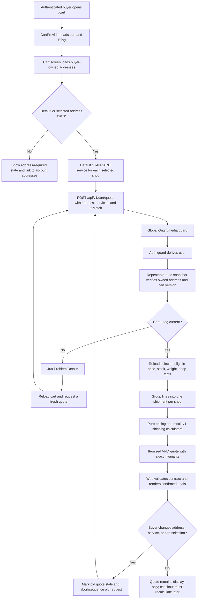

## Context

See `proposal.md` for motivation and the two delta specs for observable behavior. T16 already provides an authenticated, ETag-versioned cart grouped by shop and derives current selling prices, but it intentionally stops at selected merchandise subtotal. T13 provides owned shipping addresses whose province values use the legacy 63-province naming set. Product variants have selling and compare-at prices but no physical weight, while shops already expose a location suitable as the mock origin.

T17 crosses persistence, dataset normalization, shared contracts, NestJS orchestration, cart UI, and future checkout boundaries. The quote must be reproducible, safe against browser money tampering, internally consistent during concurrent cart changes, and replaceable by a real carrier adapter later.

## Goals / Non-Goals

**Goals:**

- Establish one pure, versioned pricing calculation boundary for cart now and checkout later.
- Return a fully itemized, algebraically self-validating quote from authoritative persistence facts.
- Model enough weight and regional data to make deterministic per-shop mock shipping meaningful.
- Add a focused cart quote experience without persisting provisional address or service choices.
- Preserve the existing authentication, global browser-mutation guard, ETag, and Problem Details conventions.

**Non-Goals:**

- Reserving stock, creating orders, locking prices, or promising a quote for a duration.
- Vouchers, coins, taxes, platform/shop subsidies, payment fees, or free-shipping campaigns.
- Real carrier availability, remote rate APIs, tracking, or service-level guarantees.
- Guest pricing or cart access; all quote work remains authentication-required.
- Re-enabling or expanding the temporarily disabled CI workflow.

## Decisions

### 1. Use a stateless authenticated cart quote endpoint

Add `POST /api/v1/cart/quote` under the existing cart authentication and browser-security boundary. The JSON body contains only:

```ts
{
  shippingAddressId: string;
  services?: Array<{
    shopId: string;
    service: 'ECONOMY' | 'STANDARD' | 'EXPRESS';
  }>;
}
```

The current cart ETag remains in `If-Match`; ownership comes only from the access session. The endpoint returns `Cache-Control: private, no-store` and a validated quote carrying `cartVersion`, `pricingVersion: "pricing-v1"`, `shippingVersion: "mock-v1"`, and `currency: "VND"`.

`POST` is chosen over a query-heavy `GET` because per-shop service choices form structured input, addresses are private, and quote responses must not enter shared caches. Persisting address/service choices on the cart was rejected because they are provisional UI choices, would create unnecessary cart version conflicts, and will later belong to checkout intent.

### 2. Separate orchestration from pure calculation

Create a capability-oriented pricing module with three boundaries:

- `PricingQuoteService`: opens a repeatable-read transaction, resolves the buyer-owned active address, verifies the cart version, reloads eligible selected commerce facts, canonicalizes service choices, and maps errors.
- `CommercePricingCalculator`: accepts a framework-free immutable snapshot, uses checked integer operations, calculates line markdowns and shop/overall totals, and returns a deterministic quote.
- `MockShippingCalculator`: accepts one canonical shop shipment and returns the versioned service, zone, weight, delivery-window, and fee components.

The cart controller is only an authenticated HTTP adapter. T19 checkout must call the same `PricingQuoteService`/calculator with freshly loaded facts rather than accepting the cart's displayed response. Calling `CartService` and adding totals there was rejected because it would entangle mutable-cart presentation with checkout-grade calculation and encourage a second implementation later.

### 3. Read a consistent database snapshot and fail stale requests

Quote orchestration begins a Prisma `RepeatableRead` transaction, loads the user's cart/version first, compares the parsed `If-Match`, then loads its selected lines, current commerce relations, address, and inventory inside the same snapshot. A concurrent cart mutation either exists before the snapshot and causes `409`, or occurs after the snapshot and does not partially alter that quote. Price/catalog writes are likewise observed consistently within the transaction.

The quote is informational and has no database row or expiration token. This avoids stale quote persistence and makes the future checkout rule explicit: reload and recalculate.

### 4. Use checked integer VND and algebraic response invariants

All persisted money already uses `BigInt`; boundary conversion checks non-negativity and `Number.isSafeInteger`. A small framework-free money utility performs checked multiply, add, and subtract without rates or floats. One minor unit is one VND, so there is no fractional currency rounding.

For a line:

```text
listUnit       = max(compareAtUnit ?? sellingUnit, sellingUnit)
listSubtotal   = listUnit * quantity
productDiscount = (listUnit - sellingUnit) * quantity
merchandiseSubtotal = sellingUnit * quantity
```

Shop and quote totals are reductions of these returned values; final payable is merchandise subtotal plus shipping. Contracts validate exact equations at line, shop, and quote levels. A generic decimal strategy was rejected because VND has zero decimal places here and Decimal-to-JSON conversions add ambiguity with no benefit.

### 5. Add weight with safe deterministic fallback

Add `ProductVariant.weightGrams Int @map("weight_grams")` with a database check from 1 through 1,000,000 grams. Migration proceeds add-nullable → backfill 500g → enforce non-null/check, keeping existing local databases deployable. Handwritten seed variants receive explicit values.

The canonical dataset normalizer reads a valid source weight if one is introduced later. Until then it generates `250 + (stable identity hash modulo 20) × 250`, producing repeatable 250–5,000g mock weights, and records `weightGrams` in `generatedFields`. Import/upsert and verification include the value. A purely random fallback was rejected because reseeding would change shipping prices; leaving every imported item at 500g was rejected because it would not exercise weight tiers meaningfully.

### 6. Share a compact legacy-province region catalog

Add a framework-neutral 63-province catalog with canonical code/name, common aliases, normalized search key, and `NORTH | CENTRAL | SOUTH` region. Backend shipping uses it for zones; the existing web administrative lookup consumes or cross-checks the same province identity while retaining its district data. Normalization removes accents, folds case/whitespace, and recognizes prefixes such as `Tỉnh`, `Thành phố`, `TP.`, and `TP`.

The existing `Shop.location` is the mock origin and `ShippingAddress.province` is the destination. Unknown values deliberately take the 12,000 VND remote surcharge. Adding a second shop-origin column was rejected for this mock phase because current shops already have a persisted location and seller address management arrives later.

### 7. Keep mock-v1 rates explicit and adapter-shaped

The calculator uses static integer configuration:

| Service    |   Base | Extra started 500g after first 500g | ETA      |
| ---------- | -----: | ----------------------------------: | -------- |
| `ECONOMY`  | 15,000 |                               3,000 | 4–6 days |
| `STANDARD` | 22,000 |                               4,000 | 2–4 days |
| `EXPRESS`  | 35,000 |                               6,000 | 1–2 days |

Zone surcharge is 0 for same province, 6,000 for same macro-region, and 12,000 for cross/unknown region. Each selected shop becomes one shipment; checked weight is the sum of `weightGrams × quantity`. Missing service choices default to `STANDARD`, while duplicate or unknown choices fail validation. Results expose `provider: "MOCK"` and versions so a later carrier adapter can replace the rate source without changing pricing arithmetic.

### 8. Make quote state local to the cart screen

Keep `CartProvider` responsible for cart ownership/version and header count. Add a cart quote API client and a screen-local quote controller that:

1. loads owned addresses after authenticated cart restoration;
2. chooses the default address and `STANDARD` per current shop;
3. sends the quote using the latest cart ETag;
4. validates the complete contract before replacing confirmed totals;
5. marks the previous quote stale during address/service/cart changes;
6. uses an abort/sequence guard so a slower old response cannot overwrite a newer choice;
7. reloads cart and requotes after `409`.

The client displays itemized list price, product discount, merchandise, shipping components, ETA, and payable total, but performs no money calculation. No address exposes full recipient details in logging or errors. If no address exists, the screen links to `/account/addresses` and leaves shipping/final total unavailable.

### 9. Treat contracts and focused tests as executable boundaries

Add shared request/response guards and parsers with exact-key validation and sum invariants. Table-driven tests cover markdown math, safe-integer overflow, every zone/service/weight boundary, input-order independence, default service, and unknown provinces. PostgreSQL HTTP tests cover authentication, Origin precedence, address ownership, ignored/rejected browser money, stale ETags, current-price reload, multi-shop grouping, and no writes. Component tests cover pending/stale/error/accessibility states.

Add `test:e2e:pricing:quick` to the existing focused runner for 360/768/1440 cart journeys using contract-valid intercepted APIs, so routine T17 verification does not rerun unrelated E2E suites or mutate developer data. Full root tests, build, guarded database tests, migration smoke, and strict OpenSpec validation remain final gates.

## Flow



## Risks / Trade-offs

- **[Mock rates look realistic but are not carrier quotes]** → Label provider/version and ETA as mock everywhere; do not persist or promise the result.
- **[Legacy province strings and shop locations can be inconsistent]** → Centralize normalization and charge the conservative cross-region surcharge for unknown values.
- **[Generated weights are synthetic]** → Record generated metadata, keep deterministic values, and make later seller-managed weight replacement additive.
- **[Catalog facts can change immediately after a quote]** → Keep responses non-cacheable and informational; future checkout always reloads and recalculates.
- **[Large quantities or corrupted BigInt values can overflow JSON-safe numbers]** → Check every conversion and arithmetic operation and fail the whole quote closed.
- **[Rapid service/address changes can race in the browser]** → Abort or sequence requests and replace totals only with the latest validated response.
- **[A repeatable-read transaction adds database work]** → Select only required fields, avoid writes/remote calls inside it, and index existing cart/address lookups.

## Migration Plan

1. Add nullable `weight_grams`, backfill existing variants to 500g, add the positive/range check, then make it non-null in one forward migration.
2. Update seed and canonical dataset normalization/import so all subsequent writes provide deterministic weight and verification proves idempotence.
3. Deploy shared contracts and backend pricing endpoints together; the API remains backward compatible because existing cart endpoints are unchanged.
4. Deploy the cart quote UI after the endpoint exists. Until then the existing merchandise-only cart remains usable.
5. Rollback application code by removing quote routing/UI while leaving the additive weight column intact. Drop the column only in a separately reviewed destructive migration if ever required.
