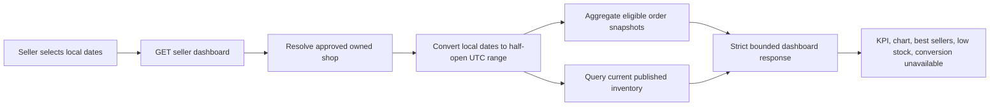
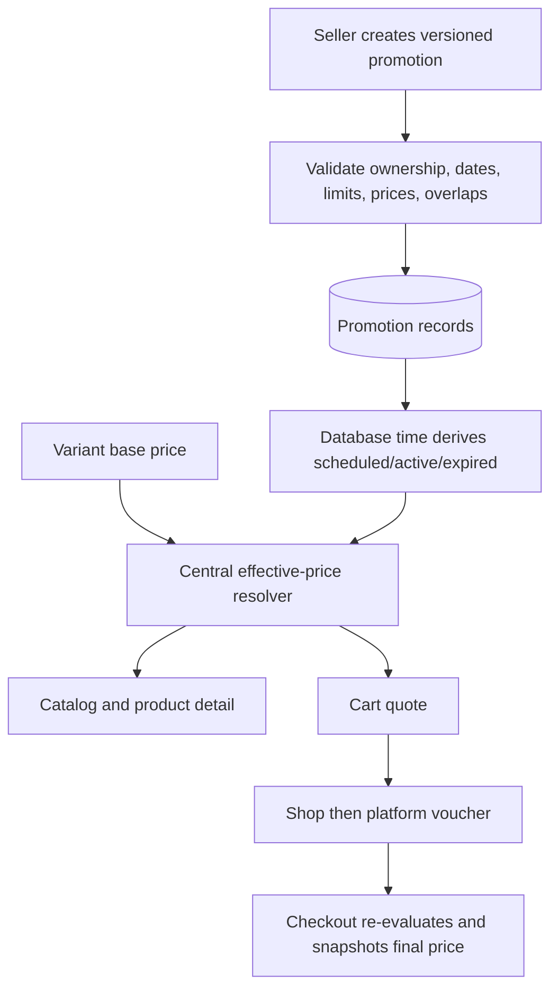

## Context

T25 completed seller fulfillment, so `ShopOrder`, `OrderLine`, and their immutable checkout snapshots are now authoritative enough for seller analytics. T24 maintains current inventory balances and a shared low-stock threshold of 10 units. T18 already owns voucher validation, consumption, redemption, and the pricing order `catalog markdown → shop voucher → platform voucher → shipping benefit`, but exposes no seller CRUD. Product variants store seller-authored base and compare-at prices; changing those fields to represent a temporary campaign would lose pricing intent and make scheduled activation unsafe.

The project currently targets Vietnam, but an analytics range such as `2026-08-01` must still mean shop-local calendar days rather than API-server or browser days. Dashboard queries can be large, promotion edits can race, and a campaign can become active between quote and checkout. These boundaries require precise server-owned semantics rather than UI-only calculations.

## Goals / Non-Goals

**Goals:**

- Give each approved seller an accurate, bounded view of their own shop performance.
- Make date and timezone boundaries deterministic and testable.
- Reuse current order snapshots, inventory truth, and voucher pricing rather than duplicate them.
- Let sellers safely schedule vouchers and product discounts without invalid prices or silent stacking.
- Keep dashboards responsive for no-data and high-volume shops and shape product rows for later export.
- Ensure storefront, cart quote, and checkout agree on the effective scheduled price.

**Non-Goals:**

- Ad auctions, impressions/click collection, attribution, conversion modeling, financial settlement, payout/net-revenue accounting, taxes, forecasting, real-time streaming analytics, materialized warehouse cubes, and downloadable CSV files.
- Platform/free-shipping voucher administration, promotion recommendation engines, flash-sale inventory allocation, seller staff permissions, or arbitrary shop-timezone editing UI.
- Rewriting historical order totals when a campaign or voucher changes.

## Decisions

### 1. Define honest metrics from current eligible order states

The dashboard uses these seller metrics:

| Metric | Definition |
| --- | --- |
| Eligible orders | Distinct owned `ShopOrder` rows currently in `AWAITING_PICKUP`, `SHIPPING`, or `DELIVERED` and created inside the selected UTC interval |
| Merchandise revenue | Sum of immutable `OrderLine.payableMerchandiseMinor` for eligible orders; excludes shipping, settlement fees, refunds, and payout claims |
| Units sold | Sum of immutable order-line quantities for eligible orders |
| Best sellers | Eligible lines grouped by product ID, ranked by units, then merchandise revenue, then product ID |
| Low stock | Current published owned variants whose available quantity is at or below the shared threshold of 10 |
| Conversion | Explicit `NOT_AVAILABLE` with null rate/visits until trustworthy traffic events exist |

`PENDING_CONFIRMATION`, `CANCELLED`, `RETURN_REQUESTED`, `RETURNED`, and `REFUNDED` are excluded. Metrics are intentionally current-state analytics: a later return/refund removes the order from a repeated historical query. The API names the money value `merchandiseRevenueMinor`; it MUST NOT call it net revenue, payout, or earnings.

Product names and images in best-seller rows come from the most recent qualifying immutable order-line snapshot so renamed or deleted products remain explainable. A current product ID is included for navigation only when it remains publicly available.

Counting pending orders was rejected because seller acceptance is not established. Counting only delivered orders was rejected because it hides the shop's accepted operating volume. Using current product price/name was rejected because it rewrites history.

### 2. Persist shop timezone and normalize one half-open UTC interval

Add `Shop.timeZone` as a validated IANA identifier and backfill it to `Asia/Ho_Chi_Minh`. T26 does not add a timezone editor; services still read the value from the shop record so future multi-region support does not change contracts.

The client sends inclusive local dates `from=YYYY-MM-DD&to=YYYY-MM-DD`. The server validates `from <= to`, caps the range at 366 local days, converts local start-of-day for `from` and the local start of the day after `to` into `[fromUtc, toUtc)`, and returns the canonical timezone and UTC boundaries. Day buckets follow local calendar labels; week starts Monday; month follows local calendar months. PostgreSQL values and response instants remain UTC.

Browser timezone, server process timezone, and inclusive `23:59:59.999` arithmetic were rejected because they create unstable boundaries. Although Vietnam currently has no daylight-saving transition, tests use a DST-observing IANA timezone to prove the conversion is not hard-coded to 24-hour days.

### 3. Aggregate in SQL and bound every result

`GET /api/v1/seller/dashboard` resolves the authenticated user's one active approved shop; no client `shopId` is accepted. The query service runs bounded SQL aggregates using owner/shop predicates and the canonical UTC interval. The response contains KPI totals, bounded time-series buckets, at most 10 best sellers, at most 10 low-stock variants, the shared low-stock threshold, conversion availability, and a database-derived `generatedAt`.

`GET /api/v1/seller/analytics/products` returns export-shaped product rows with keyset pagination, a maximum page size of 100, stable `(units DESC, merchandiseRevenueMinor DESC, productId ASC)` ordering, and a cursor bound to normalized filters. This is the reusable query boundary for a later streaming CSV endpoint; T26 does not generate a file.

Indexes support owned shop/status/date order selection and order-line grouping. Queries select only required columns and use safe integers. No unbounded order/line set is hydrated in application memory. Private responses use `Cache-Control: private, no-store`.

Live-query acceptance uses a reproducible PostgreSQL benchmark fixture containing 100,000 orders, up to 500,000 order lines, and 10,000 variants for one shop plus foreign-shop control data. After five unmeasured warm-up requests, the harness records at least 100 requests at up to 20 concurrent requests and reports P50/P95, database statement count, and captured query plans. On the documented reference profile:

| Operation | Performance budget |
| --- | --- |
| Dashboard over at most 90 local days | P95 response time at or below 750 ms |
| Dashboard over the maximum 366 local days | P95 response time at or below 1,500 ms |
| Product analytics with `limit=100` | P95 response time at or below 750 ms |

Database statement counts must remain constant as qualifying order/line volume grows; per-row lookup patterns and N+1 queries fail acceptance. Aggregate plans must begin from owned-shop/date/status predicates through supporting indexes and must not scan marketplace-wide order or inventory data from unrelated shops. The dashboard remains structurally bounded to 366 time buckets, 10 best sellers, and 10 low-stock rows. Analytics statements receive a two-second database timeout; a timeout or cancelled statement returns stable unavailable Problem Details, no partial aggregate payload, and no private query details.

Wall-clock thresholds are evaluated only by the explicit benchmark suite on the documented reference profile, not by every unit-test run. Functional integration tests still assert query-count bounds, response caps, timeout mapping, and owner-scoped plan structure so routine CI remains deterministic.

Maintaining rollup tables in checkout/fulfillment transactions was rejected for T26 because lifecycle changes, cancellations, and returns would add write-path coupling before query volume proves it necessary.

### 4. Reuse existing vouchers behind a seller-safe command boundary

Seller voucher APIs create and manage only `issuer=SHOP` vouchers belonging to the resolved shop. T26 allows `FIXED_AMOUNT` and `PERCENTAGE` merchandise benefits; platform and free-shipping vouchers remain outside seller authority. Existing globally unique canonical voucher codes, `[startsAt, endsAt)` windows, minimum spend, percentage cap, total/per-user limits, product scope, quote preview, atomic consumption, and redemption records remain authoritative.

Voucher lifecycle is derived as `SCHEDULED`, `ACTIVE`, `PAUSED`, `EXHAUSTED`, or `EXPIRED`; activation is based on database time and needs no job. Create requires an idempotency key. Update/action requires `If-Match`; pause and resume use an explicit action command. A paused voucher with no usage, redemption, or order snapshot can be hard-deleted through a versioned `DELETE` endpoint. Legacy archive metadata remains nullable for backward-compatible storage, but is not exposed or used as a voucher state.

Before first redemption, sellers may edit benefit rules, schedule, limits, and scopes subject to validation. Once `usedCount > 0`, benefit type/value, minimum spend, maximum benefit, code, and product scope become immutable; sellers may pause or change a future end time without reducing total/per-user limits below already consumed counts. Expired vouchers cannot be resumed. Product scopes must reference non-deleted products owned by the same shop. A voucher with usage history cannot be hard-deleted so committed order and redemption records remain referentially safe.

Hard-deleting used vouchers or allowing discount-math edits after redemption was rejected because it would make audits and user expectations ambiguous.

### 5. Model scheduled product discounts separately from base prices

Add `ShopDiscountCampaign` with shop, normalized name, `[startsAt, endsAt)`, enabled flag, version, archive time, and audit timestamps. Add `ShopDiscountProduct` with owned product ID and `discountBasisPoints`. One campaign can contain multiple products, with a percentage per product. T26 applies the product rate to every active variant of that product.

Rates are limited to 1%–90% (`100..9000` basis points). Effective price is:

`basePriceMinor - floor(basePriceMinor * discountBasisPoints / 10_000)`

The result must remain a positive safe integer. `ProductVariant.priceMinor` remains the base price. During an active campaign, the resolver exposes that base as the comparison price unless a valid higher `compareAtPriceMinor` already exists. A campaign never rewrites variant records.

Enabled, non-archived campaigns for the same product may not overlap in time. Create/update transactions lock sorted product identifiers and recheck overlap before commit. Once a campaign starts, its start time, product set, and rates are immutable; the seller may pause it or end it early. Ended/archived campaigns remain for audit and cannot resume.

Storing temporary prices on variants was rejected because scheduled expiration would require fragile repair jobs. Allowing multiple active campaigns and choosing the largest was rejected because it hides seller configuration errors.

### 6. Centralize effective catalog price resolution

A shared server-side price resolver takes variant base pricing, database time, and any active product campaign. It returns base, effective, comparison, discount amount/rate, campaign identity, and evaluation time. Catalog/homepage, product detail, seller-safe previews, cart quote, and checkout all use this resolver. The browser cannot send or choose a campaign discount.

Existing pricing order becomes:

1. resolve seller base/compare-at price and one scheduled product discount;
2. apply at most one shop voucher per shop;
3. apply the platform voucher;
4. apply shipping benefits.

Checkout re-evaluates under its existing transaction/locking rules. If a campaign starts, ends, pauses, or its base price changes after a quote, the authoritative quote/checkout response refreshes or rejects stale pricing according to existing cart rules; historical committed order lines stay unchanged.

### 7. Use versioned, idempotent, owner-scoped promotion APIs

Private endpoints are:

| Endpoint | Purpose |
| --- | --- |
| `GET /api/v1/seller/promotions/vouchers` | Cursor-paginated owned voucher list |
| `POST /api/v1/seller/promotions/vouchers` | Create a shop voucher |
| `GET /api/v1/seller/promotions/vouchers/:voucherId` | Read one owned voucher and ETag |
| `PATCH /api/v1/seller/promotions/vouchers/:voucherId` | Edit allowed fields with `If-Match` |
| `POST /api/v1/seller/promotions/vouchers/:voucherId/actions` | `PAUSE` or `RESUME` |
| `DELETE /api/v1/seller/promotions/vouchers/:voucherId` | Delete a paused, unused voucher with `If-Match` |
| `GET /api/v1/seller/promotions/discounts` | Cursor-paginated campaign list |
| `POST /api/v1/seller/promotions/discounts` | Create a scheduled product campaign |
| `GET /api/v1/seller/promotions/discounts/:campaignId` | Read one owned campaign and ETag |
| `PATCH /api/v1/seller/promotions/discounts/:campaignId` | Edit allowed fields with `If-Match` |
| `POST /api/v1/seller/promotions/discounts/:campaignId/actions` | `PAUSE`, `RESUME`, or `ARCHIVE` |

All ownership is joined through the authenticated approved seller; unknown and foreign IDs use the same non-enumerating response. Browser mutations require the project Origin guard. Creates and actions require canonical UUID idempotency keys; equivalent retries replay and changed-input reuse conflicts. Updates/actions require an ETag, use database time, and return authoritative state. Responses and logs exclude credentials and foreign/private data.

### 8. Add a focused Seller Center experience

`/seller` becomes the overview dashboard with date presets, custom range, KPI cards, revenue/orders/units time series, explicit conversion placeholder, best sellers, low-stock shortcuts, and no-data/unavailable states. The Seller Center navigation adds `Khuyến mãi`, leading to voucher and product-discount tabs with paginated lists, derived status badges, custom voucher pause/resume/delete and campaign archive/pause/resume dialogs, and editor pages that preload authoritative data.

The UI displays local date labels, VND formatting, validation near the affected field, and server-derived state. It does not calculate final eligibility or effective prices independently. Lists remain usable at 360px, 768px, and 1440px. Successful mutations navigate to the relevant list and refresh; stale errors reload the record without silently discarding user edits.

## Planned Flows

### Seller dashboard query

### Promotion and storefront pricing

## Risks / Trade-offs

- Current-state analytics can change retroactively after a return/refund. This is documented and preferred to reporting invalid revenue; immutable daily fact tables can be introduced later.
- Live SQL aggregates are simpler and consistent but may become expensive. Date caps, indexes, pagination, and query-plan tests are required before considering rollups.
- Global voucher-code uniqueness is stricter than marketplace-local namespaces but preserves the existing quote lookup contract.
- A product-level scheduled rate is less flexible than per-variant deals but substantially reduces overlap and misleading-price risk for the first seller promotion release.
- Persisting IANA timezone adds a schema field before an editor exists, but avoids binding analytics semantics to browser/server configuration.

## Migration Plan

1. Add `Shop.timeZone` with a deterministic `Asia/Ho_Chi_Minh` backfill and validation constraint.
2. Add voucher version/archive metadata with safe defaults and no change to existing eligibility.
3. Add discount campaign/product tables, constraints, indexes, and no initial campaigns.
4. Deploy the shared resolver and APIs behind tests; existing products retain identical effective prices when no campaign exists.
5. Deploy Seller Center screens and public price rendering together with quote/checkout integration.
6. Rollback UI/API exposure first; campaign tables can remain inert with resolver disabled. Do not destructively remove historical promotions during rollback.

## Open Questions

None. CSV generation, traffic collection/conversion, platform promotions, variant-specific campaigns, and financial settlement are explicitly deferred.
