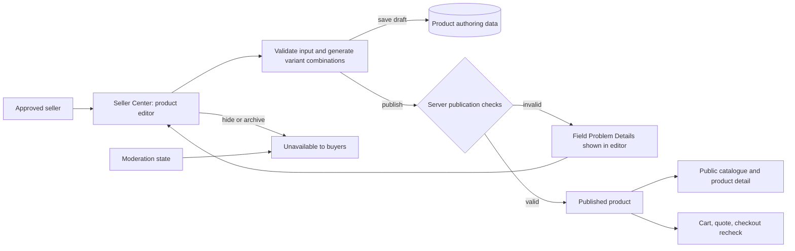

## Context

The existing catalogue already persists products, variants, images, and inventory, and public reads require an active product, category, and approved active shop. T22 supplies the approved seller-shop boundary, but it has no seller-facing product authoring API or editor. See `proposal.md` for motivation and the two delta specifications for behavior.

## Goals / Non-Goals

**Goals:**

- Keep seller ownership, validation, lifecycle transitions, and buyer purchase eligibility server-authoritative.
- Extend the present product model without breaking existing catalogue, cart, pricing, checkout, or dataset-backed listings.
- Give sellers a practical localized UI for one-at-a-time product creation and maintenance.

**Non-Goals:**

- Binary asset upload, image transformation, bulk spreadsheet import, AI description generation, promotions, or an admin category-attribute editor.
- Redesigning buyer catalogue/detail screens or retroactively forcing the imported canonical dataset through the new editor.
- Building the future admin moderation workflow; this change only makes its state and enforcement possible.

## Decisions

### Product management is a dedicated seller module

Create a `seller-products` NestJS capability with repository, service, DTOs, exception filter, and seller-role endpoints under `/api/v1/seller/products`. Each request resolves the authenticated user's one approved active shop before touching a product, and all mutations run in a transaction. This avoids accepting a shop ID from the client and reuses the role/shop policy introduced by T22. A generic extension of the public catalogue module was rejected because seller reads reveal drafts and operational metadata that must never enter public queries.

### Lifecycle is explicit and publication is a guarded transition

Model seller lifecycle separately from moderation availability: draft, published, hidden, and archived are seller states; a moderation state can independently disable buyer visibility. The public predicate is centralised and consumed by catalogue, cart, pricing, and checkout. Archiving is terminal for the seller lifecycle, protecting existing order and review references instead of deleting rows. Relying only on soft deletion was rejected because it cannot represent a hidden-but-editable listing or a reversible publication transition.

### Normalize authoring data while retaining current buyer read models

Add migrations for category attribute definitions and product attribute values, option groups/values and their variant combinations, package dimensions, ordered media metadata, and moderation state. Retain the existing `Product`, `ProductVariant`, `ProductImage`, and `Inventory` read relationships so buyer projectors need only apply the unified visibility predicate. SKU keeps its existing database-wide uniqueness; option-combination uniqueness is constrained per product. A JSON blob was rejected for attribute and variant structure because it weakens validation, deterministic combinations, and database uniqueness.

### URLs are the first media integration boundary

The editor accepts only canonical supported HTTPS media URLs and returns metadata in explicit display order. No file upload provider is introduced in T23; the UI can later replace this adapter with presigned uploads without changing product validation or lifecycle APIs. Accepting arbitrary URLs or browser-only checks was rejected because public pages must not render unsafe schemes or invalid media persisted by a bypass client.

### Variant generation has a stable identity rule

The editor submits up to two ordered option groups. The API normalizes names/values, forms the cartesian product in group/value sort order, and uses the ordered value-ID tuple as each combination identity. Existing matching combinations preserve their variant IDs, pricing, inventory, and media links; removed combinations are made inactive only when they have no order references, otherwise retained inactive. Accepting a free-form variant-name list was rejected because it cannot reliably prevent duplicate combinations or preserve edits across regeneration.

### Seller UI uses a private listing list plus editor route

Add `/seller/products` for filters/pagination and `/seller/products/new` plus `/seller/products/[productId]` for the editor. The UI calls strict shared-contract clients, does local helpful validation, and treats server Problem Details as authoritative. A single modal was rejected because a listing with media, attributes, dimensions, variants, and lifecycle errors needs durable navigation and unsaved-state handling.

### Activity flow

## Risks / Trade-offs

- [Schema expansion increases migration risk for imported data] → Migration defaults existing products to their current public state and backfills a compatible single-variant authoring representation; validate on a database copy before deployment.
- [A public URL can later disappear or point to unsupported content] → Strict HTTPS validation, render-safe URL checks, and explicit media error states; binary upload remains a separate follow-up.
- [Regenerating variant combinations can orphan cart/order references] → Preserve referenced variants as inactive and make every mutation transactional; never hard-delete referenced variants.
- [Multiple availability rules drift between modules] → Export one product purchaseability predicate and add integration coverage for public reads, cart, pricing, and checkout.
- [Category attributes lack an admin editor in this phase] → Seed/version controlled definitions for supported active categories and keep management of definitions out of seller permissions.

## Migration Plan

1. Add nullable/new authoring tables and moderation fields through a Prisma migration, then backfill existing product media, single variants, package defaults, and compatible lifecycle values.
2. Deploy backend validation and public predicate changes before exposing Seller Center creation UI.
3. Deploy Seller Center routes and verify a seller can create a draft, publish a complete listing, and hide it while buyer paths update immediately.
4. Roll back application code before reverting the additive migration. Do not drop new rows during rollback; disable the new endpoints and preserve data for a later forward migration.
