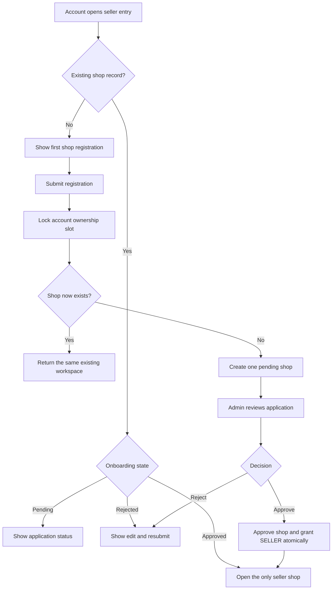
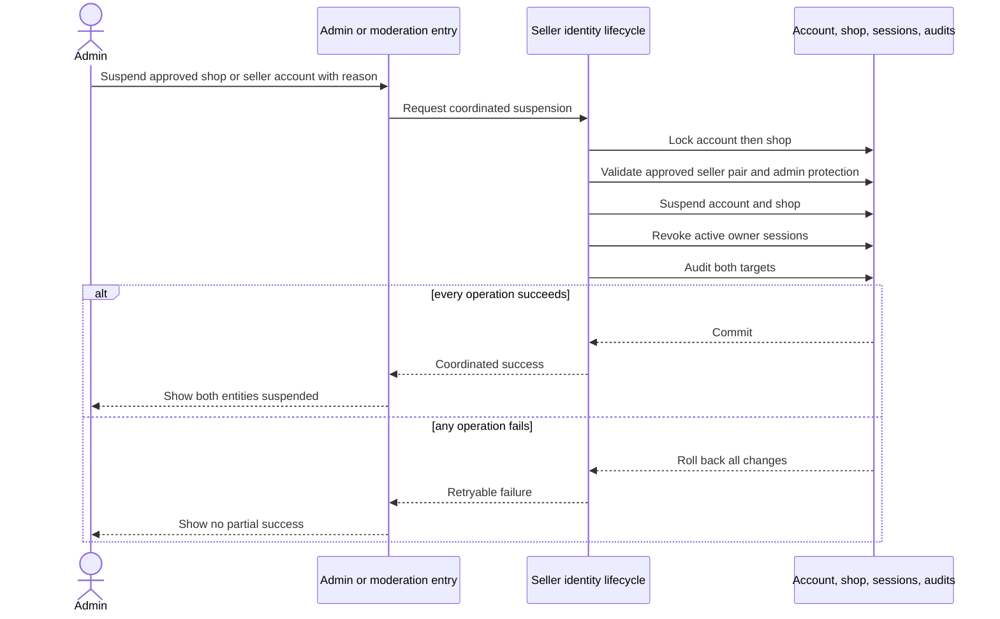
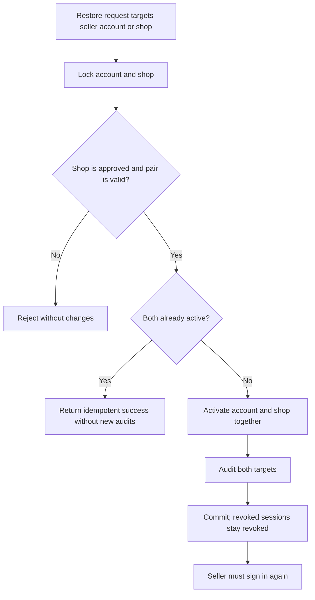
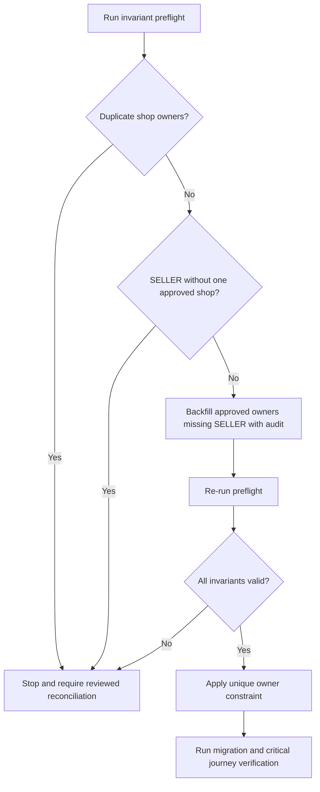

# Flow

> **Implementation status:** Seller workspace ownership checks, seller-role invariant guards,
> paired lifecycle adapters for admin/moderation, suspended-auth feedback, and the migration
> preflight/backfill scripts are implemented. PostgreSQL is reachable, but migration execution is
> intentionally blocked by one legacy seller role without an approved shop; migration/Playwright
> verification must continue after that record receives a reviewed business resolution.

## Seller registration and approval

## Coordinated suspension

## Coordinated restoration

## Migration safety

