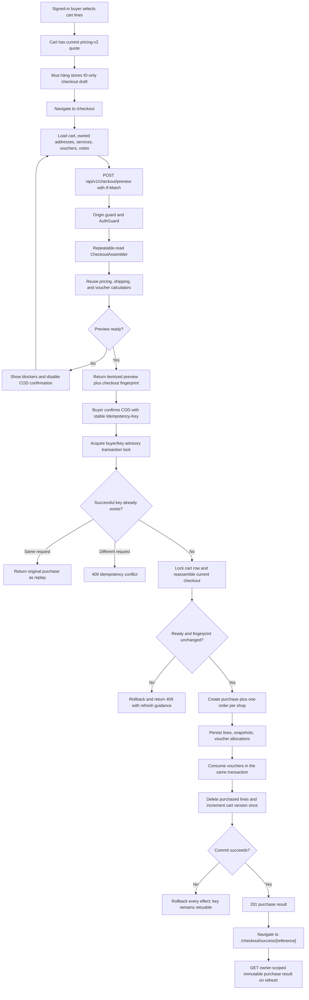

## Context

See `proposal.md` for motivation and the two delta specs for behavior. T16 persists one authenticated cart and selected state per buyer. T17 exposes ETag-protected, server-authoritative `pricing-v2` quotes through `PricingQuoteService.calculateInTransaction(...)`. T18 adds deterministic voucher allocations and `VoucherConsumptionService.consumeInTransaction(...)`, intentionally leaving the transaction owner to T19. Shipping is still the versioned `mock-v1` calculator, and addresses are buyer-owned soft-deleted rows with full legacy province/district/ward text.

No purchase or order tables exist yet. The cart page already has authoritative totals and a placeholder `Mua hàng` action, but its address, service, and voucher state is screen-local. The design must connect those seams without adding a second pricing implementation, trusting browser money, retaining mutable catalog dependencies for historical display, or pre-empting the inventory-reservation work scheduled for T24.

## Goals / Non-Goals

**Goals:**

- Make one COD confirmation create a durable purchase group and exactly one order per selected shop.
- Use the existing pricing, shipping, and voucher calculators inside the same database transaction as order persistence.
- Detect business changes between preview and confirmation without persisting temporary quote rows.
- Make network retries and concurrent duplicate submissions converge on one committed purchase.
- Preserve complete immutable order facts while retaining useful normalized relations for later buyer/seller workflows.
- Provide a refresh-safe buyer confirmation route and focused quick-E2E coverage.

**Non-Goals:**

- Online payment authorization/capture, carrier APIs, fulfillment, seller processing, cancellation, or timeline events.
- Inventory reservation, decrement-to-sold, or a cross-buyer no-oversell guarantee; T24 owns those behaviors.
- Guest checkout; all checkout and result endpoints require the existing authenticated session.
- Rate limiting or a new CSRF mechanism; these endpoints use the existing project-wide Origin guard, cookie policy, authentication, validation, and security headers.
- Public order listing or general order-detail APIs; T20 will expand the narrow confirmation-result read model.

## Decisions

### 1. Add a dedicated CheckoutModule and three buyer endpoints

Create a capability-oriented NestJS `CheckoutModule` with:

| Endpoint                                            | Purpose                                                       | Success                    |
| --------------------------------------------------- | ------------------------------------------------------------- | -------------------------- |
| `POST /api/v1/checkout/preview`                     | Build a confirmable checkout from current selected cart state | `200`                      |
| `POST /api/v1/checkout/cod`                         | Revalidate and atomically create the COD purchase             | `201`, or `200` for replay |
| `GET /api/v1/checkout/purchases/:purchaseReference` | Reload the buyer-owned committed confirmation result          | `200`                      |

Both mutations accept strict DTOs containing IDs, service codes, voucher codes, and notes only. Preview and confirmation require `If-Match: "cart-<version>"`; confirmation also requires `Idempotency-Key: <uuid>` and a 64-character checkout fingerprint. Responses are `private, no-store`, use shared exact-key parsers, and map failures to stable Problem Details.

Reusing `POST /cart/quote` as the whole checkout API was rejected: that endpoint intentionally permits display-only exclusions and has no notes, readiness, fingerprint, idempotency, or committed result. Duplicating all quote fields in a client-authored order request was rejected because it would create a tampering boundary.

### 2. Build preview and confirmation through one canonical checkout assembler

Add a framework-internal `CheckoutAssembler` that receives a `Prisma.TransactionClient`, buyer/cart version, address ID, normalized service/voucher/note selections, and one UTC evaluation instant. It calls `PricingQuoteService.calculateInTransaction(...)` and augments the result with the full address plus product/variant/shop display facts needed for snapshots. Existing `/cart/quote` behavior and contracts remain backward compatible.

The assembler returns:

- the public itemized preview;
- ordered internal line/address/shop snapshot facts;
- applied voucher snapshots and allocations;
- stable readiness blockers;
- the deterministic checkout fingerprint.

Preview runs it in `RepeatableRead`. Confirmation runs the same assembler in the write transaction, so there is one source of truth for eligibility and money. Implementing a second order-pricing calculator was rejected because even small rounding or ordering drift would violate T17/T18 invariants.

### 3. Treat any selected-line exclusion or requested-voucher rejection as a blocker

The pricing quote remains able to describe exclusions for cart display, but the checkout assembler sets `ready: false` when:

- there are no effective selected lines;
- any selected line is unavailable or understocked;
- a requested voucher is rejected or has no positive benefit;
- a participating shop lacks exactly one valid service selection;
- an input note/service references a non-participating shop.

The checkout UI can render the server's itemized facts and blocker codes but cannot confirm them. Silently creating a partial purchase from only the surviving lines was rejected because the buyer could believe an excluded product was included. Silently dropping a voucher was rejected because it can increase the COD amount unexpectedly.

Unlike the lower-level quote, checkout requires an explicit supported service for every participating shop. The web initializes each to `STANDARD`, so the contract stays deterministic without hiding defaults during final confirmation.

### 4. Use a canonical SHA-256 fingerprint instead of persisted quote rows

For ready previews, compute SHA-256 over versioned canonical JSON containing:

- cart version and sorted effective line IDs, product/variant snapshot facts, quantities, and authoritative money breakdowns;
- full owned address snapshot;
- sorted shop identity, normalized note, selected service, shipping facts, and order totals;
- sorted requested/applied voucher results and allocation facts;
- pricing, voucher, shipping, currency, and fingerprint schema versions.

Object keys and arrays have fixed order. The fingerprint excludes `evaluatedAt`, raw inventory counts that remain sufficient, and voucher counters that do not alter eligibility, preventing every later confirmation from changing solely because time advanced or unrelated stock decreased. Eligibility transitions, catalog snapshot changes, totals, and address changes still change readiness or the digest.

Confirmation recalculates and compares with a timing-safe equality check. A mismatch returns `409` and the fresh preview so the buyer can consciously reconfirm. Persisted preview rows and expiration cleanup were rejected as unnecessary state; accepting only an expected grand total was rejected because different line, address, or allocation facts can share a total.

### 5. Canonicalize the request separately for idempotency

Normalize codes, trim notes, reject control characters, cap each note at 500 characters, reject duplicate shop entries, and sort all per-shop entries by shop ID. Hash the canonical confirmation request—including buyer ID, cart version, address ID, services, vouchers, notes, and checkout fingerprint—into `requestDigest`.

Use a canonical UUID idempotency key scoped by `(buyerId, idempotencyKey)`. A successful row stores this request digest. An existing key with the same digest returns its purchase even though the original cart lines are gone; a different digest returns `409`. Failed transactions record no key, so a corrected retry can proceed.

Using the checkout fingerprint alone as an idempotency key was rejected because two intentional identical purchases must remain possible. A browser-generated key without a stored request digest was rejected because accidental key reuse with different intent would return a misleading order.

### 6. Serialize duplicate keys before reading mutable cart state

At the start of COD confirmation, derive two signed 32-bit advisory-lock values from the buyer ID and idempotency key and acquire `pg_advisory_xact_lock`. Then:

1. look up `(buyerId, idempotencyKey)`;
2. return or conflict if already committed;
3. lock the buyer cart row `FOR UPDATE` and verify its version;
4. assemble the current checkout;
5. compare readiness and fingerprint;
6. persist the purchase graph, consume vouchers, and clean the cart;
7. commit.

The transaction uses `Serializable` with a bounded retry for PostgreSQL serialization/deadlock errors before any response is returned. Advisory hash collisions only serialize unrelated confirmations; they do not merge them because the unique constraint and full key comparison remain authoritative. Relying only on `create` plus unique-error recovery was rejected because the losing transaction cannot reliably return the winner until commit and produces noisier retry behavior.

### 7. Add normalized order tables with JSONB only for bounded snapshots

Add these additive Prisma models:

- `Purchase`: UUID reference/primary key, buyer, idempotency key, request and checkout digests, currency/payment fields, full address JSON snapshot, itemized aggregate totals, created time, and child orders.
- `ShopOrder`: UUID order reference, purchase/shop relation, `PENDING_CONFIRMATION`/`UNPAID`, shop JSON snapshot, normalized note, shipping JSON snapshot, itemized order totals, created time, and order lines.
- `OrderLine`: source cart line/product/variant identifiers, product/variant/SKU/image snapshots, quantity/weight, and full line price/discount/payable columns.
- `PurchaseVoucher`: purchase/voucher relation plus code/name/issuer/benefit/slot snapshots and benefit totals.
- `PurchaseVoucherAllocation`: purchase-voucher plus shop-order and optional order-line relation, allocation kind, and amount.

Add enums initially containing `COD`, `UNPAID`, `PENDING_CONFIRMATION`, and `MERCHANDISE | SHIPPING`; T20 can add lifecycle values through an additive migration. Use database unique constraints for buyer/idempotency key, purchase/shop, purchase/voucher, and order/source-cart-line. Add non-negative money checks plus order/purchase sum checks where PostgreSQL can enforce row-local invariants.

Full line rows are normalized because seller/buyer order pages will query them. Address, shop identity, and shipping provider payloads are bounded JSONB snapshots validated before write/read because their field sets evolve together and are not search dimensions in T19. Storing the entire purchase as one JSON document was rejected because per-shop ownership, future lifecycle, and line queries require normalized records. Copying every nested display field into dozens of nullable columns was rejected as migration-heavy without current query value.

Use restrictive source relations plus copied snapshots: historical reads render snapshots, while hard deletion of referenced entities is prevented. `VoucherConsumption.purchaseReference` becomes a one-to-one relation to `Purchase.id`; the existing service is extended to return redemption identifiers needed to link/verify allocations without exposing a public consume endpoint.

### 8. Commit the complete purchase graph and side effects in one transaction

Within the locked transaction:

1. create `Purchase` with its idempotency key and aggregate snapshots;
2. create shop orders in sorted shop-ID order;
3. map every source cart line to one new order line;
4. create purchase-voucher and allocation snapshots using the pricing allocation map;
5. call `VoucherConsumptionService.consumeInTransaction(...)` with the same purchase UUID and evaluation instant;
6. delete exactly the mapped cart-line IDs with a cart ownership predicate;
7. increment the cart version exactly once and verify affected counts;
8. load/project the committed response before returning.

Any count mismatch or write failure throws and rolls back all steps. The cart row is retained when emptied, preserving the authenticated cart invariant. Marking the cart `consumedAt` or creating a new cart was rejected because unselected lines must survive and the existing cart has a stable per-user identity.

T19 reads current availability during assembly but does not update `Inventory`; this intentionally leaves cross-key overselling possible until T24 adds reservations. Pretending a simple decrement is a complete solution was rejected because T24 requires reserved/on-hand/sold semantics and expiry/release rules.

### 9. Project committed data rather than recalculating historical data

Create one purchase projector shared by first confirmation, idempotent replay, and owner retrieval. It validates BigInt-to-safe-number conversion, exact total equations, deterministic order/line/voucher ordering, snapshot shapes, and buyer ownership. Retrieval queries by both purchase reference and buyer ID; missing and foreign references map to the same `404`.

The confirmation wrapper returns `{ replayed, purchase }`; the narrow GET returns the same `purchase` shape without implying a new execution. Re-running pricing to display an order was rejected because catalog, address, shipping, and voucher data are intentionally mutable.

### 10. Carry checkout intent in versioned session storage, never money

When the cart `Mua hàng` button is enabled, save a versioned checkout draft in `sessionStorage` containing cart version, address ID, per-shop service codes, voucher codes, and no server totals or personal address fields, then navigate to `/checkout`. The checkout screen validates the draft, falls back to the default address plus `STANDARD` services when absent, lets the buyer edit address/services/notes/vouchers, and requests a new preview after each relevant change with abort/sequence protection.

For confirmation, generate `crypto.randomUUID()` once and retain it with the canonical submit intent until a definitive success/conflict. A network error reuses the key; an intentional selection change creates a new submit intent/key. On success, clear the draft and navigate to `/checkout/success/[purchaseReference]`, whose server/client boundary fetches the owner-scoped result. URL query parameters were rejected because voucher/address identifiers would leak into history and logs; global React state alone was rejected because refresh and navigation would discard intent.

### 11. Test contracts, transactions, retries, and the buyer journey in focused layers

- Shared-contract tests cover exact keys, normalization, blocker/fingerprint formats, totals, snapshots, replay metadata, and Problem Details.
- Pure/unit tests cover canonical ordering, note normalization, fingerprint stability/change matrix, allocation mapping, and purchase projection.
- Prisma/migration tests cover models, enums, checks, uniqueness, relations, and deployability from the current T18 schema.
- PostgreSQL HTTP tests cover auth/origin precedence, address ownership, stale ETags, strict input, multi-shop splitting, current-price revalidation, voucher expiry/limit races, cart cleanup, owner-only reads, safe-number failure, and replay after cart cleanup.
- A replaceable order-writer provider supplies a test-only fault after partial in-transaction writes so a real PostgreSQL test proves rollback without production-only failure flags.
- A concurrent Supertest test submits one key twice and asserts one purchase graph and one voucher usage change.
- Web component tests cover draft recovery, blockers, rapid preview races, double-click/network retry behavior, and confirmation rendering.
- Add `test:e2e:checkout:quick` to the focused runner for authenticated 360/768/1440 COD and refresh journeys with contract-valid interception. Full tests, typecheck, lint, build, migration smoke, database E2E, and strict OpenSpec validation remain final gates.

## Flow

## Risks / Trade-offs

- **[Fingerprint canonicalization can drift between preview and confirmation]** → Keep one backend canonicalizer/assembler, version the schema, and test input-order independence plus every included/excluded field.
- **[Serializable transactions and voucher/cart locks can contend]** → Lock in a fixed order, keep calculations database-local, select only required facts, use bounded retries, and surface a safe retryable `503` after exhaustion.
- **[Advisory lock hash collision serializes unrelated buyers]** → Use two 32-bit values from SHA-256; collision affects latency only, while unique constraints still define identity.
- **[JSONB snapshots are less directly queryable]** → Restrict JSONB to bounded address/shop/shipping snapshots; keep statuses, ownership, totals, lines, and voucher allocations normalized.
- **[T19 can still oversell across distinct checkout keys]** → Validate readable stock and document the limitation; implement reservations atomically in T24 rather than adding misleading partial inventory semantics now.
- **[Session storage may be stale or manually edited]** → Treat it only as untrusted UI intent, strictly parse it, and rebuild everything from authenticated server data.
- **[A response can be lost after commit]** → Persist key plus request digest in the purchase row and reuse the same browser key until a definitive result, making retry safe after an unknown network outcome.
- **[Large purchase graphs increase response and transaction size]** → Existing cart maximum is 100 lines; batch inserts, deterministic projections, and bounded note/snapshot sizes keep work finite.
- **[Future T20 lifecycle enums need expansion]** → Start with the single required state and use an additive enum migration when T20 implements transitions.

## Migration Plan

1. Add order/payment/allocation enums and the five purchase/order tables with foreign keys, unique constraints, indexes, JSONB columns, and money checks in one additive migration.
2. Extend Prisma verification and migration smoke tests; do not seed fake buyer purchases or mutate existing transactional data.
3. Deploy the migration before the API version that writes purchases. Existing cart/pricing/voucher endpoints remain compatible throughout.
4. Deploy shared contracts and `CheckoutModule`, then the `/checkout` and confirmation screens plus cart navigation.
5. Verify a multi-shop COD purchase, replay, owner retrieval, voucher usage, and selective cart cleanup against PostgreSQL before enabling the UI path in production.
6. Roll back application routing/UI first if needed; additive tables can remain dormant without affecting prior features. Dropping populated purchase tables requires a separately approved destructive migration and is not part of routine rollback.
