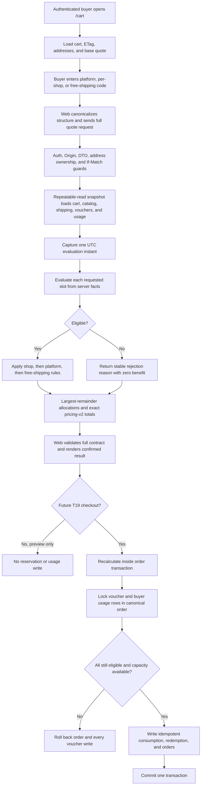

## Context

See `proposal.md` for motivation and the two delta specs for observable behavior. T17 now exposes an authenticated, ETag-protected `POST /api/v1/cart/quote` that reads a repeatable PostgreSQL snapshot and returns exact integer-VND merchandise and mock-shipping totals. Its contracts use exact-key validation and `pricing-v1`, the web keeps quote state local to `/cart`, and no checkout/order model exists yet.

T18 crosses Prisma persistence, pure pricing rules, transactional concurrency, shared contracts, OpenAPI, and responsive cart UI. The main constraint is that preview must be useful but never reserve scarce usage, while T19 must be able to recalculate and consume exactly the applied set in its future order transaction without duplicating business rules.

## Goals / Non-Goals

**Goals:**

- Keep voucher definitions and every eligibility/money decision server authoritative.
- Support one platform merchandise voucher, one shop merchandise voucher per selected shop, and one free-shipping voucher per quote.
- Make ordering, percentage rounding, caps, and cross-line/shop allocation deterministic and algebraically verifiable.
- Separate read-only preview from concurrency-safe, idempotent transactional consumption.
- Leave explicit internal seams that T19 can call with the same Prisma transaction used to create orders.
- Preserve existing authentication, Origin/media guard, cart ETag, address ownership, mock shipping, Problem Details, and screen-local race protection.

**Non-Goals:**

- Building checkout, orders, stock reservation, payment, or a public voucher-consumption endpoint.
- Seller/admin voucher CRUD screens; T27 can manage the definitions introduced here.
- Auto-claim wallets, personalized voucher discovery, campaign targeting, voucher reservation, or code suggestions.
- Coins, cashback, affiliate rewards, campaign bidding, taxes, or combining more voucher slots than specified.
- Re-enabling or broadening the temporarily disabled GitHub Actions workflow.

## Decisions

### 1. Store immutable voucher identity plus explicit mutable availability

Add Prisma enums and four persistence areas:

- `Voucher`: normalized unique code, name, `PLATFORM | SHOP` issuer, optional `shopId`, `FIXED_AMOUNT | PERCENTAGE | FREE_SHIPPING` benefit, fixed amount or basis points, maximum discount, minimum spend, `[startsAt, endsAt)`, enabled flag, total/per-buyer limits, and denormalized committed `usedCount`.
- `VoucherProductScope`: composite voucher/product whitelist. No rows means every product inside the issuer scope; importer/seed verification rejects cross-shop rows for shop vouchers.
- `VoucherUserUsage`: composite voucher/user counter used for efficient per-buyer checks and locking.
- `VoucherConsumption` plus `VoucherRedemption`: one server purchase reference, buyer, canonical voucher-set digest, timestamps, exact committed benefits, and one redemption per voucher.

Database checks enforce valid time ranges, non-negative safe-scale VND values, percentage basis points from 1 through 10,000, positive limits, `usedCount <= usageLimit`, issuer/shop consistency, and benefit-column consistency. Foreign keys use restrictive deletion where redemption history exists. Application validation additionally checks product-to-shop consistency, which a row-local PostgreSQL check cannot express.

Keeping only redemption rows and counting them during every preview was rejected because popular vouchers would turn quote traffic into repeated aggregate scans. Keeping counters without redemption audit was rejected because idempotency, reconciliation, and future support investigation would be weak.

### 2. Normalize codes at both contract and persistence boundaries

The shared contract trims, uppercases, and accepts only 4–32 ASCII `A-Z`, `0-9`, and `-` characters. Requests use the canonical value for duplicate detection; persistence stores only canonical codes under a unique constraint. Display labels remain separate Unicode text.

The quote request extends to:

```ts
{
  shippingAddressId: string;
  services?: Array<{ shopId: string; service: ShippingServiceCode }>;
  vouchers?: {
    platformCode?: string;
    shopCodes?: Array<{ shopId: string; code: string }>;
    freeShippingCode?: string;
  };
}
```

This exposes codes, slots, and shop association only. A flat arbitrary code array was rejected because slot conflicts and per-shop intent would become implicit. Sending voucher IDs or calculated benefit fields was rejected because it leaks storage identity and creates browser-authority ambiguity.

### 3. Capture one clock instant and evaluate pure voucher snapshots

Introduce an injectable clock at orchestration boundaries and capture `evaluatedAt` once per quote/checkout calculation. `PricingQuoteService` loads requested voucher definitions, product scopes, global counters, and current buyer counters inside the same database snapshot as cart/catalog/address facts. It maps those rows to framework-free immutable input for a pure `VoucherPricingCalculator`.

Eligibility checks run in a fixed precedence so a definition produces one stable reason:

1. `NOT_FOUND`
2. `DISABLED`
3. `NOT_STARTED` or `EXPIRED`
4. `GLOBAL_LIMIT_REACHED`
5. `BUYER_LIMIT_REACHED`
6. `TYPE_MISMATCH`
7. `SCOPE_MISMATCH`
8. `NO_ELIGIBLE_ITEMS`
9. `MINIMUM_SPEND_NOT_MET`

The clock, usage counters, and scopes never come from the request. One reason per selection keeps UI mapping and tests stable; returning every failed predicate was rejected because it can expose internal availability and produces noisy, order-dependent UX.

### 4. Calculate benefits over residual line buckets with checked integers

Start from T17 selling-price line subtotals. Each line becomes a residual bucket keyed by `(shopId, lineId)` while list-price/catalog discount remains informational and unchanged.

For each eligible voucher:

```text
preVoucherEligibleSpend = sum(original selling subtotals in voucher scope)
fixed benefit           = min(configured fixed amount, eligible residual)
percentage benefit      = min(floor(eligible residual × basisPoints / 10_000), maxDiscount, eligible residual)
free-shipping benefit   = min(eligible authoritative fees, maxDiscount)
```

Use checked integer/BigInt intermediates for multiplication and division, then validate safe-integer VND at the response boundary. Percentage division always floors. Minimum spend always reads the pre-voucher eligible selling subtotal so applying an earlier slot cannot retroactively make a later voucher fail eligibility, but the later benefit cannot discount value already removed.

Binary floating-point rates and generic decimal dependencies were rejected for the same reason as T17: VND is integral here and exact integer rules are simpler to audit.

### 5. Fix stacking and allocation order as part of `pricing-v2`

Apply vouchers in this order:

1. Existing catalog markdown calculation.
2. One eligible shop merchandise voucher per shop, shops sorted by ID.
3. One eligible platform merchandise voucher across remaining in-scope line value.
4. One eligible free-shipping voucher across eligible authoritative shipment fees.

Allocate a merchandise benefit proportionally across eligible residual line amounts. For each bucket use `floor(totalBenefit × bucketWeight / totalWeight)`, then assign leftover VND by descending fractional remainder and ascending `(shopId, lineId)`. Free-shipping allocation uses the same largest-remainder algorithm over eligible shop fees with `shopId` as tie-breaker. Aggregate allocations into shop and quote summaries.

The response carries per-selection benefits, per-shop allocations, merchandise-voucher total, shipping-voucher total, total voucher benefit, and final payable. Shared parsers recalculate every invariant rather than checking shape only. Applying all vouchers against the original subtotal was rejected because overlapping vouchers could over-discount; placing platform before shop was rejected because Shopee-style shop support should reduce the shop-local value first.

### 6. Bump the strict quote to `pricing-v2` and deploy API/web together

The existing exact-key `pricing-v1` response cannot safely gain voucher fields without old consumers rejecting or misreading it. Keep the endpoint path but return:

- `pricingVersion: "pricing-v2"`
- `voucherVersion: "voucher-v1"`
- existing `shippingVersion: "mock-v1"`
- one `evaluatedAt` UTC timestamp
- stable applied/rejected selection results
- zero-valued voucher fields when no codes are present

Update shared contracts, API OpenAPI schema, web parser, tests, and fixtures in one monorepo change. A second `/quote-v2` endpoint was rejected because there is only one first-party client and parallel pricing endpoints would invite checkout divergence. Keeping `pricing-v1` while changing its exact algebra was rejected because the version would no longer describe a stable contract.

### 7. Keep preview successful when individual vouchers reject

Syntactically valid but unknown, expired, exhausted, reused, mismatched, or minimum-spend codes appear in the successful quote as rejected selections with zero benefit. Structural problems—unknown fields, malformed codes, repeated codes, duplicate shop slots, invalid UUIDs, stale ETag, unauthenticated access, or address ownership—continue through sanitized HTTP Problem Details.

This separation lets buyers correct a code while retaining authoritative merchandise and shipping details. Returning `422` for normal ineligibility was rejected because multi-slot requests could contain both valid and invalid vouchers and the UI still needs the valid quote.

### 8. Provide an internal transaction-owned consumption seam for T19

Add an exported backend service shaped conceptually as:

```ts
consumeInTransaction(transaction, {
  purchaseReference,
  userId,
  appliedVoucherIds,
  authoritativeBenefitByVoucher,
  evaluatedAt,
});
```

It is not routed by a controller. The caller owns the interactive Prisma transaction and must first recalculate through the transaction-aware pricing path. Consumption then:

1. inserts the `VoucherConsumption` reference with `ON CONFLICT DO NOTHING` and verifies an existing buyer/set digest for idempotent retry;
2. orders voucher IDs and locks voucher rows;
3. creates missing `(voucherId, userId)` usage rows and locks them in the same order;
4. reloads current windows/enabled/scope/counters and rejects if the applied set is no longer valid;
5. increments global and per-buyer counters and writes exact redemption audit rows;
6. returns to T19, which creates/links orders and commits the one outer transaction.

T18 integration tests prove commit, rollback, idempotent retry, mismatched retry, and two-session final-capacity races. T19 will add the actual purchase write beside this call. Opening a nested transaction was rejected because voucher rows could commit when order creation rolls back. A public consume route was rejected because clients could waste capacity without a purchase.

### 9. Extend the existing screen-local quote controller

The cart keeps draft inputs and applied selections locally:

- global platform code input near the order summary;
- one shop code input inside each shop group;
- one global free-shipping code input near shipping totals;
- explicit apply/remove actions rather than requoting on every keystroke.

Submitting or removing a code sends the complete current voucher selection with address/services and current ETag. Quantity, selection, address, service, and shop-group changes retain still-relevant codes, prune removed shop slots, mark totals stale, and trigger the existing abort/sequence-protected requote. Rejection codes map to fixed Vietnamese UI copy; raw backend detail is never rendered.

The client never calculates expected savings. An optional optimistic “code selected” chip may render while pending, but every money value disappears or is labeled unavailable until a contract-valid latest response arrives. Automatic application of the “best” voucher was rejected because the issue asks for preview and explicit stacking, and discovering all available campaigns is outside T18.

### 10. Seed small deterministic fixtures and test the executable boundaries

Extend deterministic seed data with documented non-secret examples tied to stable shops/products, such as:

- platform fixed amount with minimum spend;
- platform percentage with cap;
- one product-scoped shop percentage voucher;
- platform free shipping with cap;
- expired, not-yet-started, globally exhausted, and current-buyer-used fixtures for guarded tests.

Use table-driven unit tests for eligibility precedence, half-open time boundaries, fixed/percentage caps, integer flooring, overlapping scopes, slot mismatch, input-order independence, and largest-remainder allocation. PostgreSQL tests cover migration constraints, read-only preview, ETag/auth/Origin/address ownership, current definition reload, global/per-buyer limits, rollback, idempotency, and real concurrent transactions. Contract/component tests cover exact fields and localized states. Add `test:e2e:vouchers:quick` to the focused runner at 360/768/1440 without rerunning unrelated suites.

## Flow



## Risks / Trade-offs

- **[A preview can become stale immediately]** → Never reserve during preview; display the evaluation time and require transactional checkout recalculation.
- **[Counters can drift from redemption audit after a bug or manual edit]** → Add verification queries/tests and treat redemption audit as reconciliation evidence; restrict production writes to the voucher service.
- **[Hot campaign rows serialize checkout traffic]** → Lock only requested vouchers in stable order, keep work inside the transaction small, index usage lookups, and defer Redis/rate limiting to later hardening tasks.
- **[Largest-remainder allocation is more complex than shop-level rounding]** → Keep it pure, versioned, documented, and exhaustively table-tested so refunds/orders can reuse exact allocations later.
- **[Product-scoped platform vouchers need residual value per line]** → Retain internal line allocations even if the cart emphasizes shop/summary totals.
- **[T19 does not exist yet]** → Ship no public consume endpoint; verify the transaction-owned service with commit/rollback/concurrency tests and document the required T19 integration contract.
- **[`pricing-v2` breaks old strict clients]** → Deploy API and first-party web together, fail old parsers closed, and roll back both application surfaces as one unit.
- **[Manual code entry is less discoverable than a voucher wallet]** → Document seed codes for local testing; defer discovery/claim UX to a later task without changing calculation semantics.

## Migration Plan

1. Add voucher enums/tables, constraints, indexes, counters, product scopes, consumption, and redemption audit in one forward Prisma migration; verify a clean database and the existing data volume.
2. Add deterministic idempotent seed fixtures and verification without changing existing catalog/cart rows.
3. Deploy shared `pricing-v2`/`voucher-v1` contracts and backend evaluation/preview/consumption seams together.
4. Deploy the matching cart UI in the same release because the old exact-key client intentionally rejects `pricing-v2`.
5. T19 later calls the transaction-aware recalculation and consumption seam from its order-creation transaction; no T18 endpoint migration is required.
6. Roll back API and web together. Leave additive voucher tables intact and disabled; remove them only through a separately reviewed destructive migration after confirming no redemption history is needed.
