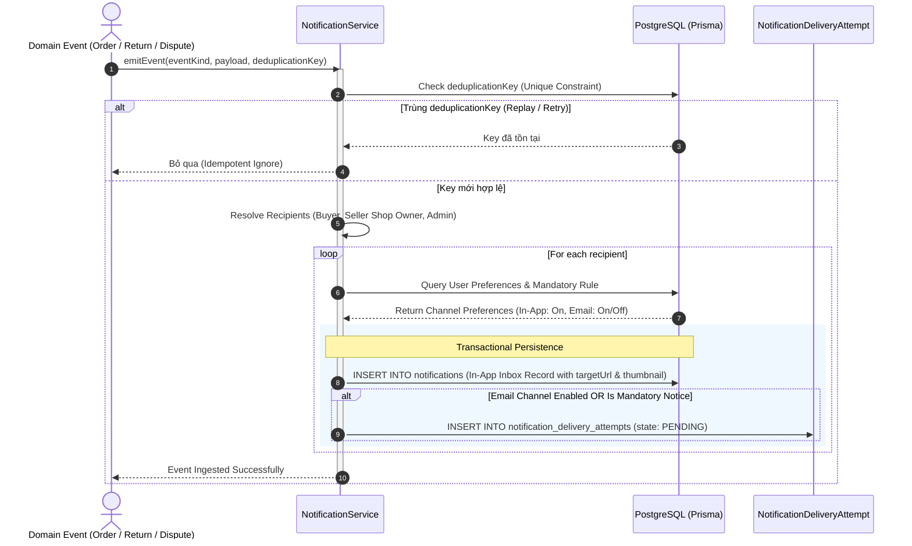
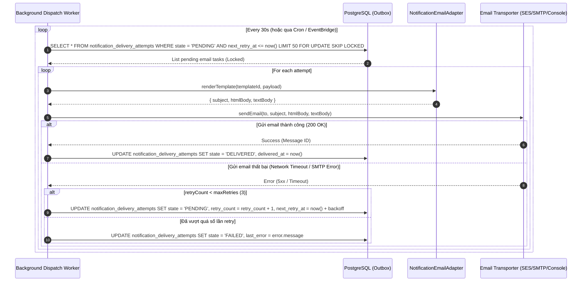
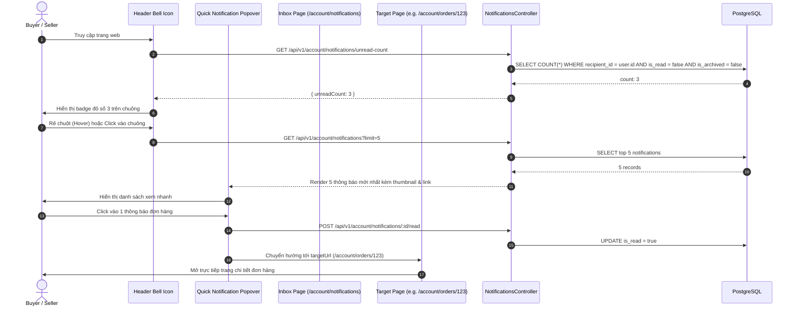

# Planned System Flows: Notification Framework (T30)

> [!NOTE]
> Tài liệu này mô tả **planned flows** cho proposal T30. Các sơ đồ sẽ được cập nhật thành **implemented flows** sau khi hoàn thành bước implementation.

---

## 1. Planned Flow 1: Event Ingestion & Outbox Fanout (Tasks 2.4, 3.1, 3.2, 3.3)

Flow xử lý khi một sự kiện trong hệ thống (Order, Return, Refund, Moderation) phát sinh thông báo cho các đối tượng liên quan (Buyer, Seller, Admin).

---

## 2. Planned Flow 2: Asynchronous Email Dispatch & Retry Worker (Task 2.5)

Flow của worker chạy nền xử lý hàng đợi gửi email và cơ chế retry khi gặp lỗi mạng.

---

## 3. Planned Flow 3: Header Popover, Inbox & Deep-Link Navigation (Tasks 4.1, 4.2)

Flow tương tác của người dùng trên giao diện web với icon chuông, popover xem nhanh và điều hướng deep-link.

