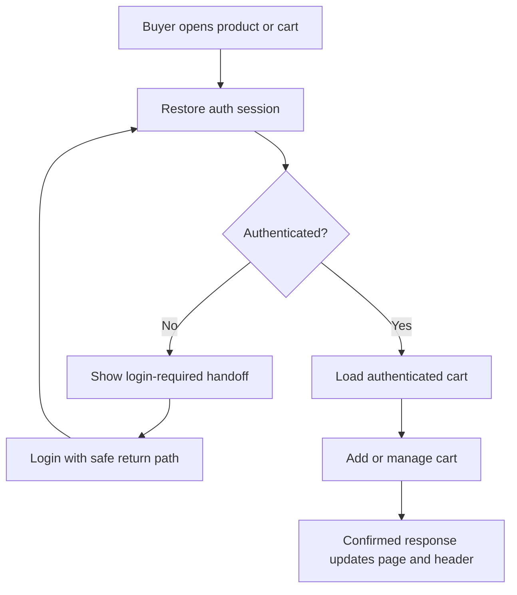

## Context

T10 exposes canonical purchasable variants and T11 restores email/Google sessions, but `/cart` was a placeholder and the header count was static. T16 adds a PostgreSQL-backed cart. The revised product rule is intentionally simple: browsing remains public, but a buyer must authenticate before the application creates, reads, or mutates any cart state.

The API is a NestJS modular monolith backed by Prisma/PostgreSQL. Browser mutation protection was controller-local before T16, while refresh and Google OAuth already use reviewed HttpOnly cookie policy. Existing auth-local throttling remains unchanged; general project rate limiting is deferred.

The initial local T16 migration included guest-compatible ownership columns. Because it has already been applied in developer databases, this revision keeps those columns dormant rather than rewriting migration history or resetting data. Runtime controllers, services, contracts, and clients expose authenticated ownership only. A later dedicated migration may remove the dormant columns after all environments are confirmed safe.

## Goals / Non-Goals

**Goals**

- Persist one authoritative multi-shop cart per authenticated user.
- Require the standard auth guard on every cart endpoint and derive ownership only from the access session.
- Make add, quantity, removal, selection, and reconciliation deterministic under retries and concurrent requests.
- Revalidate current catalog/inventory facts and calculate only selected valid merchandise totals.
- Replace `/cart`, connect product detail and the header, and support login-required/loading/error/accessibility states at 360, 768, and 1440 px.
- Promote trusted-origin and strict mutation input policy into an application-wide default.
- Verify contracts, API, database, and quick browser behavior without mutating the developer database from browser E2E.

**Non-goals**

- Guest carts, anonymous cart credentials, guest-to-user merge, or guest-cart cleanup.
- Inventory reservation, checkout totals, shipping quotes, vouchers, tax, orders, payment, or seller-side cart visibility.
- Redis, multi-region concurrency, horizontal API scaling, or a final buy-now/order contract.
- A generic security-skip decorator, cross-site `SameSite=None` credential mode, or project-wide general rate limiting.

## Decisions

### 1. Store cart ownership and lines in normalized PostgreSQL tables

`Cart` and `CartLine` remain the authoritative persistence model. Runtime code creates and resolves carts only by unique `userId`. `CartLine` has a unique `(cartId, variantId)` constraint and stores quantity, selection, and the last observed unit price needed to explain later changes. `ProductVariant.maxPurchaseQuantity` is optional and constrained to 1..99.

Guest-compatible columns from the already-applied local additive migration remain unused compatibility fields. They are not represented by public contracts, accepted by endpoints, or resolved by domain services. This avoids destructive local database resets while enforcing the new behavior at every application boundary.

### 2. Protect every cart endpoint with authenticated identity

The API surface is:

| Method   | Endpoint                               | Purpose                                                              |
| -------- | -------------------------------------- | -------------------------------------------------------------------- |
| `GET`    | `/api/v1/cart`                         | Return the authenticated user's cart or canonical empty cart         |
| `POST`   | `/api/v1/cart/items`                   | Add `{ variantId, quantity }` or merge into an existing variant line |
| `PATCH`  | `/api/v1/cart/items/:lineId`           | Set `{ quantity }` on an owned line                                  |
| `DELETE` | `/api/v1/cart/items/:lineId`           | Idempotently remove an owned line                                    |
| `PUT`    | `/api/v1/cart/items/:lineId/selection` | Set `{ selected }` for one line                                      |
| `PUT`    | `/api/v1/cart/shops/:shopId/selection` | Set `{ selected }` for eligible lines in one shop                    |
| `PUT`    | `/api/v1/cart/selection`               | Set `{ selected }` for all eligible lines                            |

The standard `AuthGuard` rejects anonymous reads and trusted-origin mutations with sanitized `401` Problem Details. As a deliberate security precedence, an unsafe request with a missing or untrusted Origin is rejected by the global guard with `403` before authentication. The merge endpoint is removed. No request accepts `userId`, `cartId`, price, shop, stock, or subtotal from the client.

Every response uses the shared cart parser and returns `Cache-Control: private, no-store`. Reads emit an ETag. Mutations require `If-Match: "cart-<version>"`; the canonical empty state uses version 0. Successful mutations return the complete canonical projection, so the web never calculates speculative totals.

### 3. Treat PostgreSQL locking and cart versioning as the concurrency boundary

Each mutation runs in a short transaction, locks the authenticated user's cart row, checks `If-Match`, loads current catalog/inventory facts, mutates one logical unit, increments `Cart.version` once, and returns after commit. The unique line constraint is the final defense against duplicate adds.

Projection queries batch-load lines and catalog relations. Money remains integer minor units/`BigInt` in persistence. Optimistic versions make stale tabs explicit while row locks serialize accepted writes.

### 4. Revalidate facts and represent issues instead of silently deleting intent

Every mutation validates active shop/category/product/variant state, deletion markers, current price, available inventory, system maximum, and optional purchase limit. Reads derive the same current presentation without updating persistence.

Unavailable or over-stock lines remain visible but are effectively unselected and contribute zero. Price-changed lines use the current price and expose the prior observed price. A successful corrective mutation refreshes the observation.

### 5. Coordinate cart state only after auth restoration

`CartProvider` waits until auth is no longer loading. If authenticated, it loads and mutates the user cart through authenticated fetch. If anonymous, it performs no cart call, clears private cart data from memory, exposes count zero, and provides no mutation path.

Product detail renders an authenticated add button for users. Anonymous buyers receive the existing login link carrying a safe product return path. `/cart` renders a login-required state for anonymous buyers. After email or Google login, the safe return path brings the buyer back; the buyer explicitly confirms add-to-cart, so no intent is replayed unexpectedly.

### 6. Make browser mutation protection a global default

The global guard requires a syntactically valid exact configured `Origin` for `POST`, `PUT`, `PATCH`, and `DELETE`; missing, malformed, or untrusted origins fail before controller logic. It also shares origins with credentialed CORS, enforces documented JSON/body bounds, rejects method override, and emits sanitized Problem Details.

The verified Google GET callback retains explicit metadata plus state, nonce, PKCE, browser binding, expiry, and single-use checks. Future external webhooks require provider-specific signature, replay, and idempotency verification. Removing guest carts does not weaken this project-wide boundary.

### 7. Apply the authentication policy to future capabilities

Public discovery routes such as home, search, category, product detail, and shop storefront remain anonymous. Features that persist or expose a user's private state—cart, checkout, order history, addresses, private vouchers, reviews, follows, chat, seller/admin actions, and similar capabilities—require authentication by default. A later OpenSpec change may define a narrower public action only when its identity, abuse, privacy, and CSRF model is explicit.

## Risks / Trade-offs

- **Login introduces friction before cart creation.** It removes guest identity, merge, retention, and cross-browser ambiguity and makes ownership straightforward.
- **Dormant migration columns temporarily remain.** Runtime behavior is authenticated-only; schema cleanup is deferred to avoid rewriting applied migration history.
- **Row locking can serialize many writes to one hot cart.** One cart belongs to one buyer and mutations remain short.
- **Global missing-Origin denial can break tests or non-browser callers.** Legitimate callers include the exact configured origin; verified provider callbacks use narrow classifications.
- **No reservation means stock can change after cart confirmation.** Checkout must revalidate all commercial facts.

## Migration Plan

1. Revise shared contracts to expose authenticated ownership only and remove merge responses.
2. Replace optional cart auth with the standard auth guard; remove guest credential, merge, and cleanup application paths while keeping the already-applied additive database migration compatible.
3. Make `CartProvider`, product detail, header, and `/cart` authentication-aware with safe login returns.
4. Update documentation, `flow.md`, unit/API/PostgreSQL tests, and `test:e2e:cart:quick`.
5. Run formatting, lint, typecheck, build, unit/API suites, guarded PostgreSQL cart tests, quick browser tests, migration smoke, and strict OpenSpec validation.

## Open Questions

None. T16 is authenticated-only, project-wide rate limiting remains deferred, and future user-scoped features require authentication by default.
