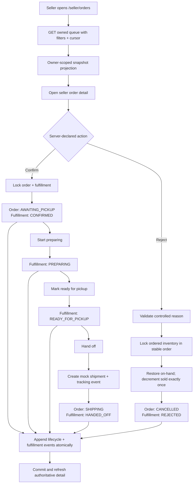
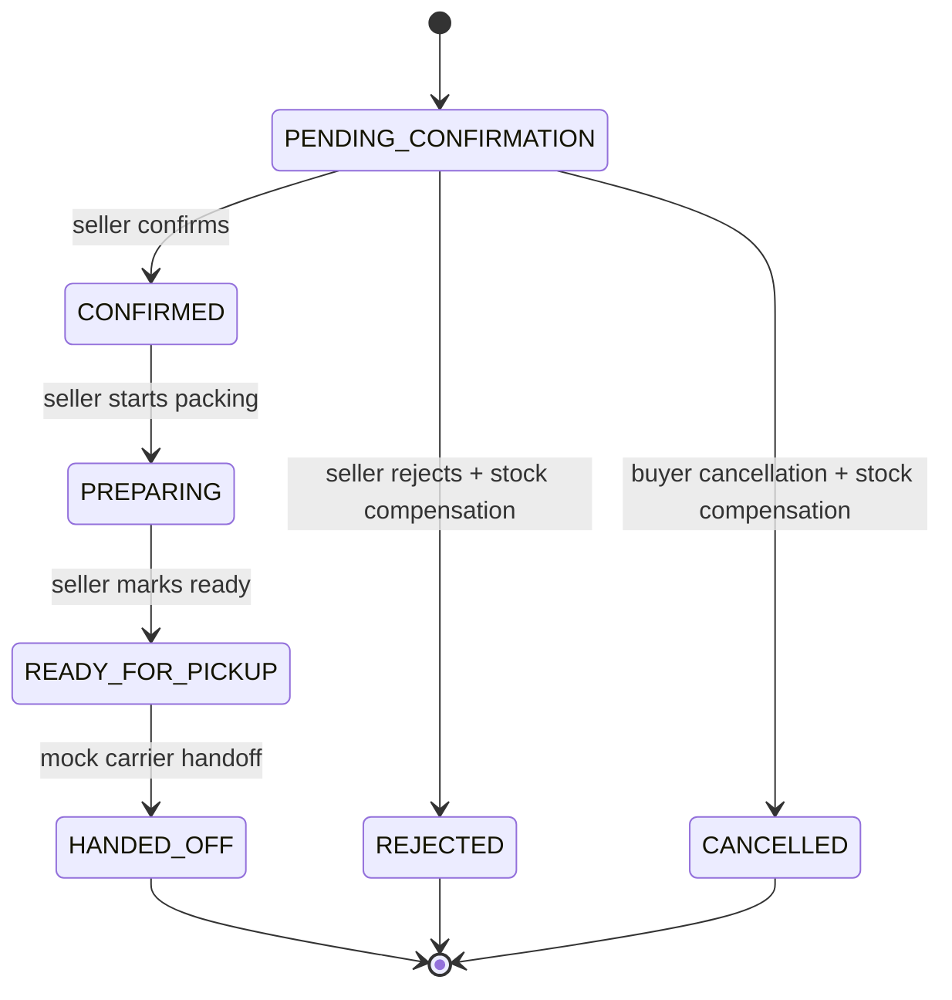

## Context

See `proposal.md` for motivation and the two delta specs for observable behavior. T19 persists one `ShopOrder` per merchant with immutable lines, address, shop, shipping, and price snapshots. T20 adds buyer order reads, a versioned lifecycle state machine, immutable `OrderTimelineEvent` rows, and buyer cancellation from `PENDING_CONFIRMATION`. T24 consumes inventory when COD checkout commits and blocks non-cancellation lifecycle transitions when a pending order's hold is unavailable.

There is no seller order query or command boundary. `ShopOrderStatus` is intentionally coarse (`PENDING_CONFIRMATION`, `AWAITING_PICKUP`, `SHIPPING`, and terminal/post-delivery states), so it cannot honestly represent confirmed, preparing, and ready-for-pickup as separate seller steps. Inventory has already moved from on-hand to sold at checkout, which means both buyer cancellation and seller rejection require an explicit, idempotent compensation transaction.

## Goals / Non-Goals

**Goals:**

- Preserve one authoritative order lifecycle while adding finer-grained, seller-only preparation state.
- Make every seller action owner-scoped, versioned, idempotent, immutable-audited, and atomic across order, fulfillment, inventory, and mock shipment effects.
- Build queue/detail/packing projections from committed snapshots and expose only data needed by the owning shop.
- Repair the existing pre-confirmation buyer cancellation path so consumed inventory is restored through the same compensation primitive as seller rejection.
- Provide responsive Seller Center screens and a deterministic focused test path.

**Non-Goals:**

- Real carrier APIs, label purchasing, tracking webhooks, payment capture/refunds, return logistics, seller staff delegation, bulk fulfillment, split packages, partial rejection, automatic deadline cancellation, or financial settlement.
- Changing immutable checkout totals/snapshots or allowing sellers to edit buyer delivery information.
- Letting seller preparation states replace the buyer-facing order lifecycle.

## Decisions

### 1. Add a one-to-one fulfillment aggregate instead of expanding `ShopOrderStatus`

Create `SellerOrderFulfillment` keyed by `orderId` with:

- `state`: `PENDING_CONFIRMATION | CONFIRMED | PREPARING | READY_FOR_PICKUP | HANDED_OFF | REJECTED | CANCELLED`;
- independent non-negative `version`;
- `confirmationDeadlineAt`, nullable `handoffDeadlineAt`, milestone timestamps, and `updatedAt`;
- a restrictive one-to-one relation to `ShopOrder`.

Create immutable `SellerOrderFulfillmentEvent` rows containing previous/result state, fulfillment version, actor, action/reason, normalized note, `late`, idempotency key/digest, and database-derived occurrence time. Enforce unique `(orderId, fulfillmentVersion)` and `(orderId, idempotencyKey)`.

The migration backfills one aggregate and version-0 event per existing order:

| Existing order status | Backfilled fulfillment state |
| --- | --- |
| `PENDING_CONFIRMATION` | `PENDING_CONFIRMATION` |
| `AWAITING_PICKUP` | `CONFIRMED` |
| `SHIPPING`, `DELIVERED`, return/refund states | `HANDED_OFF` |
| `CANCELLED` | `CANCELLED` |

For `AWAITING_PICKUP`, the first matching lifecycle-event time is the confirmation baseline; otherwise use the order update time. This avoids falsely labeling an existing buyer cancellation as seller rejection.

Adding `CONFIRMED`, `PREPARING`, and `READY_FOR_PICKUP` to `ShopOrderStatus` was rejected because buyer tabs, reviews, future carriers, and return workflows should not depend on warehouse micro-steps. Encoding preparation only as free-form timeline reason codes was rejected because it cannot enforce a state machine or support indexed seller filters.

### 2. Expose one seller read boundary and one action command

Add these private endpoints:

| Endpoint | Purpose |
| --- | --- |
| `GET /api/v1/seller/orders` | Cursor-paginated owned-shop queue with normalized filters |
| `GET /api/v1/seller/orders/:orderReference` | Owned detail, packing projection, timelines, ETag, and actions |
| `POST /api/v1/seller/orders/:orderReference/actions` | Execute one canonical fulfillment action |

The action body is `{ action, reasonCode?, reasonNote? }`, where `action` is `CONFIRM`, `START_PREPARING`, `MARK_READY_FOR_PICKUP`, `HAND_OFF`, or `REJECT`. Only rejection accepts a controlled reason and optional normalized note. The request requires `If-Match` and `Idempotency-Key`. The ETag encodes both `ShopOrder.version` and `SellerOrderFulfillment.version`, so preparation-only and lifecycle-changing commands share one stale-write boundary.

Separate endpoints for every action were rejected because their transport, authorization, idempotency, error mapping, and result contract would be identical. A generic target-status endpoint was rejected because callers must express a business action, not choose arbitrary states.

### 3. Lock and replay in a fixed transaction order

Each command transaction:

1. resolves the order through `ShopOrder.shop.ownerId` and active/approved shop predicates;
2. locks the owned `ShopOrder` then its fulfillment row;
3. checks `(orderId, idempotencyKey)` and replays a matching digest before current-state validation;
4. validates the combined ETag and action/state edge;
5. obtains PostgreSQL time, computes whether the command is late, and applies action-specific effects;
6. writes one fulfillment event and projects the authoritative response before commit.

All paths use the same lock order. `CONFIRM`, `HAND_OFF`, and `REJECT` call the existing lifecycle service inside the same transaction. Preparation-only actions update only fulfillment/version. Different-key races return a stale conflict; same-key retries return the original result.

Relying only on optimistic `updateMany` was rejected because rejection must lock multiple inventory/product rows and handoff must coordinate shipment uniqueness. Holding application-level mutexes was rejected because they do not work across API processes.

### 4. Centralize pre-fulfillment cancellation compensation

Add an internal `cancelConsumedOrderInventory` command used by both seller `REJECT` and T20 buyer cancellation. It aggregates order lines by variant, sorts identifiers, locks inventory rows, and verifies all quantities and sold counters before any update. In one transaction it:

- increments `quantityOnHand` and decrements `quantitySold` per variant;
- decrements each affected product's sold summary using guarded updates;
- increments inventory versions;
- appends inventory adjustments with new reason `ORDER_CANCELLATION`, actor when known, and the source order reference;
- records a unique compensation marker per order so retries and alternate cancellation entry points cannot reverse twice.

The inventory adjustment schema gains nullable `sourceOrderId`; a partial uniqueness rule for order-cancellation adjustments plus an order-level compensation record provides database defense in depth. Historical order snapshots and the consumed checkout reservation remain unchanged because they describe what happened at checkout; compensation is a later audited event.

Deleting or rewriting the consumed reservation was rejected because it would destroy checkout/idempotency history. Treating cancellation as an ordinary seller stock adjustment was rejected because it could partially succeed, require seller-supplied versions, or drift from order quantities.

### 5. Keep lifecycle and fulfillment effects atomic

Action mapping is fixed:

| Seller action | Required fulfillment/order state | Result |
| --- | --- | --- |
| `CONFIRM` | `PENDING_CONFIRMATION` / `PENDING_CONFIRMATION` | fulfillment `CONFIRMED`; order `AWAITING_PICKUP`; handoff deadline set |
| `START_PREPARING` | `CONFIRMED` / `AWAITING_PICKUP` | fulfillment `PREPARING`; order unchanged |
| `MARK_READY_FOR_PICKUP` | `PREPARING` / `AWAITING_PICKUP` | fulfillment `READY_FOR_PICKUP`; order unchanged |
| `HAND_OFF` | `READY_FOR_PICKUP` / `AWAITING_PICKUP` | fulfillment `HANDED_OFF`; order `SHIPPING`; mock shipment created |
| `REJECT` | `PENDING_CONFIRMATION` / `PENDING_CONFIRMATION` | fulfillment `REJECTED`; order `CANCELLED`; inventory compensated |

The T20 buyer cancellation transaction is extended to create/synchronize the fulfillment aggregate to `CANCELLED` and invoke the same inventory compensation. It retains its existing owner scope, ETag, idempotency, and buyer lifecycle event semantics.

### 6. Store a mock shipment as a replaceable adapter boundary

Create one `Shipment` per order with provider `MOCK`, unique server-generated tracking code, immutable shipping/address snapshot subset, `HANDED_OFF` state, and `handedOffAt`. Create one normalized initial tracking event in the same transaction. The service sits behind a small adapter interface so T33 can add a real carrier without changing seller action contracts.

The packing/print route is a web presentation of the strict seller detail contract rather than a server-generated PDF. It includes the order reference, buyer delivery snapshot, shop pickup/return snapshot, service, note, lines, quantities, SKU, package data, and tracking code. CSS print rules remove Seller Center chrome and actions.

Generating a real carrier label was rejected as T33 scope. Persisting only a random tracking string on `ShopOrder` was rejected because later status reconciliation needs a shipment aggregate and normalized events.

### 7. Use snapshot-only seller projectors and keyset pagination

List queries join ownership in SQL and order by `(createdAt DESC, id DESC)`. The opaque cursor includes the last tuple and a digest of normalized status, fulfillment, date, and reference filters. Fetch `limit + 1` and cap limits at 50.

List projection includes lean line thumbnails and counts. Detail adds committed delivery/shipping/shop/line/voucher data, both timelines, packing data, and server-computed available actions. Contact data is absent from list responses and present only in the owned detail/print projection. Responses are strict-contract validated and `Cache-Control: private, no-store`.

Reading current products, account addresses, or shop profile was rejected because fulfillment must match the purchase contract even when those sources change.

### 8. Deadlines are observable policy signals, not an automatic job

Set `confirmationDeadlineAt = order.createdAt + 24 hours`. On confirmation, set `handoffDeadlineAt = databaseNow + 48 hours`. Derive overdue flags from PostgreSQL time and persist `late=true` on a command committed after its relevant deadline.

T25 does not enqueue automatic cancellation. Sellers can still act late, while UI and audit data expose policy breaches for future admin/automation work. Automatic cancellation was rejected because it would need buyer notifications, voucher restoration, operational policy, and robust background compensation not requested by this issue.

### 9. Build Seller Center around server-declared actions

Add `Đơn hàng` navigation and routes `/seller/orders` and `/seller/orders/[orderReference]`. Queue tabs cover all, pending confirmation, preparing/pickup, shipping, completed, and cancelled. Filter state is validated in the URL; cursors reset when filters change.

Detail renders order/fulfillment progress, line and packing cards, address/shipping snapshot, totals, deadlines, timelines, and actions returned by the API. Reject uses a custom confirmation dialog with required controlled reason. Other actions use concise confirmation dialogs, preserve one browser UUID across transport retry, prevent duplicate clicks, send the current ETag, and refresh after success or conflict. `/seller/orders/[orderReference]/print` reuses the validated detail response and print CSS.

### 10. Verify contracts, PostgreSQL races, and the browser journey

- Shared-contract tests cover exact keys, filters/cursors, actions, reasons, ETags, deadlines, timelines, totals, available-action consistency, and malformed private data.
- Pure state-machine tests cover every allowed/forbidden edge and mapping to order status.
- Migration/PostgreSQL tests cover backfill, constraints, ownership, idempotent replay, two-action races, audit atomicity, mock shipment uniqueness, compensation, buyer-cancel integration, and rollback injection.
- Web tests cover filters, responsive queue/detail/print states, dialogs, duplicate prevention, stale refresh, and authorization.
- Add `test:e2e:seller-orders:quick` for seller queue → detail → confirm → prepare → ready → handoff plus a rejection fixture; run seller/homepage quick regressions afterward.

## Flow

## Risks / Trade-offs

- **[Order and fulfillment versions can drift]** → Lock both rows, encode both versions in one ETag, and assert lifecycle/fulfillment compatibility in every projector and command.
- **[Cancellation compensation can race inventory adjustment]** → Lock sorted inventory rows, use guarded sold/product counters, add an order compensation uniqueness marker, and retry bounded serialization failures.
- **[Existing orders have no preparation history]** → Backfill one honest system event derived from coarse order status; never invent intermediate seller actions.
- **[Late actions remain allowed]** → Expose overdue state and persist late audit flags; defer automatic cancellation until notification/voucher/admin policy exists.
- **[Seller detail contains personal delivery data]** → Enforce SQL ownership, omit contact fields from queue responses/logs/errors, use private no-store, and retain data only in the existing order snapshot lifecycle.
- **[Mock shipment may be mistaken for real shipping]** → Mark provider and UI explicitly as mock and avoid external-success language.
- **[Generic action endpoint could accept invalid combinations]** → Parse an exact discriminated action body and centralize a table-driven action/state matrix.

## Migration Plan

1. Add fulfillment/shipment enums, aggregate/event/shipment/compensation tables, inventory adjustment source linkage/reason, constraints, and query indexes in an additive migration.
2. Backfill one fulfillment aggregate and version-0 event per existing order using deterministic status mapping; verify counts and lifecycle compatibility.
3. Deploy shared contracts, cancellation compensation, and buyer-cancellation integration before enabling seller rejection.
4. Deploy seller queue/detail/action APIs, then Seller Center routes and print styles.
5. Run migration verification, PostgreSQL concurrency/failure tests, focused web/E2E suites, and strict OpenSpec validation.
6. Rollback disables seller routes/actions first. Additive fulfillment data can remain dormant; do not remove compensation/audit rows or reverse already-restored inventory during ordinary rollback.
