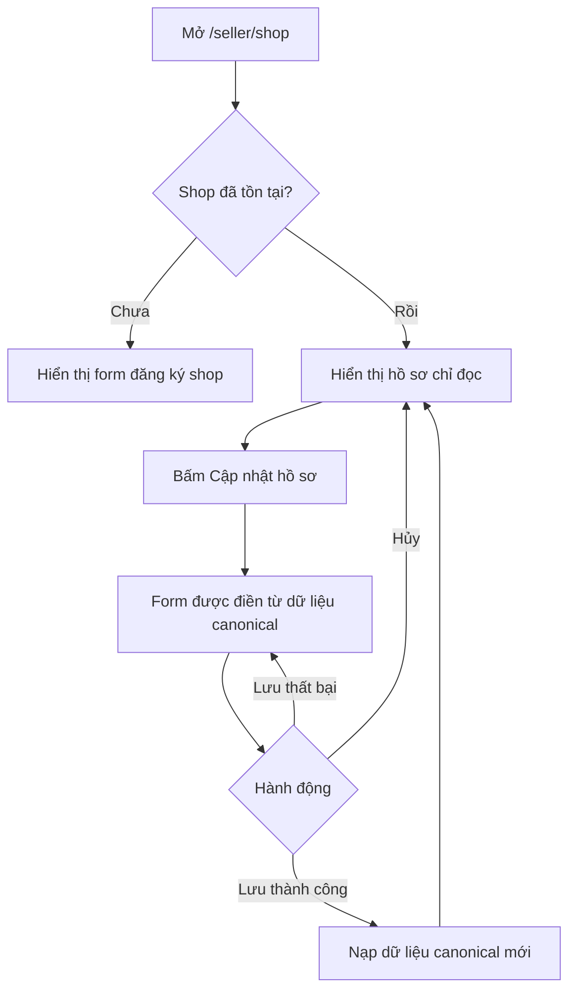
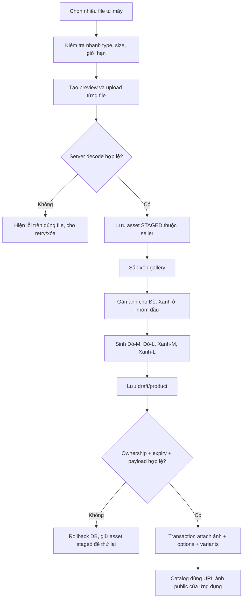

## Context

See `proposal.md` for motivation. Seller Center currently uses one form for both first-time shop onboarding and existing-shop maintenance. Seller products persist `ProductImage.url` values and the seller write contract accepts HTTPS URLs; there is no product-media upload lifecycle. Review media already demonstrates authenticated multipart ingestion, decoded-image validation, private staging, expiry cleanup, and filesystem-backed local storage, but review ownership and attachment rules are not reusable as product records.

Products already normalize option groups and option values. A classification image therefore belongs to a first-group `ProductOptionValue`, not to every generated `ProductVariant`: assigning the same image separately to `Đỏ · M` and `Đỏ · L` would duplicate data and make later option edits fragile.

## Goals / Non-Goals

**Goals:**

- Add an explicit `view`/`editing` state for an existing shop without changing first-time onboarding.
- Let one browser file selection enqueue several uploads while reporting success or failure per file.
- Keep uploaded bytes private until an owned product save attaches them atomically.
- Reuse one gallery image for a first classification value and all variants generated from it.
- Keep existing external/imported `ProductImage` rows readable and editable.
- Keep the storage implementation replaceable so local filesystem storage can later move to object storage.

**Non-Goals:**

- Image cropping, background removal, compression, or CDN transformation.
- Videos, animated images, SVG, or arbitrary documents.
- Images on the second classification group or a different image for every full variant combination.
- Replacing existing review-media storage or migrating external image bytes into managed storage.
- Automatically publishing a draft after images finish uploading.

## Decisions

### 1. Existing shops use a small profile-mode state machine

`SellerShopManagement` will derive one of `loading`, `onboarding`, `view`, or `editing` from the server result and local interaction. Existing shops enter `view`; only `Cập nhật hồ sơ` enters `editing`. The edit draft is rebuilt from the last canonical response when editing begins or is cancelled. A successful PATCH refetches/replaces canonical data and returns to `view`; a failed PATCH retains the draft.

This keeps the current form and validation logic rather than maintaining two editable implementations. Rendering disabled inputs was rejected because it still looks like an unfinished form and makes the read-only hierarchy hard to scan.

### 2. The browser accepts multiple files but uploads one file per request

The file input uses `multiple`, immediately performs cheap type/size/count checks, creates object-URL previews, then uploads accepted files through `POST /api/v1/seller/products/media` using multipart field `file` with bounded concurrency. Each request is capped at 5 MB plus protocol overhead, so one failed file does not discard successful siblings and the UI can expose independent progress/retry states. Object URLs are revoked when replaced, removed, or unmounted.

A single large multipart request was rejected because it increases mutation-body limits, makes partial error reporting harder, and forces a full retry when only one image is invalid.

### 3. Product media has its own staged asset lifecycle

Add a `SellerProductMediaAsset` model with an opaque UUID, uploader/shop ownership, random `storageKey`, MIME type, byte size, width, height, `STAGED | ATTACHED` state, expiry, optional attached product-image ID, and timestamps. `SELLER_PRODUCT_MEDIA_ROOT` defaults to `.runtime/seller-product-media`; a dedicated storage adapter owns safe write/read/delete operations. Original filenames and user-controlled paths are never used as storage keys.

The API decodes JPEG, PNG, or WebP bytes, enforces 5 MB and bounded dimensions, and creates a 24-hour staged record. Staged previews use an authenticated owner-only route. Attached media uses a separate stable public read route with an allowlisted content type and cache headers. A cleanup command deletes expired staged rows and their blobs, while attachment clears expiry and makes the public route eligible.

Reusing `ReviewMedia` was rejected because review attachment, authorization, expiry, and deletion semantics are different. Storing data URLs or blobs in PostgreSQL was rejected because it inflates database and response sizes.

### 4. Product writes use opaque media references, not new client-supplied URLs

The seller write contract will replace raw new-media URLs with ordered discriminated references:

- `existing`: an existing `ProductImage.id` owned by the product being edited;
- `upload`: a non-expired staged asset ID owned by the authenticated shop.

Each item also carries `altText` and `sortOrder`. Product detail responses continue returning image IDs and resolved URLs, so catalog and buyer screens remain URL-based. Create/update validates no more than nine unique references and requires at least one resolvable image before publish. Existing external images remain `existing` references; the seller cannot introduce a new arbitrary URL through the upload UI/API.

This prevents local `blob:` URLs or forged filesystem paths from reaching persistence and avoids server-side fetching of seller-controlled remote URLs.

### 5. Attachment and product mutation share one database transaction

Before writing product rows, the service locks or conditionally selects every referenced staged asset, verifies uploader/shop ownership, `STAGED` state, and expiry, and verifies every existing image belongs to the target product. Inside one transaction it creates/reorders `ProductImage` rows, marks new assets `ATTACHED`, connects each asset to its image, writes options/variants, and applies classification mappings. Any failed validation rolls back all database changes; staged blobs remain retryable until expiry.

Filesystem writes happen during staging, before the product transaction. If a database attachment fails, no filesystem compensation is needed. Deleting/replacing an already attached image schedules safe post-commit blob cleanup rather than deleting before the transaction succeeds.

### 6. Classification images reference the first option value

Add a nullable product-image relation to `ProductOptionValue`. The write contract represents each option value as `{ value, mediaRef }`, where `mediaRef` is allowed only in group index `0` and references one item from the same product media array. The server resolves it to the newly retained/created `ProductImage`, then connects that image to the corresponding first-group option value.

Variant projections derive their display image from the first combination value. For `Đỏ × {M,L}`, both variants resolve through the `Đỏ` option value. Renaming values in the editor preserves the local stable value key; removal clears the mapping. The server still validates the final payload by group position and value uniqueness rather than trusting client keys.

Using `ProductImage.variantId` was rejected because it allows only one variant owner and cannot express one image shared by `Đỏ · M` and `Đỏ · L`.

### 7. Multipart security is an exact-route exception

The browser mutation guard will allow `multipart/form-data` only for the exact seller media upload route while preserving session authentication, production Secure cookies, SameSite behavior, and the existing Origin/CSRF guard for browser mutations. DTO/product JSON routes stay JSON-only. Upload authorization verifies the authenticated seller and shop state before storage is committed.

A project-wide multipart exception was rejected because it widens parser and CSRF exposure for unrelated mutations.

### 8. Compatibility and deployment are additive

The migration adds the staged-media table, its state enum/indexes, and the nullable option-value image relation. Existing `ProductImage.url` rows remain unchanged. Managed images store an application URL derived from the asset ID, allowing existing catalog projections to continue reading `url`. Deployment creates the media root before accepting uploads and schedules the staged cleanup command; production can supply an object-storage implementation behind the same adapter later.

## Activity Flows

### Shop profile

### Product media and classification image

## Risks / Trade-offs

- [Local filesystem is not horizontally shared] → Keep a storage adapter boundary, document a persistent mounted volume, and allow production object storage later.
- [Unused uploads consume disk] → Expire staged assets after 24 hours and provide deterministic cleanup with tests.
- [Browser selects many images at once] → Cap unique images at nine, upload with bounded concurrency, and retain per-file retry/error state.
- [Product update deletes an image still referenced by an option value] → Resolve the final media set first, clear/reject dangling mappings in one transaction, and delete blobs only after commit.
- [External legacy URLs may disappear remotely] → Preserve compatibility but prohibit adding new remote URLs; sellers can replace them with managed uploads.
- [Staged preview URLs might be shared] → Require the owning seller session and never expose staged URLs through buyer-facing projections.
- [Image order and references can drift during async upload] → Give every local selection a stable client key and serialize only successfully uploaded references at save time.

## Migration Plan

1. Add the media-state enum/table, ownership/index constraints, attached image relation, and nullable first-option-value image relation through a Prisma migration.
2. Deploy the API storage root/configuration, authenticated upload/preview routes, public attached-media route, and cleanup command while the old product URL contract remains readable.
3. Deploy the new shared write/response contracts and atomically attaching seller-product service.
4. Deploy the Seller Center profile view and product file-picker/classification mapping UI.
5. Run cleanup on a schedule and monitor upload rejection/storage errors.

Rollback disables new uploads first. Existing attached application URLs and database rows remain readable; reverting the UI does not delete media. The additive columns/table can be removed only after managed URLs are migrated or no longer referenced.
