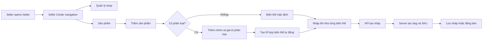

## Context

The Seller Center currently consists of individual pages for shop profile and product management. Product creation exposes a mutable slug input, while seller category lookup does not distinguish categories that should no longer be used for authoring. See `proposal.md` for motivation and the change specification for behavior.

## Goals / Non-Goals

**Goals:**

- Give existing and future seller pages a consistent navigation shell without creating dead links.
- Move slug ownership fully to the server and keep public URLs stable after product creation.
- Make the product form understandable when a listing does not need variants.

**Non-Goals:**

- Build seller order, finance, marketing, or analytics pages that do not yet exist.
- Rename or remove existing public catalogue categories or change existing product URLs.
- Add more than the present two-level product-option model.

## Decisions

### Seller layout owns navigation, pages own their content

Create a route layout for `/seller` that renders the Seller Center header and a navigation component around current seller pages. It will link only to `/seller/shop` and `/seller/products`, use the route pathname for active state, and adapt to a horizontal/compact control on small screens. This avoids duplicating navigation inside every page and avoids presenting non-functional order or promotion links.

### Product slug and SKUs are created at the API boundary

Remove `slug` and variant `sku` from the seller product write contract and editor state. On draft creation the service will normalize the product name and append a short, URL-safe hash based on the server creation timestamp plus a collision nonce; it will persist that value transactionally. It will derive a unique SKU for the default variant and every new option combination from that server-owned identity. Updates preserve the stored slug and retained variant SKUs. Browser-generated identifiers were rejected because they could be manipulated and diverge from server validation; replacing identifiers on every rename or edit was rejected because it breaks external references and operational reconciliation.

### Seller-category eligibility is enforced twice

The category-list endpoint filters the `mobile` and `kitchen` slugs so the normal editor never offers them. The product service also rejects them from submitted create/update data, ensuring a stale client or direct API request cannot bypass the policy. The public catalogue continues to query these categories normally.

### Classification UI is progressive and optional

The editor starts with a clear “Không có phân loại” default variant and an optional “Thêm nhóm phân loại” action. It introduces the labels with concrete Vietnamese examples: **Phân loại hàng** is a buyer choice such as Màu sắc or Kích cỡ; **Giá trị phân loại** is Đỏ, Xanh, M, or L; and **Biến thể** is each sellable combination. Each group has a name and add/remove-value controls, and the second group is revealed only by a dedicated add action. When values are added or removed, the existing deterministic-combination generator immediately refreshes the variants table (for example, Đỏ/Xanh × M/L produces four rows). The table has system-managed identifiers and seller-entered stock for every generated combination; it does not offer manual row insertion, which would duplicate or contradict the classification model. Hiding optional inputs until requested is preferred to empty two-group fields because it reduces cognitive load without weakening the data model.

### Activity flow

## Risks / Trade-offs

- [Concurrent products with identical names or combinations] → Include a creation-time hash and collision nonce, then retain database unique slug/SKU constraints as the final safeguard.
- [Sellers expect order navigation immediately] → Show only live routes now; the layout has a clear extension point for future modules.
- [Legacy category data continues to exist] → Restrict only seller authoring, leaving buyer reads unchanged and avoiding a risky dataset migration.

## Migration Plan

1. Deploy compatible API contract and server slug/category enforcement before the updated editor.
2. Deploy the `/seller` layout and editor UI; existing stored product slugs remain unchanged.
3. Roll back frontend and API code together if needed; no schema or data rollback is necessary.
