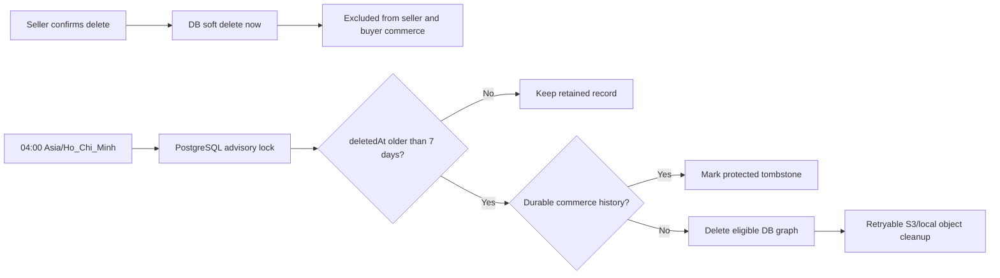
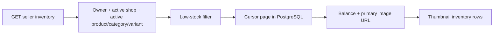

## Context

See `proposal.md` for motivation and the two capability specs for observable behavior. Product deletion currently has two different meanings in Seller Center: a draft calls `DELETE /api/v1/seller/products/:productId`, detaches its media for near-term cleanup, and sets `deletedAt`; an active product is only transitioned to `ARCHIVED`. Both paths use `window.confirm`. The inventory query currently selects any non-deleted variant owned by an approved shop, filters low-stock rows after applying the database limit, and does not project a product image.

The catalog graph mixes disposable authoring data with references that protect historical commerce. `OrderLine`, `ProductReview`, and `InventoryReservationLine` restrict deletion of products or variants. Inventory creation also writes `INITIAL_STOCK`/`PRODUCT_EDIT` adjustments, so treating every inventory adjustment as protected history would make retention cleanup ineffective. Media may live in local storage or S3 and already has a staged/attached lifecycle. The application can run multiple API instances, therefore an in-process timer alone cannot guarantee one cleanup writer.

## Goals / Non-Goals

**Goals:**

- Give all seller product lifecycles one private soft-delete path and one accessible custom confirmation experience.
- Enforce a strict, database-time retention boundary and safely clean bounded batches once per day across multiple API instances.
- Preserve commerce history while allowing authoring-only products to be physically removed.
- Make inventory pagination, filtering, imagery, and mutations share the same active-sale eligibility rule.
- Keep object-storage deletion retryable after the database transaction commits.

**Non-Goals:**

- Seller-facing restore, recycle-bin, or immediate hard-delete APIs.
- Deleting order/review snapshots or shortening their retention.
- Replacing the existing pg-boss reservation-expiry queue; this change adds only product-retention scheduling.
- Interpreting “đã bán” as `soldCount > 0`; it means the product is currently published/active for sale.
- Redesigning product image upload or the general Seller Center navigation.

## Decisions

### 1. Unify seller deletion as soft delete

`DELETE /api/v1/seller/products/:productId` will accept an owned non-deleted product in `DRAFT`, `ACTIVE`, `HIDDEN`, or `ARCHIVED` state. Inside a transaction it will lock/revalidate ownership, use database time for `deletedAt`, invalidate/remove ephemeral cart and merchandising references, and increment affected cart versions. It will not detach or delete attached media at this point; images remain private and attached during the seven-day retention window so cleanup owns one consistent graph.

The service and controller will be renamed away from `deleteDraft`, while the route remains unchanged. Unknown, foreign, and already-deleted IDs return the same private 404. This is preferred over keeping archive-as-delete because archived products would remain visible in seller management and would never enter retention. It is preferred over immediate hard delete because the user selected a recovery/retention interval and durable references require protection.

### 2. Use a Nest cron trigger with database coordination

Add `@nestjs/schedule` and register a cron task with expression `0 0 4 * * *` and timezone `Asia/Ho_Chi_Minh`. The cron handler delegates to a separately callable cleanup service so tests and operational tooling do not depend on wall-clock timers. pg-boss remains responsible only for inventory reservation expiration.

The cleanup service obtains a PostgreSQL advisory lock before candidate selection. It obtains `clock_timestamp()` from PostgreSQL, computes the cutoff in SQL, and selects only `deleted_at < database_now - interval '7 days'`; equality is intentionally excluded. Candidates are ordered by `(deletedAt, id)`, limited to a configurable small batch, and locked/revalidated with `FOR UPDATE SKIP LOCKED`. Each candidate commits independently so one malformed graph cannot roll back the full run. Repeated runs are idempotent because removed IDs disappear and retained IDs receive a terminal cleanup classification.

This is preferred over an application `setInterval` because scheduling and timezone are explicit, and over relying on the process clock because database writes and eligibility share one authority. Advisory locking is preferred over a Redis lock because PostgreSQL is already mandatory and the job mutates PostgreSQL data.

### 3. Classify durable history before physical deletion

Add nullable cleanup outcome fields to `Product`, such as `purgeBlockedAt` and a bounded `purgeBlockReason`, plus an index supporting `(deletedAt, purgeBlockedAt, id)`. Before deletion the transaction classifies direct and variant-level references:

- Any order line, product review, reservation line (including terminal reservations), dataset-owned source record, or inventory state showing completed/reserved commerce protects the product as a tombstone.
- Commerce-linked inventory adjustments are protected with their order/reservation history.
- Authoring-only `INITIAL_STOCK` and `PRODUCT_EDIT` adjustments may be deleted with the inventory/variant graph when no durable commerce reference exists.
- Cart lines, favorites, recently viewed rows, homepage placements, voucher product scopes, option/attribute rows, unused balances, and media relationships are disposable dependencies.

A protected candidate stays soft deleted and receives a blocked outcome so the daily job reports it without attempting the same destructive transaction every day. An eligible candidate is deleted in dependency order in one transaction. This distinction is necessary because every normal product can receive an initial-stock audit; protecting every audit would make the cleanup rule non-functional. An archive-table redesign was considered, but adds a second historical query model and migration complexity without improving buyer/order snapshots in this scope.

### 4. Preserve review snapshots and route deleted products to an explicit page state

Historical review/order projections will use the immutable `OrderLine` snapshot (`productName`, `productImageUrl`, variant name/SKU) instead of reading display fields from a mutable tombstone. The shared response gains a required `productAvailable` boolean computed by the backend from the same public product-detail predicate: non-deleted active/moderation-active product, eligible category, active shop, and at least one eligible variant. Clients never infer availability from the presence of `productId`.

Review UI keeps rating, text, review media, product snapshot, and the normal `/products/:productId` anchor for both available and deleted products. When public product detail finds a retained row with `deletedAt IS NOT NULL`, it returns minimal `410 Gone` Problem Details with code `PRODUCT_DELETED`. The Next.js product screen maps that code to a dedicated `Sản phẩm đã bị xóa` state with safe navigation back to shopping or review history. Unknown IDs retain the generic 404 path, while hidden/archived/suspended products continue to use their existing unavailable behavior. Neither review nor deleted-product responses expose `deletedAt`, `purgeBlockReason`, product description, seller identity, media URLs, or storage keys from the tombstone.

Returning 404 for the whole review was rejected because deletion must not erase the buyer's historical contribution. Removing the review link was rejected because the required experience is to navigate to an explicit deleted-product page. Reusing the generic product-load failure was rejected because it cannot distinguish deletion from a temporary outage. A minimal 410 response is preferred over returning tombstone content because it supports the required screen without leaking retained fields. Copying a second snapshot into the tombstone was rejected because `OrderLine` already stores the purchase-time representation associated with a verified review.

### 5. Separate database cleanup from storage cleanup

During eligible database deletion, attached media assets are converted to retryable staged cleanup records: their product/image links are cleared, `expiresAt` is set to database time, and their storage keys remain server-only. Product images and the eligible product graph are then deleted atomically. After commit, the service attempts S3/local object deletion and removes the media asset row only after storage success. Failures remain staged for the existing media cleanup mechanism and are counted/logged without restoring the product.

This is preferred over deleting S3 objects inside the database transaction because external I/O cannot participate atomically and could hold locks for too long.

### 6. Expose aggregate cleanup health without seller data

The cleanup service records in-process last-attempt/last-success timestamps and aggregate outcomes, and the existing private operational health surface will expose readiness plus deleted, retained, failed, and remaining-candidate counts. Structured logs include run ID, duration, and counts, never descriptions, media URLs, buyer data, or credentials. Database candidate counts remain the source for backlog rather than trusting process memory after restart.

No seller-facing endpoint exposes purge status. The delete response remains `204 No Content` and `Cache-Control: no-store`.

### 7. Apply one active-sale predicate before inventory pagination

Inventory list, history access, and adjustment lookup will share a repository predicate requiring:

- approved, active, non-deleted seller-owned shop;
- non-deleted product with `ProductStatus.ACTIVE`, `ProductModerationStatus.ACTIVE`, and an active non-deleted category;
- non-deleted variant with `VariantStatus.ACTIVE`.

The database query applies product eligibility, low-stock filtering, cursor ordering, and `take + 1` before constructing the page. `InventoryBalance` gains `productImageUrl: string | null`, selected from the first attached image by `(sortOrder, id)`. Shared parsers remain exact so API/UI drift fails tests. Mutations re-run the same eligibility predicate and retain version, idempotency, reservation, and ownership protections.

Using `ProductStatus.ACTIVE` is the repository representation of “đang bán/published”. Requiring `quantitySold > 0` was rejected because that would hide a newly published product before its first order and prevent the seller from managing its stock.

### 8. Render accessible custom deletion and inventory imagery

Seller product rows open one controlled `alertdialog` containing the thumbnail/fallback, product name, seven-day warning, cancel action, and destructive action. Desktop uses a centered modal and narrow screens use a bottom-sheet layout. The component traps focus, supports Escape, restores focus to the invoking button, locks background scrolling, prevents duplicate submission, and keeps sanitized API errors in the dialog. Successful deletion removes the row and announces the result.

Inventory rows place a fixed-size thumbnail beside product name, variant, and SKU. A null URL or image load error switches to a neutral accessible placeholder without moving stock/action columns. Existing Next image-host allowlisting remains the source for remote S3 rendering.

Historical review cards use the same snapshot image fallback behavior and always keep their normal product link. The product-detail error boundary recognizes `PRODUCT_DELETED` and renders a layout-stable deleted-product screen rather than the generic retry state; pointer and keyboard users follow the same navigation behavior.

### 9. Keep flows documented and testable

Implementation will add the following diagrams to `flow.md`:

## Risks / Trade-offs

- [A protected product remains in PostgreSQL beyond seven days] → Keep it private, mark the terminal reason, and count it separately; historical integrity takes precedence over physical deletion.
- [All initial inventory audits accidentally block cleanup] → Explicitly distinguish authoring-only setup/edit rows from durable commerce-linked history and cover both paths in PostgreSQL tests.
- [Two API instances run at 04:00] → Use a stable PostgreSQL advisory-lock key and revalidate rows in transactions.
- [API is down at 04:00] → Do not run early; overdue records wait for the next successful scheduled run and remain observable as backlog.
- [S3 deletion fails after DB commit] → Leave staged asset metadata for idempotent retry and never recreate deleted catalog records.
- [Soft-deleted product remains in a cached commerce view] → Ensure all list/detail/cart/pricing/reservation paths include `deletedAt IS NULL`; use no-store on seller mutations and regression tests on public reads.
- [Strict active-only inventory surprises sellers managing hidden drafts] → Keep product lifecycle editing on the product screen; inventory intentionally manages only listings buyers can currently purchase.
- [Remote image URL fails] → Render a layout-stable fallback and test null/error states.
- [A historical review has an incomplete legacy snapshot] → Return nullable image data, preserve the stored product name when available, render a neutral fallback, and never fall back to private tombstone fields.

## Migration Plan

1. Add cleanup outcome columns/index and the scheduler dependency with the cron disabled by default through configuration.
2. Deploy the unified soft-delete path, shared active-sale predicate, contract field, and UI changes; backfill no product timestamps.
3. Run a read-only candidate report in staging against database time and verify protected/eligible classification plus media keys.
4. Enable the `04:00` cron in one environment, then confirm advisory-lock behavior with multiple API instances and inspect aggregate status.
5. Enable production scheduling. The first run uses the same bounded batch, preventing a large historical backlog from becoming one transaction.

Rollback disables the scheduler first. Application and UI changes can then roll back while additive cleanup columns/index remain harmless. Already permanently removed eligible records are not recoverable from the application; database/object-storage backups are the only rollback after purge.
